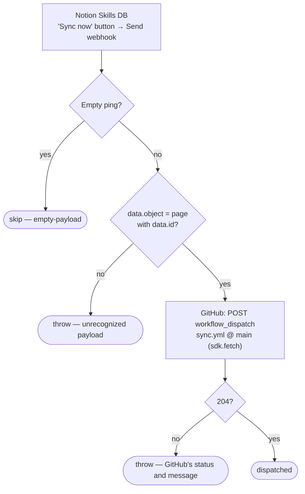

# notion-button-to-skills-sync

Clicking the **Sync now** button on any row of the Notion **Skills** database starts the skills sync in [`work-flowers/synced-skills`](https://github.com/work-flowers/synced-skills) straight away, rather than waiting for its hourly schedule. That schedule is best-effort on GitHub and has run up to 7 hours late.

Every click starts a full sync of the whole database. The page that was clicked only shows up in the run log.

**Status:** 🆕 Pending create. Merging the PR creates and enables the Zap. Then add the button in Notion (see [Setup](#setup)).

## What it does

## Trigger

The trigger is a Webhooks by Zapier Catch Hook (`hook_v2`). The button's **Send webhook** action posts `{ source: { user_id, … }, data: <page> }`. The workflow reads only `data.id` and `source.user_id`, and makes no Notion API calls.

Point the button at the **catch URL**: `trigger.webhook_url` in `zap.json`, filled in by the first publish. Do **not** use the `code-substrate-workflows.zapier.com` `trigger_url`, which is Zapier-internal.

## The dispatch

GitHub's Zapier app has no "dispatch workflow" action, so the step calls `POST /repos/work-flowers/synced-skills/actions/workflows/sync.yml/dispatches` with `{"ref":"main"}` through `sdk.fetch` on the `github_wf` connection.

- GitHub answers `204` on success. Any other status is a real rejection (auth, wrong path or bad ref), so the step throws with GitHub's message and doesn't retry.
- Clicks that land while a sync is running don't run in parallel. `sync.yml`'s `notion-skills-sync` concurrency group queues them.

## Setup

1. Merge the PR. The pipeline publishes the Zap and writes `trigger.webhook_url` back into `zap.json`.
2. In the Notion Skills database, add a **Button** property (e.g. `Sync now`) with one action: **Send webhook**, URL = that catch URL. Saving the action sends an empty test ping, which the Zap skips (`skipped: empty-payload`).
3. Click it on any row, then check [the Actions tab](https://github.com/work-flowers/synced-skills/actions/workflows/sync.yml) for a new `workflow_dispatch` run.

## Verified cases

| Case | Result |
| --- | --- |
| `run-durable` with a sample button payload (2026-10-02) | ✅ finished, `dispatched: true`; GitHub logged a `workflow_dispatch` run of `sync.yml` 6 s later |
| Guard, offline: `{}`, `null`, `""`, `{"querystring":{}}`, JSON-string `"null"` | skip |
| Guard, offline: unrelated object, `{"data":{}}`, `{"data":{"object":"page","id":""}}` | throw |
| Guard, offline: double-encoded JSON string of a page payload | dispatch |
| First real click from Notion | not yet run |
