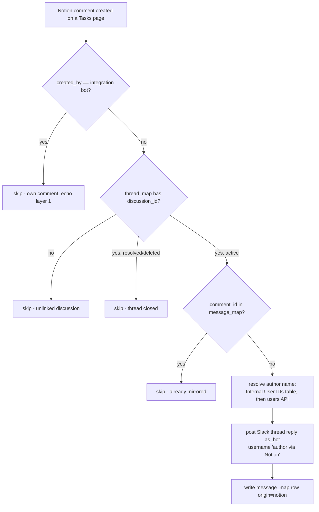

# notion-comment-to-slack-thread

Notion → Slack half of the **Slack thread ↔ Notion discussion two-way sync** (TKT-825). A new comment in a linked task discussion posts into the linked Slack thread as a bot message under `<author> (via Notion)`.

Companions: [`slack-thread-to-notion-discussion`](../slack-thread-to-notion-discussion/) (reverse direction) and [`slack-notion-thread-sync-sweep`](../slack-notion-thread-sync-sweep/) (resolve detection + backstop).

## Trigger

`NotionCLIAPI@2.39.2` / `new_comment`, **scoped to the Tasks data source** (`datasource_id` param) — one trigger covers every task page. Verified deployed 2026-09-01: fires ~4 seconds after a comment is created and delivers the **full comment object** (`id`, `discussion_id`, `rich_text`, `created_by`, `display_name`), so no fetch-back call is needed. **Do not drop the scope** — an unscoped poll returned nothing. This replaced the original catch-hook + Notion-webhook design entirely (no webhook subscription, verification token, or HMAC anywhere).

## Behaviour notes

- **Author resolution** uses the **Internal User IDs** Table first (`Notion User ID` → First/Last name), falling back to `GET /v1/users/{id}`, then to "Notion user".
- Posting `as_bot` is load-bearing: the companion Zap's `user.is_bot` guard is what stops this post from echoing back into Notion.
- The `message_map` row is written right after the post returns (the Slack `ts` isn't known before); the `is_bot` guard covers the seconds-wide gap.
- Comment `rich_text` is flattened to plain text v1; mentions render as names, block-level formatting is dropped.

## Data

| Store | ID |
| --- | --- |
| `thread_map` Table | `01M1DXXXH3E7K7JWDJYA1R50CF` |
| `message_map` Table | `01M1DXY3QEF60HX7HW8XYVE5AF` |
| Internal User IDs Table | `01JM3J9SG5X6S8GBSSC8AS28AT` |
| Tasks data source (trigger scope) | `27a91b07-11ac-81ed-973f-000ba6da1441` |

Design + spike evidence: [Notion task TKT-825](https://app.notion.com/p/3ce91b0711ac811aa266cfae9b977315).
