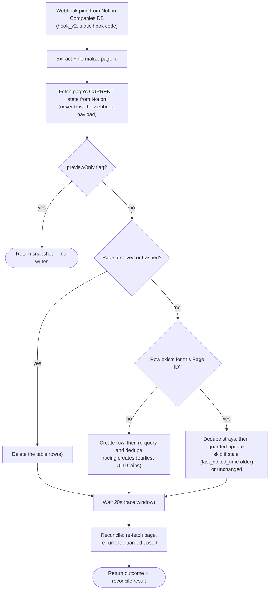

# notion-companies-to-zapier-table

Mirrors Notion **Companies** records into the company-ID Zapier Table (`01JM8PH8YM93A482M8BFZ6WKW6`), one row per company keyed on Notion Page ID. Race-safe by design: the webhook is treated as a ping only.

**Status:** enabled on Zapier.

## What it does

On any Companies-page webhook, it re-fetches the page's *current* state from Notion (never trusting the payload), then performs a guarded upsert into the table: creates on first sight (deduping racing creates deterministically on earliest ULID), updates only when the snapshot's `last_edited_time` is not older than the stored one (so a stale event can never regress a newer write), skips no-op writes, and deletes the row when the page is archived/trashed. After a 20-second wait it runs a reconcile pass — re-fetch and re-upsert — so the last-finishing run always leaves the table matching Notion.

Mirrored columns: Company Name, Notion Company ID, Domain (from Website), and the external-ID fields (Harvest Client ID, Google Drive Folder ID, Slack Channel ID, Xero Contact ID, Linear Customer ID, Linear Team ID). "Slack Channel Is Archived" is deliberately not managed here.

## Workflow

## Trigger

Webhooks by Zapier Catch Hook (`hook_v2`) with a static hook code — a Notion database automation on the Companies DB posts to the catch URL on create/update. Input flag `previewOnly: true` returns the snapshot without writing.

## Maintainer notes

- Connection alias `notion_wf` (Notion, work.flowers workspace); Notion API version `2026-03-11` via `sdk.fetch`.
- **History:** originally managed in the personal `denchiuten/notion-companies-hub` repo by mistake; adopted into this repo 2026-07-23. The *deployed* version's header comment and workflow description still point at the old repo — update both at the next republish (the local source here already carries the correct header).
- Domain is a link field in the table: Zapier Tables normalizes bare domains to `https://`, so comparisons are scheme-insensitive; empty Website leaves the stored Domain untouched.
- The reconcile pass gives the same end-state guarantee as a Delay-queue serialized on page_id, without the queue.
