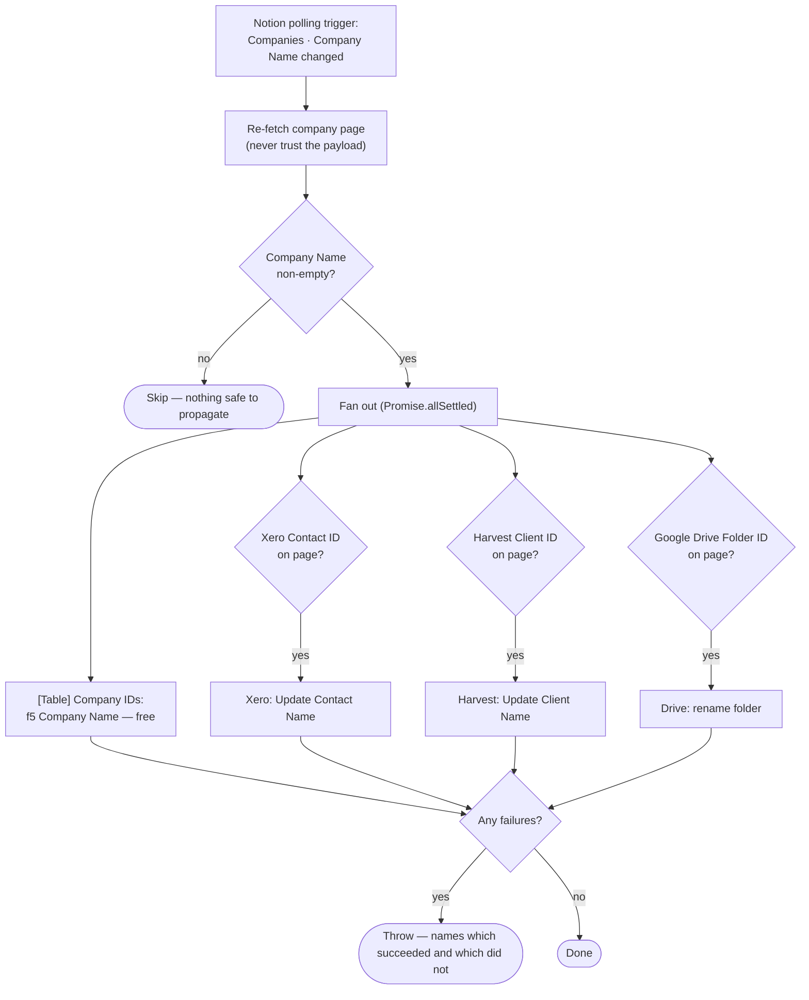

# notion-company-renamed-to-xero-harvest-drive

Notion Companies polling trigger (**Company Name** changed) → rename that
company in **Xero**, **Harvest**, **Google Drive** and **[Table] Company IDs** —
each only where that system's id is recorded on the page.

Migration of the classic Zap **"Sync Company Name Updates to Xero, Harvest, and
Zapier Table"**.

- **Workflow ID:** _pending first publish_ (account-visible)
- **Trigger:** Notion `updated_data_source_item_properties` on Companies
  (`21991b07-11ac-80b0-b787-000b3d3995f6`), watching `title` (Company Name) — a
  polling trigger, no external URL to cut over. Durable triggers have no
  polling-interval field; the classic Zap ran at the account default too
  (`polling_interval_override: 0`).

## Workflow

## What changed vs the classic Zap

- **Ids come off the Notion page, not the Table.** The classic Zap looked the
  four ids up in [Table] Company IDs and halted the entire run when the company
  had no row there. The durable reads them from the page it already has to
  fetch — fresher, one fewer lookup, and no dependency on the mirror having
  caught up. Same precedent as
  [`xero-contact-from-notion-deal`](../xero-contact-from-notion-deal/) and
  [`deal-to-client-drive-folder`](../deal-to-client-drive-folder/).
- **The four writes stay independent.** The classic Zap ran them as four
  parallel paths, so a Xero failure never blocked Harvest. `Promise.allSettled`
  over four `ctx.step`s keeps that: all four are attempted, each retried up to 3
  times, and the run then fails loudly with a message naming which targets
  succeeded and which did not. Steps that succeeded stay checkpointed, so a
  retry only redoes the failed one.
- **A blank Company Name skips.** Renaming a Xero contact, Harvest client or
  Drive folder to `""` is destructive, and a blank title is a real state for a
  freshly created row.
- **The Xero tenant is a source constant** (`62699a8c-…`), matching the other
  Xero Zaps here. The classic Zap pulled it from a Zap component variable, which
  has no durable equivalent.

## Maintainer notes

- Connections: `notion_wf` = `02b73654-15c8-85c3-b16a-07304d2beb17` (work.flowers
  Notion — **never** the Knoxx connection), `xero_wf` =
  `02336808-1736-878b-a0a8-87e02bb0aec3`, `harvest_wf` =
  `02df9d5d-89ea-8dab-bb40-8ee0c2ac4362`, `gdrive` =
  `02eb8724-3fc7-8edc-9b30-be83af0b327f`.
- Xero and Harvest renames go through **custom actions** on those apps —
  `XeroCLIAPI` `ae:515080` (Update Contact Name) and `HarvestCLIAPI` `ae:541562`
  (Update Client Name), the same two the classic Zap called. Both are
  account-defined, so they will not appear in a fresh account; confirm with
  `list-actions <app> --action-type write` before assuming they moved.
- The Table write deliberately leaves `Notion Last Edited` alone, so
  [`notion-companies-to-zapier-table`](../notion-companies-to-zapier-table/)'s
  staleness guard keeps working. That mirror also carries the name across on its
  own webhook; this write just makes the rename land immediately, and is free.
- The Drive step passes no `drive`, matching the classic Zap — folder ids are
  global.

## Cutover

**Pending.** The durable is published but **disabled**. To cut over:

1. Disable the classic Zap **"Sync Company Name Updates to Xero, Harvest, and
   Zapier Table"** in the Zapier UI.
2. `zapier-sdk --experimental enable-workflow <workflow_id>`
3. Record the date in `zap.json` under `cutover.classic_zap_disabled`.

An overlap is benign — both sides write the same name to the same four
places — so order does not matter here.

## Testing

Not yet run. Every path in this workflow is a rename in a production system, so
there is no side-effect-free happy path to exercise with `run-durable`; the
skip path (a company with a blank name) proves nothing about the code after it.
Verified read-only instead: both custom actions' input fields
(`contactId`/`newName`/`xeroTenantId`, `clientId`/`newName`) against the live
connections, the Drive `update_file_name` fields, and that `title` is a real
`watched_properties` choice for the Companies data source. **Watch the first
live run after cutover.**
