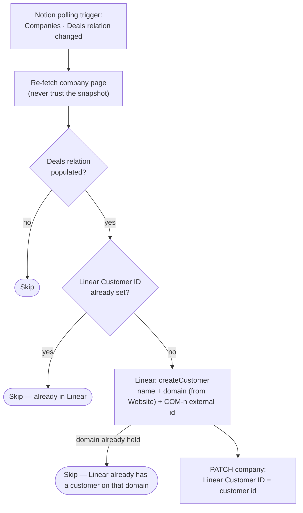

# notion-company-to-linear-customer

Notion Companies polling trigger (Deals relation changed) → create the company
as a **Linear customer** (bare domain + `COM-n` external id) and write the
customer id back to the Company.

Migration of the classic Zap **"Company Linked to Deal → Create Customer in
Linear"**.

- **Workflow ID:** `019feb0a-aa26-7322-9cb9-d744919fc0d7` (account-visible)
- **Trigger:** Notion `updated_data_source_item_properties` on Companies,
  watching the `Deals` relation (property id `giUg`) — a polling trigger, no
  external URL to cut over. Durable triggers have no polling-interval field;
  the classic Zap ran at the account default too (`polling_interval_override: 0`).
- **Editor:** <https://zapier.com/durables-editor/019feb0a-aa26-7322-9cb9-d744919fc0d7>

## Workflow

## What changed vs the classic Zap

- **No [Table] Company IDs lookup.** The classic Zap found the table row to
  read the `COM-n` id (f11) and guard on f7; the durable reads the `ID`
  unique_id and the `Linear Customer ID` guard straight off the company page.
  A table miss can no longer error the run, and
  [`notion-companies-to-zapier-table`](../notion-companies-to-zapier-table/)
  mirrors the written id back into f7.
- **`domains` gets a bare hostname** parsed out of the `Website` url (classic
  passed the raw url value). `www.` is stripped.
- **Existing records hold domains, not UUIDs, in `Linear Customer ID`** — the
  classic Zap's mapping put e.g. `tanninroad.com.au` there instead of the
  Linear customer UUID. The guard only asks "non-empty?", so those records are
  correctly skipped; the durable writes real UUIDs going forward.

## A domain Linear already holds

`createCustomer` rejects a company whose `Website` domain another Linear
customer already holds — `A customer with one of these domains already exists`.
Zapier reports it as a `partner_error` at **HTTP 200**, which the durable
runtime treats as retryable, so the step made five identical attempts and the
run reported only:

> Step "create-linear-customer" exhausted all retry attempts.

That names neither Linear nor the reason (Zapier Error Triage ticket 52,
Masjid Al-Falah / `alfalah.sg`, 2026-09-23). The workflow now matches that
sentence narrowly, stops, and returns
`skipped: "linear-domain-already-exists"` with the company, the domain and the
`COM-n` external id — so the run is green and the reason is in the run output.
Every other failure (a genuine firewall refusal, a 5xx, a rate limit) still
throws and stays retryable.

Nothing is written back to `Linear Customer ID` on that path: there is no
customer id to write, and a sentinel value would masquerade as one. The company
stays unlinked until someone points it at the existing Linear customer —
Linear's Zapier app exposes only *Find Customer by ID*, so there is no domain
lookup to resolve it in code. If one appears, this branch can write the id back
and close the loop.

The collision usually means the company is genuinely already in Linear (created
before the 2026-08-10 cutover, or by hand), but a **duplicate Notion Companies
record** for the same domain produces the same message — worth checking which
before linking.

## Testing

`run-durable` on 2026-08-10 (guard path, no side effects): company
`39e91b07-11ac-8184-9d3f-f8868d285989` (Tannin Road, 1 deal linked, id already
set) → `skipped: already-in-linear`. The `createCustomer` inputs (`name`,
`domains`, `externalIds`) are field-verified against the live connection;
watch the first live run after cutover.

The domain-collision branch (2026-09-23) is **not** exercised by that test — it
is reached only by a live collision. Its predicate is a pure exported function
(`isDomainAlreadyExistsError`) so it can be tested without a run; the branch was
verified by type-check only, against the error shape recorded in the ticket's
run journal.

## Cutover

**Complete as of 2026-08-10.** The classic Zap **"Company Linked to Deal ->
Create Customer in Linear"** was disabled — confirmed by Dennis. Not
machine-verifiable: classic Zaps are exposed by neither the SDK CLI nor the
MCP connector.

## Maintainer notes

- Connections: `notion_wf` = work.flowers Notion
  (`02b73654-15c8-85c3-b16a-07304d2beb17`), `linear_wf` =
  `02657f6e-5360-8418-ba05-cb02eb2b95f5` (work.flowers Dennis).
- The trigger payload is only used for the page id — all property reads happen
  on a fresh fetch of the page.
