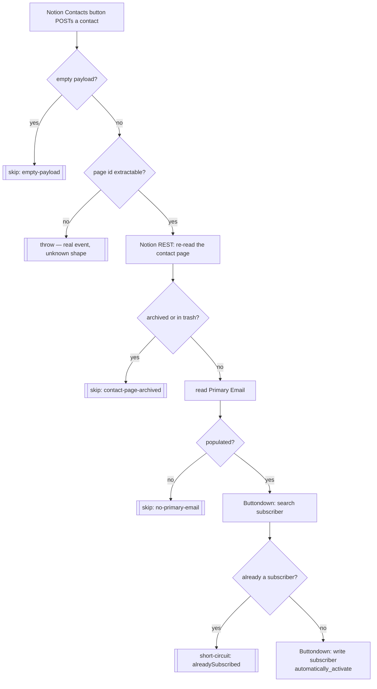

# notion-contact-to-newsletter-subscriber

Press the button on a Notion **Contact** → subscribe their Primary Email to the Buttondown newsletter.

Migrated from the classic Zap **"Click to Add Newsletter Subscriber"**.

Sibling of [`deal-won-to-newsletter-subscriber`](../deal-won-to-newsletter-subscriber/), which does the same thing automatically when a deal is won. They were deliberately kept separate rather than merged: each stays independently disableable, and each Notion sender posts to exactly one URL.

Nothing is written back to Notion. The `Mailing List` tick comes back round on its own via [`new-buttondown-subscriber-update-in-notion`](../new-buttondown-subscriber-update-in-notion/) once Buttondown confirms the subscription.

## ⚠️ Cutover is pending

This durable has a **new catch URL**. Until the Notion button property is repointed at it, this Zap has an active trigger and zero traffic while the classic Zap keeps serving.

```
https://hooks.zapier.com/hooks/catch/20495893/mu4Zr5AmKVd2g2Zv/
```

1. Repoint the **Contacts** button property at the URL above.
2. Disable the classic Zap **"Click to Add Newsletter Subscriber"** in the Zapier UI.

Each button posts to exactly one URL, so there is no double-fire window between the two steps. Classic Zaps are exposed by neither the SDK CLI nor the MCP connector, so step 2 cannot be verified from this repo.

> Use `webhook_url` above — **never** the `trigger_url` in `zap.json`, which is Zapier-internal.

## Workflow



## Why the empty-payload guard earns its place here

A Notion **button property** delivers an empty body (`{"querystring":{}}`) every time someone tests it while wiring it up — which happens on every configuration pass. A durable that threw on that would turn routine setup into Zapier error alerts for events that never existed, training everyone to ignore the alerts that matter.

A payload carrying **content but no usable page id** still throws, loudly. That is a real event whose shape we failed to understand, and silencing it hides the bug.

## The Buttondown firewall finding

**Buttondown answers a re-subscribe of an existing address with `This subscriber was blocked by your firewall`** — a `partner_error` at HTTP 200, *not* an "already exists" message, and indistinguishable from a genuine firewall refusal of a brand-new address.

Reproduced live on 2026-08-10 (run `019febef-133f-…`): it burned all five step retries and failed the run. A second click on the same contact would have produced a hard error alert.

So the workflow **looks before it writes**: `search subscriber` first (a miss returns `{data: []}`, not an error), short-circuit if found, and only then create. Catching the message instead would have been wrong — it would also swallow a real firewall refusal, and a lead silently not subscribed is worse than an alert. Any refusal that survives the pre-check is real and fails loudly, by design.

The narrow `already exists` catch that remains covers one thing only: the race where the sibling deal-won Zap subscribes the same address between the check and the write.

## What changed vs the classic Zap

| Change | Why |
| --- | --- |
| Empty-payload guard | See above. |
| Re-reads the contact page | The address may have been edited in the same breath as the click. |
| Empty `Primary Email` → `skipped`, not a halt | The classic `Primary Email Populated` filter halted silently. |
| Archived/trashed contact → `skipped` | New guard. |
| Subscriber pre-check | See the firewall finding. Makes a repeated click idempotent. |

## Bindings

| Thing | Value |
| --- | --- |
| Notion connection | `02b73654-15c8-85c3-b16a-07304d2beb17` — **work.flowers**, never `Knoxx \| Dennis #2` |
| Notion data source | Contacts `21991b07-11ac-81a6-a894-000be4a09a67` (read only) |
| Property read | `Primary Email` (email) |
| Buttondown connection | `02b2a81f-2fcf-8e3d-9219-826e4ffe4fbe` (`workflowers`) |

Repo rule 5 (default templates) does not apply: no Notion page is ever created.

## Verified 2026-08-10

| Path | Run | Result |
| --- | --- | --- |
| Main | `019febf5-1c1b-76d3-a095-b03dbda76c77` | contact `21991b07-…6501` → `jochen@terrascope.com` → already subscribed, short-circuited |
| Ping | `019febf5-6e74-7b01-b0fa-4ecab50c89f4` | `{"querystring":{}}` → `{skipped: "empty-payload"}` |

The main-path contact was chosen so the run exercised page fetch, email extraction and the subscriber pre-check end to end **without creating a subscriber**.

**Not tested: the create branch.** Exercising it would have added a real person to the live mailing list. The first genuinely new subscriber is worth watching.
