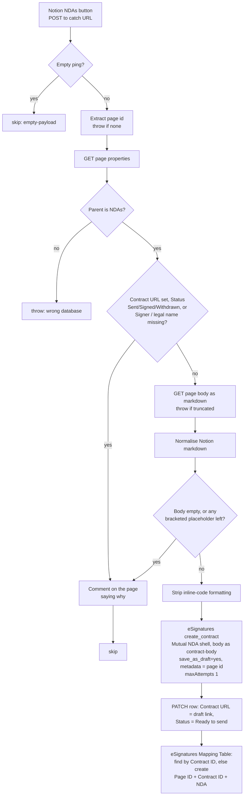

# notion-nda-to-esignatures-draft

Press **Send for signature** on a row in the Notion **NDAs** database, and this Zap turns the
row's page body into an eSignatures.com **draft** contract. The draft link is written back to the
row. Nothing goes to a signer: you review the draft in eSignatures and send it from there.

It works like [`esignatures-send-for-signing`](../esignatures-send-for-signing/) does for SOWs:
the page body *is* the contract.

- **Trigger:** Webhooks by Zapier catch hook (`WebHookCLIAPI@1.1.1` / `hook_v2`). The sender is
  the NDAs **Send for signature** button property, whose *Send webhook* action points at the
  `webhook_url` in [`zap.json`](zap.json).
- **Contract text:** the row's page body. It starts from the NDAs **database template**, which
  holds the full Mutual NDA with each placeholder written as inline code around a bracketed
  label, e.g. `` `[Short name]` ``. Type over each one in place.
- **eSignatures template:** `6325d51d-cd18-47fe-8925-0a0ccff24f3a` ("Mutual NDA"). It is a bare
  shell: `{{ contract-body }}`, a page break, then Signatory Details with the `signatory_title`
  signer field. The Zap uses the public `EsignaturesioCLIAPI` app's `create_contract`, passing
  the body as `placeholder_fields_markdown_map.contract-body`.
- **Signers:** 1 is the row's **Signer** contact (name from the `Signer Name` rollup; email from
  **Override Email (Optional)** when set, otherwise the `Signer Email` rollup; company =
  Counterparty Legal Name). 2 is Dennis (`dennis@work.flowers`,
  Company Flow Pte. Ltd.), who signs after the counterparty. Auto Sign is **off**. Each signer
  fills in their title when signing.

## Placeholders

| In the template | Replace with |
| --- | --- |
| `[Counterparty legal name]` | Full registered name, e.g. Marshall Consulting Pte Ltd |
| `[entity description, e.g. a company registered in Singapore]` | e.g. a non-profit registered in Australia |
| `[Short name]` (6 places) | The defined term used throughout, e.g. Marshall Consulting |
| `[purpose]` | Completes "so that workFlowers and its authorised personnel may …" |
| `[specific confidential information]` | Completes clause 1.2 "For clarity, Confidential Information includes …" |
| `[authorised personnel, e.g. Peter Gao]` | Clause 2.4, the named workFlowers people |
| `[sensitive data types, e.g. …]` | Clause 4.4 |
| `[counterparty notice email]` | Clause 10.6 |

A filled value keeps the inline-code formatting when you type over the selection. That is fine:
the Zap strips all inline-code formatting before sending, so values print as ordinary text. It
has to, because eSignatures' Extended Markdown reads a backticked span at the end of a line as a
signer-field config.

**The rule the Zap checks is "no square brackets inside inline code."** Any bracketed
inline-code span left in the body stops the run, and the page comment lists which ones remain.
Don't write a value with square brackets as inline code.

The row's **Counterparty Legal Name** (title) is still used for the contract title
(`Mutual NDA – <name>`) and signer 1's company name. It should match what you typed into the body.

## Guards

- **Already drafted:** a row whose **Contract URL** is set gets a comment and no new draft. This
  is what stops a second click creating a second contract. To start over, clear Contract URL.
  There is no Contract ID property; the contract id is the UUID inside the URL, as on SOWs.
- **Status** `Sent`, `Signed` or `Withdrawn` also means no draft. `Draft`, `Ready to send` or an
  empty Status are all fine; the button press is the intent.
- **Missing data:** a missing Signer, Signer name or email, or Counterparty Legal Name gets a page
  comment. So do an empty body and any unfilled placeholder. These are skips, not errors, because
  only a person can fix them.
- **Partial export:** a markdown export Notion reports as `truncated`, or with blocks it could not
  export, **throws**. A contract missing a clause is worse than no contract.
- **Wrong database:** a page whose parent is not the NDAs data source **throws**. It means the
  button, or a replay, is wired to the wrong place.
- **Empty ping** (`{"querystring":{}}`, which a Notion button test sends) is skipped. Any other
  payload with no page id throws (repo default).

## Maintainer notes

- **The markdown normaliser is copied verbatim** from
  [`esignatures-send-for-signing/shared.ts`](../esignatures-send-for-signing/shared.ts). A fix to
  either copy belongs in both. It converts Notion's HTML tables, callouts and columns, and puts a
  blank line between blocks so clauses don't run together.
- **A Notion divider becomes a PDF page break** in eSignatures (`---`). The shell already breaks
  before Signatory Details, so leave dividers out of the body unless you want a break.
- **Status becomes `Ready to send` when the draft is created** (it was `Sent` until 2026-09-28):
  the draft is waiting for review, not sent.
  [`esignatures-status-to-notion`](../esignatures-status-to-notion/) moves the row on after that. It
  sets `Sent` + `Sent Date` when you send the draft from eSignatures, and `Signed` + `Signed Date`
  plus the executed PDF in `Signed PDF` once everyone has signed. It finds the row through the
  **eSignatures Mapping** Table (`01KHZEP4FA560E9GMTGTBR1E2N`), which this Zap writes to right
  after the Notion write-back: `Page ID`, `Contract ID`, `Agreement Type = NDA`. Table ops cost no
  tasks. The write-back goes first because Contract URL is the duplicate-draft guard. If the Table
  write then fails, the run goes red and that contract won't be tracked until a row is added by
  hand. Each contract also carries its Notion page id as `metadata`, as a second way back to the
  row.
- **`create_contract` runs once.** It is not idempotent, so a retry after an ambiguous failure
  could leave a duplicate draft. A failed run is readable instead, and pressing the button again
  is the retry. The write-back PATCH keeps the default retries because replaying it lands in the
  same state.
- **Two quick clicks can create two drafts.** Both runs read an empty Contract URL before either
  writes one back. Durables have no lock (see shared rules). It costs one stray draft, which you
  delete in eSignatures.
- **Draft URL:** the contract object carries it as `draft_contract_url` (verified 2026-09-28).
  The result is doubly nested like the private app's:
  `{ data: [ { status: "queued", data: { contract: { id, draft_contract_url, … } } } ] }`.
  `extractDraftUrl` falls back to any https URL containing the contract id, then to
  `https://esignatures.com/draft_contracts/<id>/edit`, in case the field is renamed.
- The row is written with raw Notion REST (`PATCH /v1/pages`), not `update_database_item`,
  because the action's schema cache lags newly created databases.
- Repo rule 5 (default templates) does not apply here. The Zap only updates an existing page.
- **Zapier strips double curly braces** from any text it sends, so any edit to the eSignatures
  shell made through Zapier must write the placeholder as `{{ contract-body }}` with inner spaces.

## Verification

| Case | Result |
| --- | --- |
| Types: `npm run build` (tsc `--strict --noUnusedLocals`, durable 0.12.6 + sdk 0.103.0) | Clean |
| Normaliser vs `esignatures-send-for-signing/shared.ts` | Byte-identical |
| Template body as-is, local harness (Notion single-newline export simulated) | All 8 placeholders reported, `unfilled-placeholders` |
| Template body with every placeholder filled | No refusal, 0 backticks left, 50 paragraphs, values print as plain text |
| Bracketed span inside a fenced code block | Ignored (not a placeholder) |
| Payload shapes: `{}`, `null`, `""`, `{"querystring":{}}`, double-encoded ping | Skip |
| Payload shapes: `{"foo":1}`, `{"data":{}}`, `{"data":{"id":""}}`, non-empty `querystring` | Throw |
| eSignatures template read-back | `placeholder_keys` = `contract-body`; `signer_field_ids` = `signatory_title` |
| **Live, main path** — real Palmera Projects row, `run-durable`, 2026-09-28 | Draft `6adb7c81-ceec-4666-a20f-0ac1d8775442` created from the page body (11,592 chars), signers Abarna Raj (1) and Dennis (2), `metadata` = page id. Write-back **failed**: `Contract ID is not a property that exists` (deleted that day). Fixed to Contract URL only; the corrected PATCH was applied to the row by hand and succeeded |
| **Live, second press** on the same row | `already-drafted`, one page comment, no second draft |
| **Live, empty ping** `{"querystring":{}}` | `empty-payload`, no error |

## Setup

1. ~~Share the NDAs database with the Zapier Notion integration~~ — done 2026-09-28.
2. ~~Create the NDAs database template from the Mutual NDA text and make it the default~~ — done
   2026-09-28.
3. Merge. The publish pipeline creates the Zap and writes the catch URL into `zap.json`
   `trigger.webhook_url`.
4. Point the **Send for signature** button's *Send webhook* action at that URL.
