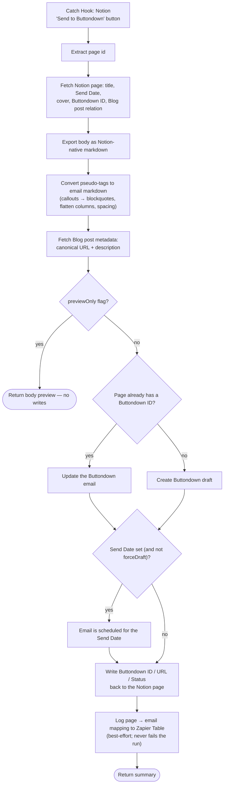

# notion-newsletter-to-buttondown

Turns a Notion **Newsletter Issues** page into a Buttondown draft or scheduled email. Create-or-update, keyed on the page's Buttondown ID.

**Status:** enabled on Zapier.

## What it does

Fetches the Notion page, exports its body via Notion's **native markdown export** (structurally faithful, unlike the lossy Zapier block converter), converts Notion pseudo-tags (callouts, columns, spacers, spans) to email-safe markdown, pulls the canonical URL and description from the related Blog post, then creates or updates the Buttondown email — scheduled when the page has a Send Date. Finally it writes the Buttondown ID/URL/Status back to the Notion page and best-effort logs the page → email mapping to a Zapier Table.

## Workflow

## Trigger

Webhooks by Zapier Catch Hook (`hook_v2`) — the "Send to Buttondown" button on the Newsletter Issues DB posts the page. Input flags: `previewOnly: true` runs the conversion end-to-end with no writes; `forceDraft: true` creates a draft even when a Send Date is set.

## Maintainer notes

- Connection aliases `notion_wf` (Notion) and `buttondown` (custom Buttondown integration, `App240106CLIAPI`), resolved at publish time via `--connections`.
- The Buttondown `create_draft` action re-hosts cover and inline images, so expiring Notion file URLs don't break in the email.
- The markdown conversion handles fenced code blocks specially — indentation inside fences is preserved while Notion's structural tab indentation elsewhere is stripped.
- Mapping log lives in Zapier Table `01KNJN2MSBAJVXRME6M1Y65F5B` (Page ID → Buttondown Email ID), keyed on Page ID so re-runs refresh rather than duplicate.
