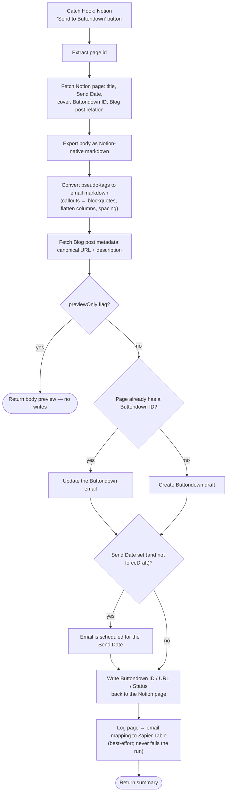

# notion-newsletter-to-buttondown

Turns a Notion **Newsletter Issues** page into a Buttondown draft or scheduled email. Create-or-update, keyed on the page's Buttondown ID.

**Status:** enabled on Zapier.

## What it does

Fetches the Notion page, exports its body via Notion's **native markdown export** (structurally faithful, unlike the lossy Zapier block converter), converts Notion pseudo-tags (callouts, columns, spacers, spans) to email-safe markdown, surfaces image captions as visible lines, pulls the canonical URL and description from the related Blog post, then creates or updates the Buttondown email — scheduled when the page has a Send Date. Finally it writes the Buttondown ID/URL/Status back to the Notion page and best-effort logs the page → email mapping to a Zapier Table.

## Workflow

```mermaid
flowchart TD
    A["Catch Hook: Notion<br/>'Send to Buttondown' button"] --> B["Extract page id"]
    B --> C["Fetch Notion page: title, Send Date,<br/>cover, Buttondown ID, Blog post relation"]
    C --> D["Export body as Notion-native markdown"]
    D --> E["Convert pseudo-tags to email markdown<br/>(callouts → blockquotes, flatten columns, spacing)"]
    E --> F["Fetch Blog post metadata:<br/>canonical URL + description"]
    F --> G{"previewOnly flag?"}
    G -- yes --> H(["Return body preview — no writes"])
    G -- no --> I{"Page already has a Buttondown ID?"}
    I -- yes --> J["Update the Buttondown email"]
    I -- no --> K["Create Buttondown draft"]
    J --> L{"Send Date set (and not forceDraft)?"}
    K --> L
    L -- yes --> M["Email is scheduled for the Send Date"] --> N
    L -- no --> N["Write Buttondown ID / URL / Status<br/>back to the Notion page"]
    N --> O["Log page → email mapping to Zapier Table<br/>(best-effort; never fails the run)"]
    O --> P(["Return summary"])
```

## Trigger

Webhooks by Zapier Catch Hook (`hook_v2`) — the "Send to Buttondown" button on the Newsletter Issues DB posts the page. Input flags: `previewOnly: true` runs the conversion end-to-end with no writes; `forceDraft: true` creates a draft even when a Send Date is set.

## Maintainer notes

- Connection aliases `notion_wf` (Notion) and `buttondown` (custom Buttondown integration, `App240106CLIAPI`), resolved at publish time via `--connections`.
- The Buttondown `create_draft` action re-hosts cover and inline images, so expiring Notion file URLs don't break in the email.
- The markdown conversion handles fenced code blocks specially — indentation inside fences is preserved while Notion's structural tab indentation elsewhere is stripped.
- **Image captions.** Notion's export puts a block's caption in the Markdown alt-text slot (``), where it is invisible to sighted readers. The conversion mirrors it into an italic line under the image and keeps the alt attribute, so the caption is both visible and accessible. Uncaptioned images (``), inline images mid-sentence, and images inside code fences are left untouched.
- **Clickable images (link the caption).** Notion image blocks carry no link target and the export has no linked-image form, so a caption that is *nothing but* a Markdown link is how you author a clickable image. Notion nests it in the alt slot as `](src)`; the conversion rewrites that to `` plus a linked italic line, so the link still works when the client blocks images. This is the supported way to present a video in an issue: a poster frame linked to the watch page, since iframes are stripped by virtually every email client. A caption that merely *contains* a link (surrounding prose, or link text with brackets) still can't be parsed unambiguously out of the alt slot and is left as-is; if that becomes common, read `caption` off the image blocks via the blocks API instead of the markdown.
- **Code fences are preserved verbatim**, deliberately — real code samples keep their indentation. The consequence is that a Notion `html` code block used as an embed (a Supercut or YouTube iframe, say) ships as a literal code box showing the HTML source. Use a linked poster frame instead; the [Blog to Newsletter Repurposing Skill](https://app.notion.com/p/8ffabc37db284e68bfe5de4b735b8012) covers the authoring side.
- Mapping log lives in Zapier Table `01KNJN2MSBAJVXRME6M1Y65F5B` (Page ID → Buttondown Email ID), keyed on Page ID so re-runs refresh rather than duplicate.
