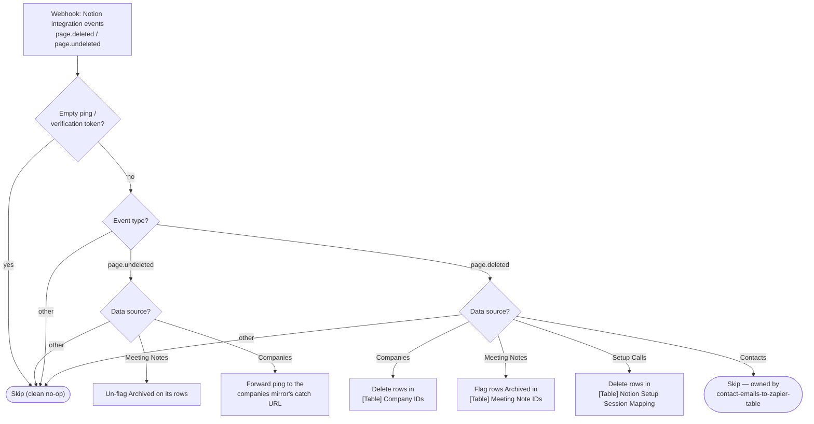

# notion-page-deleted-to-zapier-tables

When a page is deleted in Notion, remove or flag its row in the Zapier Table that
maps it — so the free Table lookups the other Zaps rely on stop resolving pages
that no longer exist.

**Status:** enabled on Zapier. **Cutover pending** — the Notion integration-webhook
subscription still posts to the classic Zap; see below.

Migration of paths B/C/D of the classic Zap **"Delete Contact, Company or Meeting
Note Page from Zapier Table"**. Path A (Contacts) was already retired into
[`contact-emails-to-zapier-table`](../contact-emails-to-zapier-table/) on
2026-07-26, which needs the email-table context to tell a merge hand-over from a
genuine delete — Contacts events are deliberately skipped here.

## What it does

| Deleted page's data source | Table | Action |
| --- | --- | --- |
| Companies (`21991b07-…3995f6`) | `[Table] Company IDs` | **Delete** the row(s) keyed on `Notion Page ID` |
| Meeting Notes (`19891b07-…fab86e`) | `[Table] Meeting Note IDs` | **Flag `Archived`**, never delete (same rule as [`gcal-event-updated-to-meeting-note`](../gcal-event-updated-to-meeting-note/): a transient mistake must not destroy a mapping) |
| [Ernest] Internal Setup Calls DB (`2d191b07-…32e307`) | `[Table] Notion Setup Session Mapping` | **Delete** the row(s) keyed on `Page ID` |
| Contacts | — | Skip — owned by `contact-emails-to-zapier-table` |
| Anything else (Deals, …) | — | Skip with a log line; nothing maps them |

Improvements over the classic Zap, which ignored restores entirely:

- **`page.undeleted` for a meeting note** un-flags `Archived`.
- **`page.undeleted` for a company** is forwarded to
  [`notion-companies-to-zapier-table`](../notion-companies-to-zapier-table/)'s catch
  URL — a restore fires no DB automation, so the mirror would otherwise never
  learn the page is back; the forward makes it re-fetch the page and re-create
  the row this workflow deleted.

Everything is a Zapier Tables call — **zero tasks per run, no connections**. Page
ids are normalized to dashed-UUID form before lookup (the events and the Tables
both use it, but the classic Zap's exact-match would have silently missed any
undashed id).



## Trigger

Webhooks by Zapier Catch Hook (`WebHookCLIAPI@1.1.1` / `hook_v2`, no auth).
Payload is Notion's integration-webhook shape:
`{ type, entity: { id }, data: { parent: { data_source_id } } }`.

A payload with content but no page id **throws loudly** — that is a real event
whose shape we failed to understand. An empty ping (someone testing the URL) and
Notion's `{ verification_token }` subscription ping both skip cleanly; the token
stays readable in the skipped run's input, which is where to fetch it when wiring
the subscription up.

## Cutover (pending)

1. Repoint the Notion integration-webhook subscription that posts `page.deleted`
   events to the classic Zap at this workflow's catch URL:
   `https://hooks.zapier.com/hooks/catch/20495893/VWywrUjF4Yy49wbR/`
   (Notion → Settings → Integrations → the webhook subscription). Complete the
   verification with the token from the skipped run this produces.
2. Turn the classic Zap **"Delete Contact, Company or Meeting Note Page from
   Zapier Table"** off in the Zapier UI. Path A was paused 2026-07-26; this
   retires paths B/C/D.

Note this is a *different* subscription from the `page.deleted`/`page.undeleted`
one already pointing at `contact-emails-to-zapier-table` — that one covers the
Core CRM Objects database and stays where it is. Meeting Notes and the Setup
Calls DB live in other databases, which is why the classic Zap had its own
subscription.

## Maintainer notes

- No connections; every step is a free Zapier Tables call via the SDK.
- Table field keys: Company IDs `f14` = Notion Page ID; Meeting Note IDs `f2` =
  Page ID, `f7` = Archived; Setup Session Mapping `f2` = Page ID.
- The company-restore forward POSTs to the mirror's catch URL
  (`…/b25a7dfde826bff6/`) with `sdk.fetch` (no connection). If the mirror is
  ever re-created, update `COMPANY_MIRROR_CATCH_URL`.
- Verified live 2026-08-14 with scratch rows in all three tables: delete,
  flag, un-flag, forward (mirror run confirmed), empty-ping skip, untracked-DS
  skip, and undashed-id normalization all exercised via `run-durable`.

## Test

```bash
SOURCE_FILES="$(jq -n --rawfile workflow workflow.ts '{"workflow.ts": $workflow}')"
zapier-sdk --experimental run-durable "$SOURCE_FILES" \
  --dependencies '{"@zapier/zapier-sdk":"0.99.0","zod":"4.4.3"}' \
  --zapier-durable-version '0.12.5' \
  --input '{"type":"page.deleted","entity":{"id":"<page-id>"},"data":{"parent":{"data_source_id":"<data-source-id>"}}}' \
  --private
```

Create a scratch row first (Table writes are free) rather than pointing it at a
real mapping — deletions are soft (`deleted_at`, visible with `--trash include`)
but reclaiming them is manual.
