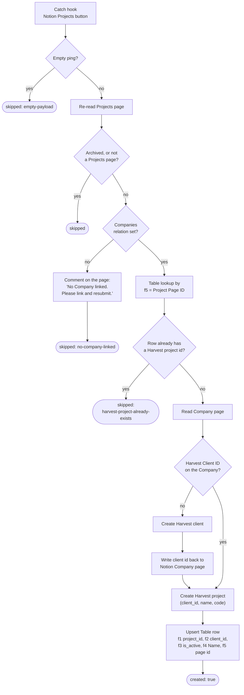

# notion-project-to-harvest-client-project

Notion Projects **"Create Harvest Project"** button → make sure the linked Company has a Harvest client, create the Harvest project against it, and record the Notion-page → Harvest-project mapping so time tracking can find it.

**Status:** ✅ Enabled — ⚠️ cutover pending (the Notion button still has to be repointed at the catch URL below), and the write steps have never run (see [Verification](#verification)).

Migration of the classic Zap **"Create Harvest Client / Project"**, disabled 2026-08-07.

## What it does

1. Ignores empty pings of the catch URL.
2. Re-reads the Notion Projects page (the button's payload snapshot may already be stale).
3. No `Companies` relation → comments **"No Company linked. Please link and resubmit."** on the page and stops.
4. Already mapped to a Harvest project in the Table → stops.
5. Reads the Company page. No `Harvest Client ID` → creates the Harvest client and writes the id back onto the Company page.
6. Creates the Harvest project (`client_id`, `name` = Project name, `code` = e.g. `WF-26`).
7. Upserts the mapping row in Zapier Table `01K8A2KV9X1W95GAB6Y69D7G4C`.

## Workflow



## Trigger

Catch hook — `WebHookCLIAPI@1.1.1` / `hook_v2`.

**External catch URL** (this is the one the Notion button posts to):

```
https://hooks.zapier.com/hooks/catch/20495893/1TpRZoVI55HiS2yZ/
```

Not `trigger_url` in [zap.json](zap.json) — that one is Zapier-internal.

### Cutover

The Notion Projects **"Create Harvest Project"** button property still points at the classic Zap. Repoint it at the catch URL above. Wiring a Notion button delivers an empty body on save/test, which is why the workflow skips rather than throws on an empty payload — no error alerts during setup.

## Why this is not a faithful port

The classic Zap **never worked**. Every run ended at "No Company linked. Please link and resubmit."

It was copied from a Deals-based Zap and only half-rewritten for Projects:

| Classic Zap referenced | Reality on Projects |
| --- | --- |
| `properties.Company.relation[].id` (branch filter + Table lookup) | the relation is **`Companies`** (plural) — `Company` does not exist, so the "Company Linked" path never matched |
| `properties["Company Name"].rollup…` (Harvest client name) | Projects has no `Company Name` rollup — only `Company ID` and `Company Domain` |
| `Project ID` prefix assumed `PRJ` | the real prefix is `WF` |
| Two sibling Paths, one creating the client and one creating the project | they raced: the project path read a Harvest client id the client path had not written yet |
| Step 8 wrote `f1 = "PRJ-n"`, `f3 = true`; step 14 then overwrote `f1` with the Harvest project id and `f3` with `is_active` | contradictory writes to the same row |

Dennis confirmed on 2026-08-07: fix the logic rather than reproduce it. Client and project are now created **sequentially**, and the "No Company linked" comment is kept for the genuine no-company case.

**Also confirmed: no dedupe search before creating.** The durable does not call Harvest's Find Client / Find Project first. Idempotence rests entirely on the `Harvest Client ID` property and the Table row, matching the classic Zap. A client or project that exists in Harvest but is recorded in neither place will be created again.

## Maintainer notes

- **The Notion Company page is the source of truth for `Harvest Client ID`**, not the Company IDs Table (`01JM8PH8YM93A482M8BFZ6WKW6`). The classic Zap upserted that Table directly; here [`notion-companies-to-zapier-table`](../notion-companies-to-zapier-table/) mirrors the property into it, so writing the page keeps the Table correct with no work here. Same call this repo already made in [`xero-contact-from-notion-deal`](../xero-contact-from-notion-deal/).
- **[`harvest-project-to-zapier-table`](../harvest-project-to-zapier-table/) writes the same table.** Its Harvest poll fires minutes after this durable creates a project, and it **upserts on `f1`** — so it enriches the row written here rather than adding a duplicate, and it never touches `f5`. That table was reconciled on 2026-08-07 (66 rows → 50; 16 duplicate pairs removed, `is_active` re-synced against Harvest); read that directory's README before reasoning about its contents.
- **`f3` must carry Harvest's real `is_active`**, not a hardcoded `true` — [`start-a-timer-from-notion-task`](../start-a-timer-from-notion-task/) reads this Table on `(f5, f3 = true)` and will not find a project whose row says otherwise.
- **`previewOnly`** — `run-durable`/`trigger-workflow` with `{"pageId":"…","previewOnly":true}` resolves the whole chain and reports what *would* be created, writing nothing: no Harvest client, no Harvest project, no Notion comment, no Table row. It deliberately walks past the "already mapped" guard so a mapped project can still exercise company resolution. A Notion button never sets it.
- **Reading Tables results:** `find_record` keys the row `data` by **field id** (`f1`, `f5`), while the CLI's `list-table-records` keys it by **field name** (`project_id`, `Project Page ID`). Cross-referencing the two with the wrong keys silently yields `undefined` for every row.
- Connection aliases `notion_wf` and `harvest_wf`, resolved at run/publish time via `--connections`. Zapier Tables needs no connection and costs no tasks.

## Verification

| Path | Status |
| --- | --- |
| Empty-payload ping | ✅ run `019fda44-77d2-7115-9e8b-1d955196cb36` → `{ skipped: "empty-payload" }` |
| No `Companies` relation (WF-26, preview) | ✅ run `019fda44-8316-742e-8350-3d6369e58e69` |
| Full resolution chain (WF-25, preview) | ✅ run `019fda43-e021-7d66-a45e-faf4d6c96d84` — resolved *Noah Health Pte Ltd*, existing client `15890649`, existing Table row `01KVJKA04T13AJDB8XH693JTT9` / project `48549718`, code `WF-25` |
| `tsc --strict --noEmit` | ✅ passes |
| **`create-harvest-client`** | ❌ never run |
| **`write-client-id-to-notion`** | ❌ never run |
| **`create-harvest-project`** | ❌ never run |
| **`create-project-row` / `update-project-row`** | ❌ never run |
| **`comment-no-company`** | ❌ never run |

No Notion project currently needs a Harvest project — only WF-1 and WF-2 lack a mapping, and both are completed 2026 workshops — so a live end-to-end test would have created a throwaway Harvest client and project. **The first real button click is the write path's first test.** Watch that run.
