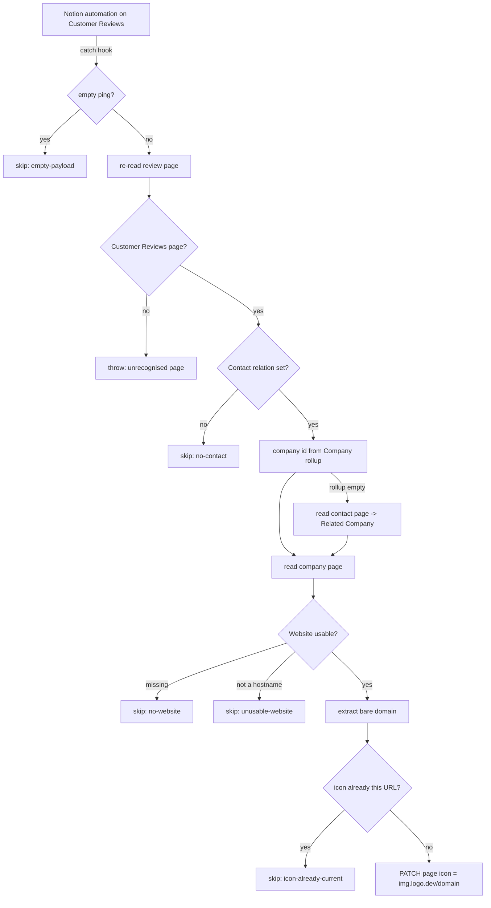

# Notion Review → Company Logo

Durable replacement for the classic Zap **"Add Logo to Customer Review"**. A
Customer Review page gets its page **icon** set to the reviewer's company logo,
fetched from [logo.dev](https://logo.dev) by the company's own domain.

## What it does

1. **Trigger** — catch hook (`WebHookCLIAPI@1.1.1` / `hook_v2`) posted to by a
   Notion automation on the **Customer Reviews** data source
   (`ff49c51a-79b1-4254-872a-d1934b8696f6`). An **empty ping** — pasting the
   catch URL into a Notion automation and hitting "test", opening it in a
   browser, curling it — is skipped with a log line instead of throwing, per
   the repo-wide rule. A payload carrying content but no page id still throws,
   loudly.
2. **Re-read the review page.** The automation's snapshot may be stale, and the
   `Company` rollup this workflow depends on is not reliably included in the
   webhook body.
3. **Confirm it is a Customer Review.** The catch URL is public, and Deals
   carries a `Contact` relation too — a page from another data source would
   otherwise have its icon rewritten from an unrelated company's logo. A page
   whose parent is a different data source, or which has no `Contact` property
   at all, throws.
4. **Resolve the company.** The review's `Company` rollup (`Contact` →
   `Related Company`) already holds the company page id, so the common path
   costs no extra read; the contact page is fetched only when the rollup comes
   back empty.
5. **Read `Website` off the company** and reduce it to a bare host.
6. **PATCH the review page's icon** to
   `https://img.logo.dev/<domain>?token=<publishable key>`.

## How it differs from the classic Zap

- **The classic Zap could no longer find a company at all.** Its step 3
  searched Companies for `Clay Contacts` **relation contains** the trigger's
  contact id — and Companies has no `Clay Contacts` property any more (the
  live relation is `Contacts`). The durable walks the `Company` rollup that
  already sits on the review page instead, which is both fresher and one call
  cheaper.
- **No Custom Action.** The classic Zap's final step was the per-account
  Custom Action `ae:373967` ("Add Page Icon to Notion Page", editable at
  `zapier.com/app/extensions/actions/373967`). `update_page` cannot write an
  icon, so the durable PATCHes `/v1/pages/{id}` directly — the same route
  [`luma-event-to-notion`](../luma-event-to-notion/) takes for covers. Nothing
  outside this repo has to stay configured for the Zap to work.
- **Tighter domain extraction.** The classic Formatter regex
  (`^(?:https?:\/\/)?(?:www\.)?([^\/]+)`) cut at the first slash only, so a
  scheme-less `work.flowers?utm=x` or a pasted `host:8080` reached the logo URL
  intact. A `Website` that is not a hostname at all (the property is free text,
  so values like "TBC" happen) now skips rather than setting a visibly broken
  image as a page icon.
- **A failed icon write fails the run.** The icon is this workflow's entire
  output, so unlike a best-effort cover it is not swallowed.

## Icons are overwritten unconditionally

**This matches the classic Zap, and it is a deliberate choice** (Dennis,
2026-09-06): every run sets the icon to the logo.dev image, replacing whatever
was there. Several review pages currently carry hand-picked icons — custom
emoji (`cogrow`, `terrascope`, `of-logo`, `elite-academy`) and uploaded files —
and a re-trigger on one of those pages **will** replace it.

The only write skipped is a byte-identical one (`skipped:
"icon-already-current"`), which would leave the page exactly as it is. If the
posture should change later, the guard is a single comparison in step 6 of
`workflow.ts`.

## The logo.dev token

`pk_MgvuyiQuRe6IT_XWNAUgrA` is a **publishable** key, carried over from the
classic Zap unchanged. It is designed to sit in a client-side image URL and is
already public — it is embedded in every review page icon this Zap has ever set,
and in [`start-a-timer-from-notion-task`](../start-a-timer-from-notion-task/)'s
Notion favicon. It is not a secret and needs no vault.

## Verified cases

Run privately via `run-durable` on 2026-09-06 against live records, source
type-checked clean (`--strict --noUnusedLocals`).

| Payload | Result |
| --- | --- |
| `{"data":{"id":"2c591b07…"}}` + `previewOnly` (co:grow review, custom-emoji icon) | Main path: rollup → company `co:grow` → `https://cogrow.company` → `cogrow.company` → correct logo URL built; prior `custom_emoji` icon reported |
| `{"data":{"id":"36491b07…"}}` + `previewOnly` (Secure Code Warrior review) | `skipped: "icon-already-current"` — the one page the classic Zap ever succeeded on |
| `{}` | `skipped: "empty-payload"` |
| `""` | `skipped: "empty-payload"` |
| `{"querystring":{}}` | `skipped: "empty-payload"` |
| `{"hello":"world"}` | **throws** `Could not find a Notion page id in the payload` |
| `{"data":{}}` | **throws** — wrapper present, payload missing |
| `{"data":{"id":""}}` | **throws** — empty-string id |
| A Companies page id | **throws** `belongs to data source 21991b07-… not Customer Reviews` |
| `null` (delivered by the CLI as the string `"null"`) | **throws** `Payload carried content but no usable Notion page id` — **0 step attempts** |
| `{"data":{"id":"not-a-uuid"}}` | **throws** the same, 0 step attempts |

**The `null` case found a real hole, now closed.** `--input null` reached the
workflow as the four-character string `"null"` — not an object, so not a ping,
and it was taken for a page id. Notion answered the malformed id with a `400`
that could never succeed, the step retried it five times, and the run reported
only `Step "fetch-review-page" exhausted all retry attempts`, destroying the
validation message that said exactly what was wrong (the retry-design trap in
[`.claude/rules/durables-sdk.md`](../.claude/rules/durables-sdk.md)). A page id
is now required to be a uuid **before** it reaches a `ctx.step`, so any
unusable id fails once, immediately, naming the payload — verified at 0 step
attempts. Real catch-hook pings deliver `{"querystring":{}}` rather than a bare
`"null"`, so this was harness-shaped, but the retry-masking half was not.

Not exercisable on live data: **`no-contact`** — all 11 review pages currently
carry a `Contact`. **`no-website` / `unusable-website`** — every company behind
a current review has a usable `Website`. Both are guard-only returns.

## Cutover

The classic Zap is **paused in full** (every node `paused: true` in the
2026-09-06 export), so there is no double-write window and this durable ships
enabled. It does nothing, however, until the Notion side is repointed:

1. Open the **Customer Reviews** automation in Notion that POSTs to the classic
   Zap's catch URL and change the URL to this Zap's `trigger.webhook_url` (see
   `zap.json` — filled in by the publish pipeline on first publish).
2. Delete the classic Zap, or leave it paused. Classic Zaps are exposed by
   neither the SDK CLI nor the MCP connector, so this is a Zapier-UI step and
   is not machine-verifiable from this repo.

Until step 1 happens, nothing reaches this durable.

## Backfill

10 of 11 review pages do **not** carry a logo.dev icon (3 have no icon at all,
7 have hand-set emoji or uploaded files). This Zap only fires on new events, so
existing pages are untouched until something re-triggers them. A backfill would
be a separate script, and — given the overwrite posture above — would replace
those hand-set icons; it is deliberately not part of this migration.
