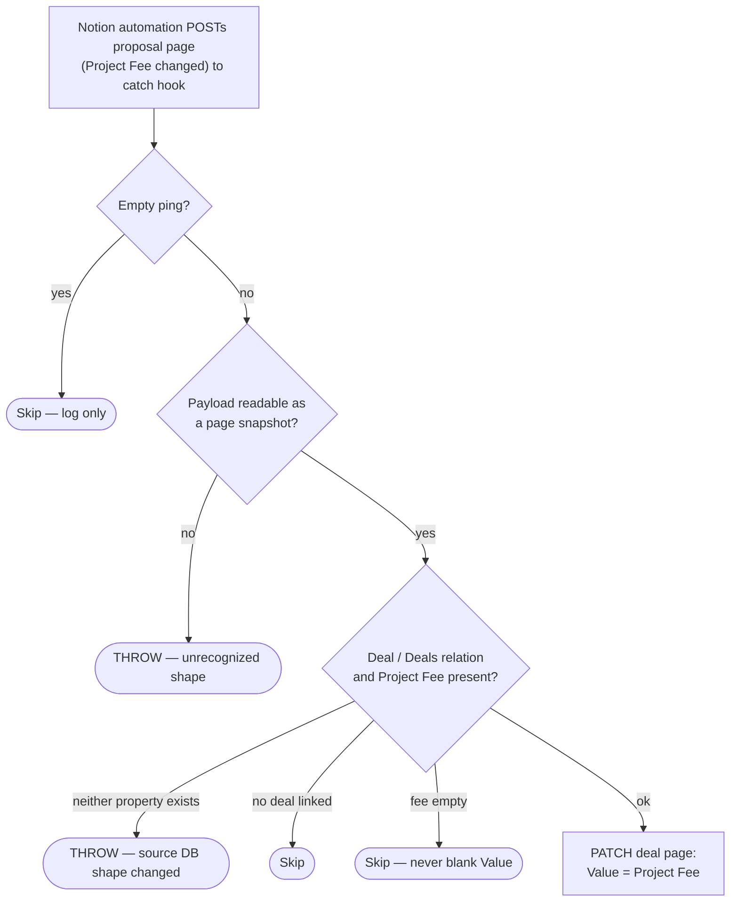

# proposal-fee-to-deal-value

Proposal webhook from Notion → copy the proposal's **Project Fee** onto the
related Deal's **Value**.

Migration of the classic Zap **"Update Deal Value When Proposal Fee Updated"**.

- **Workflow ID:** `019feb0a-b966-78a1-b2e1-da422eca223f` (account-visible)
- **Trigger:** Webhooks by Zapier catch hook —
  `https://hooks.zapier.com/hooks/catch/20495893/cCSLFIVwOZMqVxFz/`
- **Editor:** <https://zapier.com/durables-editor/019feb0a-b966-78a1-b2e1-da422eca223f>

## ⚠️ Staleness flag — verify at cutover

As of 2026-08-10 **no data source visible to the work.flowers Zapier
integration carries a "Project Fee" property**. The current *Project
Proposals* data source (`1d791b07-11ac-8058-8c70-000b0d0dfaf2`) has `Deals`
but no fee — fees appear to have moved into the Xero Quote flow — and the
classic Zap's export already showed `has_automatic_issues` on its Notion step.
The source database is either unshared with the integration (a Notion webhook
automation doesn't need sharing) or has been restructured since the Zap was
built. **When repointing the Notion automation, open it and confirm what its
source database actually sends.** If the shape changed, this durable throws
loudly, naming the properties it saw.

## Workflow

## What changed vs the classic Zap

- **The payload is the input** — unlike this repo's other Notion durables, the
  source page can't be re-read because its database isn't shared with the
  integration. Only the fee and the deal relation are read from it.
- **An empty fee skips instead of writing** (the mirror rule: never blank what
  you failed to read). The classic Zap would have pushed an empty value at the
  Deal.
- Accepts both `Deal` and `Deals` as the relation name, since the current
  Project Proposals schema uses the plural.
- Empty-ping skip; unrecognizable content throws loudly.

## Testing

`run-durable` on 2026-08-10, **full main path** with a no-op value: synthetic
payload carrying deal `9ca1f339-617f-4e08-946b-7bb00a475fa9` (Tannin Road) and
its current fee `2500` → `updated: true`, Deal Value re-written to the same
number. Empty-ping payload → `skipped: empty-payload`.

## Cutover (pending)

1. In Notion, find the automation that POSTs proposal pages to the classic
   Zap's catch URL, repoint it to the `webhook_url` above, and **verify the
   source database still sends `Project Fee` + a `Deal`/`Deals` relation**
   (see the staleness flag).
2. Disable the classic Zap **"Update Deal Value When Proposal Fee Updated"**
   in the Zapier UI.
3. Record both in `zap.json` → `cutover`.

## Maintainer notes

- Connection: `notion_wf` = work.flowers Notion
  (`02b73654-15c8-85c3-b16a-07304d2beb17`).
- Writes Deals `Value` via a raw page PATCH (the action schema cache goes
  stale on newly added properties; same pattern as the rest of the repo).
