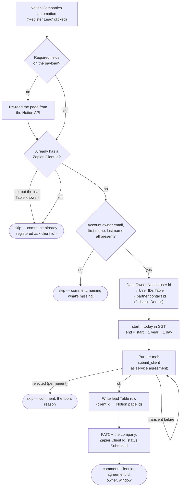

# register-zapier-partner-lead

Clicking **Register Lead** on a Notion **Companies** record submits that company's Zapier account owner to the **Zapier Solution Partner** program as a managed-revenue client, indexes the resulting client id against the Notion page, and stamps the client id + `Submitted` status back on the record.

Migration of the classic Zap **Register Zapier Lead**. Its sibling, [`zapier-partner-lead-status-to-notion`](../zapier-partner-lead-status-to-notion/), tracks what Zapier then does with the lead.

**Status:** ✅ Published and enabled, trigger claimed. The Notion button now posts here — a real click on **Maintain It Australia** arrived on 2026-08-07. One step of the cutover is still unconfirmed: whether the classic Zap has been switched off. See [Cutover](#cutover).

## What it does



## Trigger

Webhooks by Zapier Catch Hook (`hook_v2`). A Notion database automation on the **Companies** data source (`21991b07-11ac-80b0-b787-000b3d3995f6`, in *Core CRM Objects*) posts the page on button click.

The automation must POST to the **catch URL**:

```
https://hooks.zapier.com/hooks/catch/20495893/Cpw1RVzven0oltapo/
```

Not the `code-substrate-workflows.zapier.com` `trigger_url` in `zap.json`, which is Zapier-internal.

The payload is the standard Notion automation shape — `{ data: { id, url, properties }, source: { user_id } }` — and the workflow reads the page id, `Company Name`, `Size`, `Zapier Client Id`, `Zapier Lead Status`, and four rollups: `Account Owner Email` (plus its `Account Owner Email Override`), `Account Owner First Name`, `Account Owner Last Name`, and `Deal Owner`.

## Cutover

1. ✅ **Repoint the automation's *Send to webhook* step at the catch URL above.** Done — run `019fda07-17e1-7c57-b0b2-dbb0f305eba7` (2026-08-07T02:22Z) is a genuine button click delivered here, which is the only proof that exists from this side.
2. ⬜ **Turn off the classic Zap *Register Zapier Lead*** — otherwise a single click submits the lead twice, and the partner tool will open a second service agreement against the same client. Not verifiable from the SDK (it lists durables only, not classic Zaps), so confirm it in the Zapier UI.

If the classic Zap was still live for the 2026-08-07 click, client `0280000000005zR00hE` may carry a duplicate service agreement. The partner tool exposes no agreement search — `find_client_portfolio` returns the client and its end date only — so that has to be checked partner-side too.

## What changed from the classic Zap

| # | Classic Zap | Here | Why |
| --- | --- | --- | --- |
| 1 | Wrote nothing to Notion | Stamps `Zapier Client Id` and `Zapier Lead Status: Submitted`, then comments | A company had no client id — and no sign the click had worked — until a status change happened to arrive later. `Submitted` was already an option in the select that nothing ever set |
| 2 | Re-clicking submitted again | Skips, and says why on the page | `submit_client` reuses an existing client record but opens a **second service agreement**, and the Table gained a duplicate row |
| 3 | `end_date` = `+11 months` | `start + 1 year − 1 day` | The tool requires *less than* 12 months; 11 gave away roughly a month of commission window on every agreement |
| 4 | Two Formatter steps for the dates | Computed inline | Two tasks per run for arithmetic |
| 5 | `company_size` sent empty | Mapped from Notion's `Size` | The vocabularies already agree bar the top band (`1000+` → `1,000+`) |
| 6 | `source` sent empty | `"Notion CRM"` | Provenance on the partner-side client record |
| 7 | `Success` ← a `success` field the response doesn't carry | `Boolean(client.id)` | All three rows the classic Zap wrote say `false` despite carrying a service agreement id |
| 8 | `Status` ← a `status` field the response doesn't carry | `"Submitted"` | Same: that column was `null` on every row it created |
| 9 | Table dates written bare (`YYYY-MM-DD`) | Pinned `T00:00:00Z` | Tables coerces a bare date into the account timezone, storing `T16:00:00Z` the *previous* day |
| 10 | A missing rollup produced a hard failure | Re-reads the page, then skips with a comment naming the gap | A Notion automation payload can omit a rollup; and a genuinely empty field is permanent, so retrying it just spins the durable |

## Maintainer notes

- **The Notion write goes through the raw API, not `NotionCLIAPI`.** The `update_database_item` action addresses properties as `properties|||<name>|||<type>` keys drawn from a **cached** schema, and that cache still did not list the six `Zapier …` properties added for this migration minutes after they existed. A raw `PATCH /v1/pages/{id}` names properties directly, so it can't go stale, and it costs the same (a raw request through a connection is billed like an action — only Zapier Table ops are free).
- **`submit_client` is create-or-reuse on (partner account, client email)** and explicitly *does not* update an existing client's details. That's why repeat clicks are guarded in code rather than left to the tool.
- **Permanent vs. transient submit failures are classified**, and only transient ones are rethrown inside the step to earn a durable retry. A rejected input is reported on the page instead — retrying it can only spin the retry loop until the run gives up, telling nobody why. An unrecognised error is treated as transient so an unfamiliar outage isn't silently written off.
- **The partner-contact fallback is inferred, not read.** The classic Zap defaulted `partner_contact_id` to a `Components.variables[…]` value that isn't readable through the SDK. `DEFAULT_PARTNER_CONTACT_ID` is Dennis (`00500000000005d00hE`), who owns 245 of the 247 leads on the account. It only applies when the Deal Owner has no partner contact id of their own; the seven valid ids are enumerable via `list-action-input-field-choices App227952CLIAPI write submit_client partner_contact_id`.
- **The `Zapier Partner Contact ID is not null` filter is load-bearing.** Without it the User IDs lookup can return a row whose partner contact id is blank, shadowing the fallback with an empty string — and `submit_client` requires that field. Verified: Dennis's Notion user id returns his row; Jade's (no partner contact id) returns zero rows, so the fallback applies.
- **Timezone is load-bearing for the start date.** "Today" is the Singapore day; the UTC day rolls over at 08:00 SGT, so a UTC date would back-date every agreement registered before 8am. Singapore has had no DST since 1982, so the code uses a fixed +8 offset rather than depending on the durable runtime carrying a full ICU timezone database.
- **A Zapier Table `labeled_string` column rejects an empty string.** `""` fails the whole `createTableRecords` call with a 400 `Labeled string must have a value key`; a non-empty plain string is coerced into `{value, label}` fine, and plain `string` columns take `""` happily. So an optional value bound to a labeled column must be *omitted*, never blanked — and because the failure is permanent, the durable's retries can only exhaust themselves. This cost the first live click (see below).
- **`@zapier/zapier-durable` is pinned to 0.10.1, not the latest.** A publish on 0.11.0 failed at run time with `Dependency installation failed` — the runtime's pnpm enforces a minimum release age and 0.11.0 was under a day old. Check the publish date before bumping.

## Verified

| What | How | Result |
| --- | --- | --- |
| **Repeat-click skip, end to end** | Live `trigger-workflow` run with Kim Hing's real page wrapped as an automation payload | `{ skipped: true, reason: "already registered", clientId: "02800000000053P00hE" }`, and the page comment posted with an `@Dennis` mention: *"Already registered as a Zapier partner lead — client `…`, status Approved. Nothing re-submitted…"*. Extraction, the duplicate guard and the raw Notion comment POST all confirmed against the real runtime. **That test comment is still on Kim Hing's page** — harmless and accurate; resolve it in Notion if you'd rather it went |
| Payload extraction from a real Companies page | Offline harness over `GET /v1/pages` for Kim Hing and Tannin Road, wrapped as an automation payload | All fields correct. Kim Hing: email/first/last from the rollups, `Size` `1-49` mapped, `Deal Owner` → Ernest's Notion user id. Tannin Road: no `Size` → `""` |
| Deal owner → partner contact | Ernest's Notion user id via the User IDs Table | `0050000000007Z700hE` — exactly what the classic Zap recorded on Kim Hing's Table row. Tannin Road's Dennis → `00500000000005d00hE`, likewise matching |
| `isnull` filter behaviour | Live Table query | A user with a partner contact id returns 1 row; one without returns 0, so the fallback applies |
| Agreement window arithmetic | Offline, incl. leap years | `2026-07-28 → 2027-07-27`; `2028-02-29 → 2029-02-28`; `2027-03-01 → 2028-02-29` |
| SGT day boundary | Offline | `15:59Z → 2026-07-28`, `16:00Z → 2026-07-29` |
| Error classification | Offline | HTTP 400/validation → permanent; 503, `socket hang up`, unrecognised → transient |
| Types | `tsc --strict` against durable 0.10.1 + sdk 0.91.0 | Clean (re-run after the 2026-08-07 fix) |
| **`submit_client` happy path** | First real button click, Maintain It Australia | Client `0280000000005zR00hE` created, window `2026-08-07 → 2027-08-06` accepted, `source: "Notion CRM"` recorded. The run then failed on the Table write — see [First live click](#first-live-click--maintain-it-australia-2026-08-07) |
| Blank `Size` → Table write | The same run, then the fix | `""` into the `labeled_string` `Client Company Size` = 400 `Labeled string must have a value key`; omitting the key writes the row with that column null |

## First live click — Maintain It Australia, 2026-08-07

The happy path was exercised for real for the first time, and **it failed after registering the lead**. Worth reading before touching the Table write.

Run `019fda07-17e1-7c57-b0b2-dbb0f305eba7` (02:22:05Z → 02:26:20Z, `failed`):

```
StepExhaustedError: Step "index-lead-in-table" exhausted all retry attempts.
  cause: ZapierValidationError 400 — "Labeled string must have a value key."  (meta.value: "")
```

Maintain It Australia had no `Size`, so `companySize` was `""`. The lead Table's **`Client Company Size` is a `labeled_string` column, and Tables rejects `""` for that type** — a 400, i.e. permanent, so the step burned every retry and the run died at step 7. `submit_client` had already succeeded at step 6, leaving the lead registered in the partner program with nothing in the Table and nothing on the Notion page — precisely the split state the step ordering was meant to avoid.

Fixed in version `019fda12-a071-7ecd-9222-c0bc94c1766e`: `Client Company Size` is spread into the record only when non-empty, so a company with no `Size` leaves the column unset. `Status` is the only other `labeled_string` in that table and always gets `"Submitted"`. **Any future optional value mapped into a labeled column needs the same treatment** — check types with `zapier-sdk list-table-fields 01KPZFHX4RP6SER3AEK4YJ62BF` (`get-table` returns metadata only, no fields).

The failed run's state was repaired by hand: Table row `01KZD197ATZRSZG6TKXH38M4R5` written for client `0280000000005zR00hE`, and the page stamped with that client id + `Submitted` plus an explanatory comment. Two things could not be recovered — the **service agreement id**, `client`, and `created_on`, which only existed in the lost `submit_client` response (the partner tool has no agreement search), and `Client Owner Id`. Those four columns are null on that row.

Also learned from the same run: `brett@maintainitaustralia.com.au` returns `zapier_account_status: "No Account Found"`, so **this lead cannot progress past `Submitted`** until the real Zapier account-owner email is supplied. That is a data question for the account, not a Zap bug — but it means the sibling status-change workflow will stay quiet for this company.

### What the run did settle

Both open questions from the pre-launch "Remaining work" are now answered:

1. **The response shape is as inferred.** `extractSubmitResult` produced a client id, so `client.*` is right. `service_agreement.*` is unproven — the run died before anything read those fields back, and they are exactly the columns that came out null.
2. **The tool accepts `start + 1 year − 1 day`.** `find_client_portfolio` reports `service_agreement_end_date: 2027-08-06T00:00:00` against a `2026-08-07` start — no rejection, so the 11-month offset stays retired.
