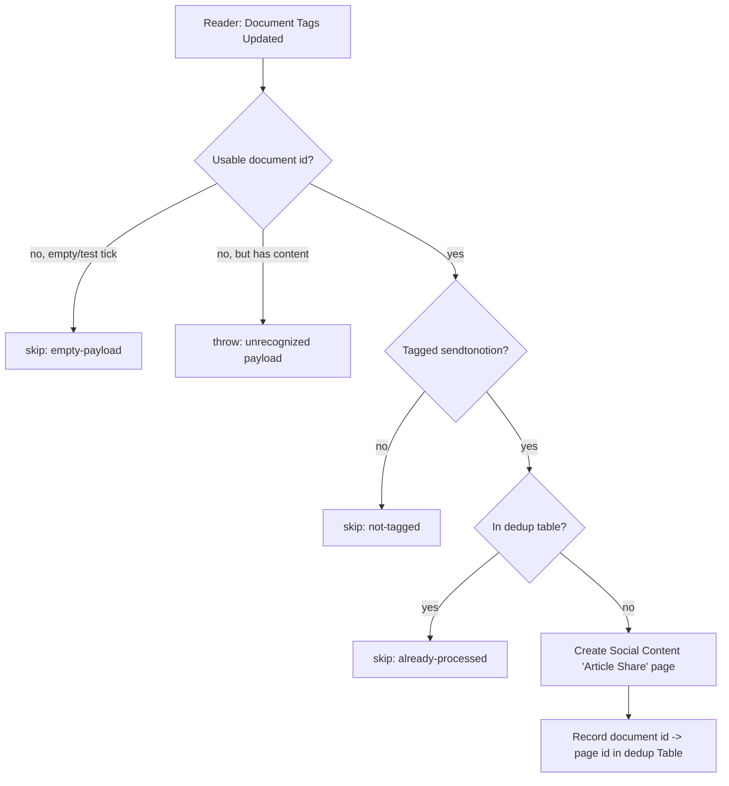

# save-tagged-docs-to-notion

Migrated from the classic multi-step Zap **"Save Tagged Docs in Notion"** (paused since 2026-08-29).

When a Readwise Reader document is tagged **`sendtonotion`**, this durable creates an **"Article Share"** idea in the work.flowers Notion **Social Content** data source, so a saved article becomes a LinkedIn content idea. A free Zapier Table keyed on the Reader document id is the dedup ledger, so each document is turned into a page exactly once.

## Trigger

- **Readwise Reader — "Document Tags Updated"** (`App228555CLIAPI@1.0.3` / `document_tag_updated`), a polling trigger on the `d.chiuten@icloud.com` Reader connection.
- The trigger has **no tag filter** — it fires on any tag change to any document. The `sendtonotion` gate is enforced in `workflow.ts`.

## What it writes

A Social Content page with these properties (mirroring the classic Zap):

| Property | Value |
| --- | --- |
| Name (title) | `Article Share: <title>` |
| Type (select) | `Article Share` |
| Status (status) | `Ideas 🧠` |
| Author (people) | Dennis |
| Channel (multi-select) | `LI@dchiuten` |
| sc_link_article (url) | document source URL |
| sc_title_article (rich text) | document title |
| sc_first_comment (rich text) | `"<title>": <source_url>` |
| Research note (checkbox) | ✓ |

Page creation uses `template_mode: "default"` (repo rule 5); if the Social Content data source has no default template, the create is retried without it.

## Dedup ledger

Zapier Table `01KKNC03EA4Z5Y0KR8H6TP2A8K` — columns: `Document ID` (f1), `Date Added` (f2), `Notion Page ID` (f3). A document already present is skipped; a newly created page is recorded here.

## Flow

## Maintenance notes

- **Unrecognized-payload posture: throw** (repo default). A payload with real content but no extractable document id is treated as a vendor schema change and raises, producing a red run and an alert. An empty/test tick skips silently.
- **Known Zapier bug (open, ticket W6ZE93-VMEWP):** durable polling triggers never re-fire for a document id they have already delivered. Adding `sendtonotion` to a document that previously fired under a different tag edit may not re-deliver, so the tag can be missed. Re-verify when Zapier reports movement. Until then, the manual backfill path below covers gaps.
- **Backfill:** documents tagged `sendtonotion` during a downtime can be reconciled by comparing Reader (filter by tag) against the dedup Table and creating any missing pages + ledger rows. A backfill for the 2026-08-29 → migration gap was run when this Zap was migrated.
