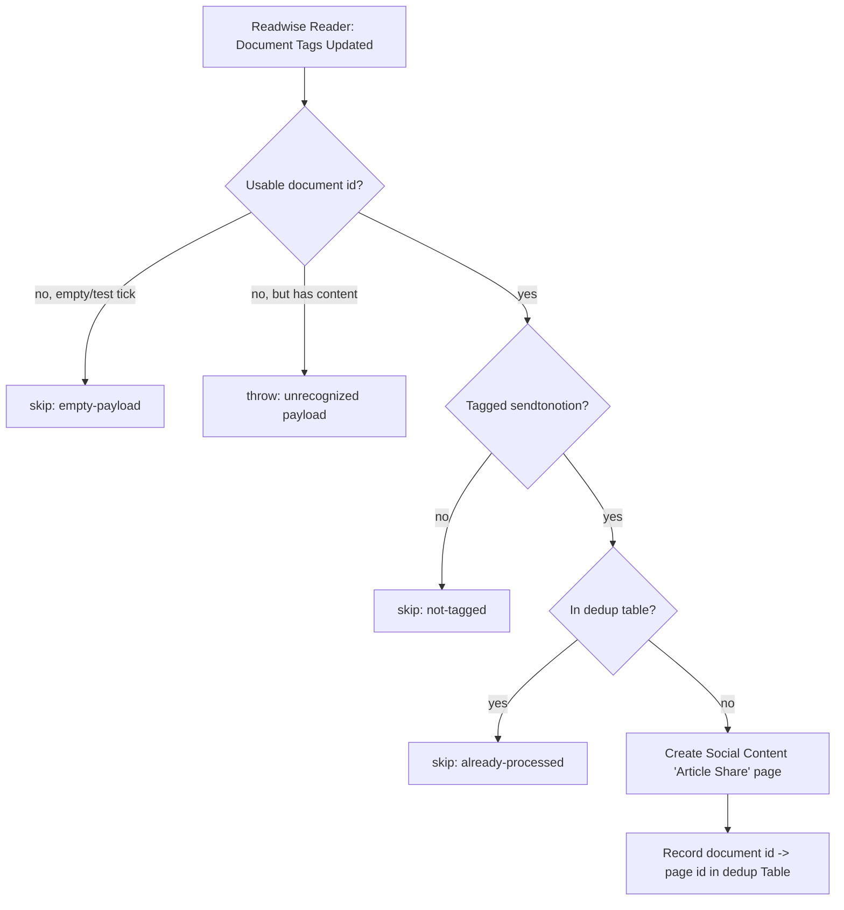

# save-tagged-docs-to-notion

Migrated from the classic multi-step Zap **"Save Tagged Docs in Notion"** (paused since 2026-08-29).

When a Readwise Reader document is tagged **`sendtonotion`**, this durable creates an **"Article Share"** idea in the work.flowers Notion **Social Content** data source, so a saved article becomes a LinkedIn content idea. A free Zapier Table keyed on the Reader document id is the dedup ledger, so each document is turned into a page exactly once.

## Trigger

- **Readwise Reader — "Document Tags Updated"** (`App228555CLIAPI@1.0.3` / `document_tag_updated`) on the `d.chiuten@icloud.com` Reader connection. Despite the name it is a REST hook, not a poll: Zapier registers a `hooks.zapier.com/hooks/standard/…` webhook in Readwise's webhook settings for the `tags_updated` event.
- The trigger has **no tag filter**: it fires on any tag change to any document. The `sendtonotion` gate is enforced in `workflow.ts`.

## ⚠️ Tags added after Reader's auto-tagging are dropped

The durable runtime dedupes every trigger delivery on the record id (Zapier bug W6ZE93-VMEWP, confirmed 2026-09-08, no ETA), so this Zap fires **once per Reader document, ever**. Reader auto-tags articles on save, which usually uses up that one firing, so a `sendtonotion` tag added later never reaches the workflow. Nothing errors and run history looks normal. 5 of the 9 documents tagged between 2026-09-16 and 2026-09-29 were missed this way and backfilled by hand on 2026-10-01.

**A catch hook does not escape it (tested 2026-10-01).** The trigger was briefly switched to a raw `WebHookCLIAPI` catch hook. Two identical POSTs with top-level `id: dedupe-probe-20261001` produced one run: the second was accepted (`status: success`) and never ran. A control with a different id ran within seconds. The durable dedupe keys catch-hook payloads on their top-level `id`, and Readwise puts the document id there, so the native trigger was restored as simpler and no worse.

**Why there is no automated backstop.** A scheduled sweep (list Reader documents tagged `sendtonotion`, create any missing from the dedup Table) would fix this, but it needs a Readwise access token: Zapier's relay refuses to attach the Reader connection's credentials (`This authentication does not specify a domain filter`). Dennis chose not to store a token (2026-10-01). Revisit if Zapier ships the fix or a token store becomes acceptable.

## What it writes

A Social Content page with these properties (mirroring the classic Zap):

| Property | Value |
| --- | --- |
| Name (title) | `Article Share: <title>` |
| Type (select) | `Article Share` |
| Status (status) | `Ideas 🧠` |
| Author (people) | Dennis |
| Channel (multi-select) | `LI@dchiuten` |
| sc_link_article (url) | document source URL |
| sc_title_article (rich text) | document title |
| sc_first_comment (rich text) | `"<title>": <source_url>` |
| Research note (checkbox) | ✓ |

Page creation uses `template_mode: "default"` (repo rule 5); if the Social Content data source has no default template, the create is retried without it.

## Dedup ledger

Zapier Table `01KKNC03EA4Z5Y0KR8H6TP2A8K` — columns: `Document ID` (f1), `Date Added` (f2), `Notion Page ID` (f3). A document already present is skipped; a newly created page is recorded here.

## Flow

```mermaid
flowchart TD
  A[Readwise Reader: Document Tags Updated] --> B{Usable document id?}
  B -- no, empty/test tick --> S1[skip: empty-payload]
  B -- no, but has content --> ERR[throw: unrecognized payload]
  B -- yes --> C{Tagged sendtonotion?}
  C -- no --> S2[skip: not-tagged]
  C -- yes --> D{In dedup table?}
  D -- yes --> S3[skip: already-processed]
  D -- no --> E[Create Social Content 'Article Share' page]
  E --> F[Record document id -> page id in dedup Table]
```

## Maintenance notes

- **Unrecognized-payload posture: throw** (repo default). A payload with real content but no extractable document id is treated as a vendor schema change and raises, producing a red run and an alert. An empty/test tick skips silently.
- **Missed tags:** see the ⚠️ section above. Until Zapier fixes W6ZE93-VMEWP, run the backfill below every so often.
- **Backfill:** documents tagged `sendtonotion` during a downtime (or dropped by the dedupe bug) can be reconciled by comparing Reader (filter by tag) against the dedup Table and creating any missing pages + ledger rows. A backfill for the 2026-08-29 → migration gap was run when this Zap was migrated, and another on 2026-10-01 for the five documents the dedupe bug dropped. Watch for: a paywalled article's Reader `source_url` can carry a personal access token in its query string (Stratechery did); strip it before writing it to Notion.
