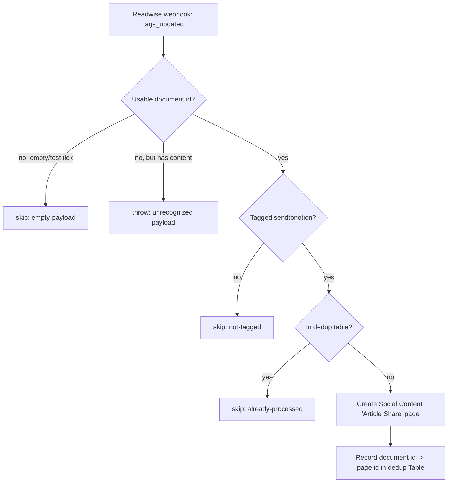

# save-tagged-docs-to-notion

Migrated from the classic multi-step Zap **"Save Tagged Docs in Notion"** (paused since 2026-08-29).

When a Readwise Reader document is tagged **`sendtonotion`**, this durable creates an **"Article Share"** idea in the work.flowers Notion **Social Content** data source, so a saved article becomes a LinkedIn content idea. A free Zapier Table keyed on the Reader document id is the dedup ledger, so each document is turned into a page exactly once.

## Trigger

- **Catch hook** (`WebHookCLIAPI@1.1.1` / `hook_v2`). The sender is a **Readwise webhook** (configured in Readwise's webhook settings) subscribed to Reader's **`tags_updated`** event, POSTing the document object to the `webhook_url` recorded in [`zap.json`](zap.json).
- The webhook has **no tag filter**: it fires on any tag change to any document. The `sendtonotion` gate is enforced in `workflow.ts`.
- **Why not the Readwise Reader app trigger?** Until 2026-10-01 this Zap used the app's "Document Tags Updated" trigger (`App228555CLIAPI@1.0.3`). That trigger is itself a REST hook (Zapier registered `hooks/standard/…` in Readwise), but the durable runtime deduped its deliveries on the document id (Zapier bug W6ZE93-VMEWP), so each document fired **once ever**. Reader auto-tags articles on save, which used up that firing, so a `sendtonotion` tag added afterwards was silently dropped. 5 of the 9 documents tagged between 2026-09-16 and 2026-09-29 were missed and backfilled by hand.

## What it writes

A Social Content page with these properties (mirroring the classic Zap):

| Property | Value |
| --- | --- |
| Name (title) | `Article Share: <title>` |
| Type (select) | `Article Share` |
| Status (status) | `Ideas 🧠` |
| Author (people) | Dennis |
| Channel (multi-select) | `LI@dchiuten` |
| sc_link_article (url) | document source URL |
| sc_title_article (rich text) | document title |
| sc_first_comment (rich text) | `"<title>": <source_url>` |
| Research note (checkbox) | ✓ |

Page creation uses `template_mode: "default"` (repo rule 5); if the Social Content data source has no default template, the create is retried without it.

## Dedup ledger

Zapier Table `01KKNC03EA4Z5Y0KR8H6TP2A8K` — columns: `Document ID` (f1), `Date Added` (f2), `Notion Page ID` (f3). A document already present is skipped; a newly created page is recorded here.

## Flow

```mermaid
flowchart TD
  A[Readwise webhook: tags_updated] --> B{Usable document id?}
  B -- no, empty/test tick --> S1[skip: empty-payload]
  B -- no, but has content --> ERR[throw: unrecognized payload]
  B -- yes --> C{Tagged sendtonotion?}
  C -- no --> S2[skip: not-tagged]
  C -- yes --> D{In dedup table?}
  D -- yes --> S3[skip: already-processed]
  D -- no --> E[Create Social Content 'Article Share' page]
  E --> F[Record document id -> page id in dedup Table]
```

## Maintenance notes

- **Unrecognized-payload posture: throw** (repo default). A payload with real content but no extractable document id is treated as a vendor schema change and raises, producing a red run and an alert. An empty/test tick skips silently.
- **Unverified: catch-hook dedupe.** It is not yet proven that the durable runtime leaves catch-hook deliveries alone. Readwise puts the document id in the payload's top-level `id`, which is the field the W6ZE93-VMEWP dedupe keys on. After the publish, POST the same non-`sendtonotion` payload twice to the catch URL: two `not-tagged` runs means the fix holds. If only one run appears, the fallback is a scheduled sweep that lists Reader documents tagged `sendtonotion` and creates any missing from the dedup Table.
- **Cutover after the publish:** in Readwise, add a webhook for `tags_updated` pointing at the new catch URL, then delete the old `hooks.zapier.com/hooks/standard/20495893/21f32aab…` webhook if Zapier has not already removed it. Tags added between the merge and that step are not delivered; reconcile them with the backfill below.
- **Backfill:** documents tagged `sendtonotion` during a downtime (or missed by the old trigger) can be reconciled by comparing Reader (filter by tag) against the dedup Table and creating any missing pages + ledger rows. A backfill for the 2026-08-29 → migration gap was run when this Zap was migrated, and another on 2026-10-01 for the five documents the app trigger dropped.
