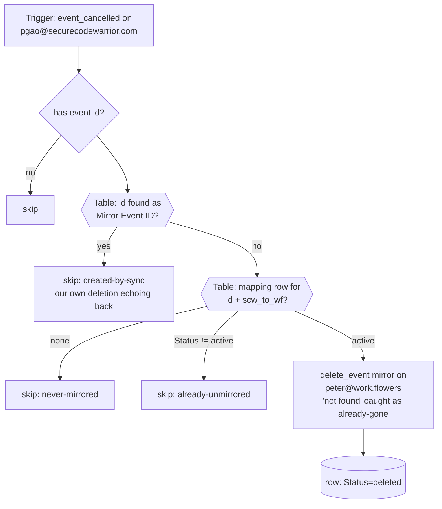

# scw-cancellations-to-workflowers-unblock-peter

**Peter's copy of [`scw-cancellations-to-workflowers-unblock`](../scw-cancellations-to-workflowers-unblock/)**, repointed at Peter's calendars, connections and table; logic identical. Deletion propagation for Peter's two-way calendar-blocking pair: triggers on **`event_cancelled`** for `pgao@securecodewarrior.com`, looks the cancelled event up in **GCal Sync Map (Peter)** (`01M2HT9XPZEASFV09J4A3QTDGT`), deletes its full-title mirror on `peter@work.flowers`, and marks the row `deleted`. Creates and updates stay with [`scw-events-to-workflowers-block-peter`](../scw-events-to-workflowers-block-peter/).

## Why this exists

The main pair's `event_updated` trigger runs with `expand_recurring: true`, and in that mode **Zapier silently drops cancellations** — proven on Dennis's pair on 2026-08-31 (0 cancelled tombstones in 100 runs vs 13/100 on an `expand_recurring: false` trigger; a deleted work.flowers event left its SCW block standing). `event_cancelled` is the per-direction fix. Its payload carries per-occurrence ids (`<seriesId>_<originalStartUTC>` for recurring instances), matching the map's keying.

## Maintainer notes

- **A truncated series never reaches this trigger.** A "this and following" edit puts an `UNTIL` on the old series and Google emits no per-occurrence tombstone for the vanished instances; [`gcal-block-sweep-peter`](../gcal-block-sweep-peter/)'s daily reconcile pass removes those orphaned mirrors.
- **Loop guard**: deleting a mirror fires `event_cancelled` on the mirror's own calendar — for this trigger's calendar, that is the reverse direction's Busy blocks being deleted. The `Mirror Event ID` table lookup (free) swallows those echoes.
- Task cost: 0 for every skip path; 1 `delete_event` per real unblock. `never-mirrored` is the overwhelmingly common outcome.
- Peter-specific: trigger on Peter's SCW connection, `gcal_wf` is Peter's work.flowers connection, trigger pinned at `GoogleCalendarCLIAPI@1.16.0`.

## Verified cases (run-durable, 2026-09-15, pre-publish, against Peter's two connections and the new table)

| Case | Result |
| --- | --- |
| Cancelled tombstone for the sibling's test event (active row, live mirror on work.flowers) | `unmirrored: true`; the mirror reads back as `status: cancelled` on `peter@work.flowers`, row `Status=deleted`, `Source Updated` refreshed |
| Same tombstone replayed | `skipped: already-unmirrored` |
| Unknown event id | `skipped: never-mirrored` |
| Id that is a known Mirror Event ID | `skipped: created-by-sync` |
