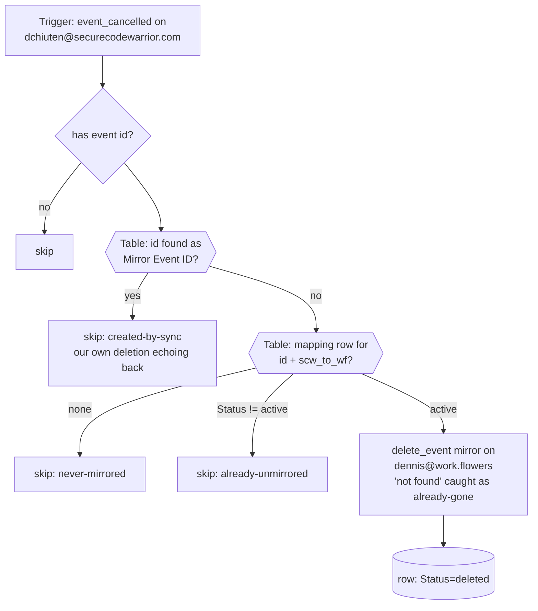

# scw-cancellations-to-workflowers-unblock

Deletion propagation for the two-way calendar-blocking pair. Triggers on **`event_cancelled`** for `dchiuten@securecodewarrior.com`, looks the cancelled event up in the shared **GCal Sync Map** Table (`01M13QPJ5GRJV33096MBNSN1Q5`), deletes its full-title mirror on `dennis@work.flowers`, and marks the row `deleted`. Creates and updates stay with [`scw-events-to-workflowers-block`](../scw-events-to-workflowers-block/); this Zap does nothing else.

## Why this exists

The main pair's `event_updated` trigger runs with `expand_recurring: true` — and in that mode **Zapier silently drops cancellations**. Proven 2026-08-31: [`gcal-event-updated-to-meeting-note`](../gcal-event-updated-to-meeting-note/) (identical trigger, `expand_recurring: false`, same account) had 13 cancelled tombstones in its last 100 runs, while the blocking Zap had **0 in 100** — and a deleted 9 AM work.flowers event left its SCW Busy block standing. The original trigger notes bet the other way based on the meeting-note Zap's behaviour; `expand_recurring` turned out to be the deciding difference. `event_cancelled` is the documented fallback, now implemented per direction. Its payload carries per-occurrence ids (`<seriesId>_<originalStartUTC>` for recurring instances), matching the map's keying.

## Maintainer notes

- **Loop guard**: deleting a mirror fires `event_cancelled` on the mirror's own calendar — for this trigger's calendar, that's the reverse direction's Busy blocks being deleted. The `Mirror Event ID` table lookup (free) swallows those echoes.
- Task cost: 0 for every skip path; 1 `delete_event` per real unblock. `never-mirrored` is the overwhelmingly common outcome (all-day, Free, declined, beyond-horizon, or pre-cutover events).
- The `event_updated` Zaps keep their own cancel branch as a belt — harmless if a tombstone ever does arrive there.

## Verified cases (run-durable, 2026-08-31, pre-publish)

| Case | Result |
| --- | --- |
| Unknown event id | `skipped: never-mirrored` |
| Id that is a known Mirror Event ID | `skipped: created-by-sync` |
| Active row, mirror already gone | delete caught as already-gone, row marked `deleted` |
