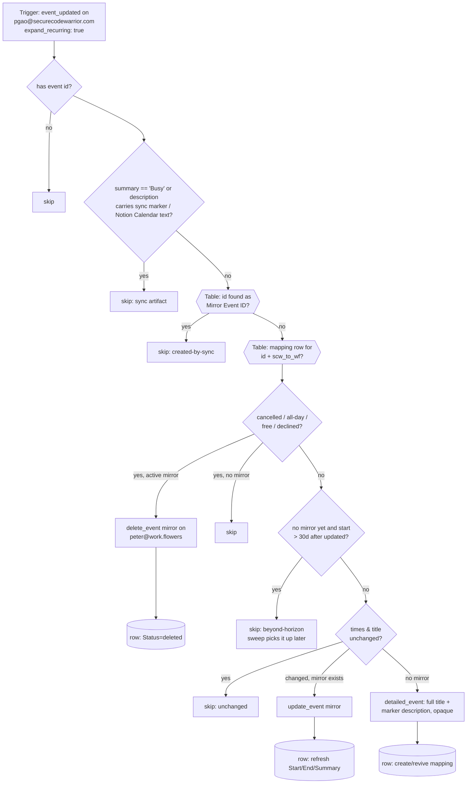

# scw-events-to-workflowers-block-peter

**Peter's copy of [`scw-events-to-workflowers-block`](../scw-events-to-workflowers-block/)** — the same workflow, repointed at Peter's two Google Calendars, Peter's two connections and Peter's own **GCal Sync Map (Peter)** Zapier Table. The logic is deliberately identical to Dennis's file (only the constants block and the names differ), so a fix in either copy should be ported to the other by diff. Read the original's README for the full war stories; this one records what is specific to Peter's deployment.

One half of the two-way calendar-blocking pair between Peter's two calendars. Watches **pgao@securecodewarrior.com** (`event_updated`, per-occurrence via `expand_recurring: true`) and mirrors every timed, busy, non-declined occurrence onto **peter@work.flowers** **with its full title**, so Peter's SCW meetings visibly block work.flowers time — and so Dennis can see Peter's availability when booking joint meetings. As on Dennis's pair, this trigger only ever sees an occurrence once (Zapier durables dedupe on the raw event id — ticket W6ZE93-VMEWP) and never receives cancellations (`expand_recurring: true` drops them), so the update/delete branches are belts: every later move, rename, decline or Free/all-day switch is propagated by [`gcal-block-sweep-peter`](../gcal-block-sweep-peter/), and deletions by [`scw-cancellations-to-workflowers-unblock-peter`](../scw-cancellations-to-workflowers-unblock-peter/).

Siblings: [`workflowers-events-to-scw-busy-peter`](../workflowers-events-to-scw-busy-peter/) (the reverse direction, bare "Busy" blocks), [`scw-cancellations-to-workflowers-unblock-peter`](../scw-cancellations-to-workflowers-unblock-peter/) (deletion propagation for this direction) and [`gcal-block-sweep-peter`](../gcal-block-sweep-peter/) (daily horizon backstop + cutover backfill). All of Peter's five share the **GCal Sync Map (Peter)** Zapier Table (`01M2HT9XPZEASFV09J4A3QTDGT`) — **never Dennis's table `01M13QPJ5GRJV33096MBNSN1Q5`**: a shared table would cross-contaminate the loop guards and mirror maps of the two people's syncs.

## Loop guards (unchanged from Dennis's — same asymmetry, so they carry over as-is)

1. **Structural** — this Zap only reads Peter's SCW calendar and only writes Peter's work.flowers calendar; the reverse Zap does the opposite. A guard miss can travel at most one hop.
2. **Table** — every mirror's event id is recorded as `Mirror Event ID`; an incoming event whose id is found there is the sync's own output (this also catches the sparse cancelled tombstone of a mirror).
3. **Content** — a bare `Busy` summary (the reverse direction's mirrors) or a description containing `[gcal-block]` is never mirrored. The `Event blocked with` (Notion Calendar) check is inherited and inert for Peter.

## What is Peter-specific

- **Calendars**: source `pgao@securecodewarrior.com`, destination `peter@work.flowers`.
- **Connections**: the trigger carries Peter's SCW Google Calendar connection; `gcal_wf` is Peter's work.flowers connection. Neither is one of Dennis's (`02cb5353-…` / `02a752ba-…`) — see `zap.json`.
- **Table**: `GCal Sync Map (Peter)`, identical 8-column schema (`Source Event ID` f1 … `Source Updated` f8).
- **Trigger pin**: `GoogleCalendarCLIAPI@1.16.0`, the version Zapier served when this was authored (2026-09-15). Dennis's originals still carry `1.15.0`.
- **No prior blocking to cut over from** — Peter confirmed on 2026-09-15 that nothing else writes busy blocks on either calendar, so this ships `enable_on_publish: true` like Dennis's originals. Cutover is just the sweep's manual backfill (see its README).
- Mirrors created on `peter@work.flowers` are not seen by [`gcal-event-updated-to-meeting-note`](../gcal-event-updated-to-meeting-note/) (that Zap polls Dennis's calendar), so the coexistence note in the original README does not apply here.

## Maintainer notes

- Keep `HORIZON_DAYS` (30) in lockstep across all five of Peter's workflows **and** with Dennis's — they are the same design.
- Task cost per run: 0 for every skip path (Table reads are free), 1 for a create/update/delete.
- Never key anything on `iCalUID` — it is series-wide. `id` is the per-occurrence key.

## Verified cases (run-durable, 2026-09-15, pre-publish, against Peter's two connections and the new table)

| Case | Result |
| --- | --- |
| New timed SCW event (16 Sep 21:00–21:30 SGT) | mirror `ob8tqvbhoc5t920il1fmue4t28` created on `peter@work.flowers` with the source title, the `[gcal-block] source:<id>` marker description, default visibility, `reminders.useDefault: false`; row written with `Direction=scw_to_wf`, `Status=active`, `Start`/`End` stored verbatim with `+08:00` |
| Same payload replayed | `skipped: unchanged`, 0 tasks |
| Bare `Busy` summary on SCW (the reverse direction's mirror shape) | `skipped: busy-block-not-mirrored` |
| Description carrying the `[gcal-block]` marker | `skipped: sync-artifact-not-mirrored` |
| Occurrence starting 90 days out | `skipped: beyond-horizon` |
| Self `responseStatus: declined` | `skipped: declined-by-self` |

The all-day and `transparent` skips share their code with [`workflowers-events-to-scw-busy-peter`](../workflowers-events-to-scw-busy-peter/), where they were exercised the same day. The test mirror and its row were then removed by the [`scw-cancellations-to-workflowers-unblock-peter`](../scw-cancellations-to-workflowers-unblock-peter/) tests and a `delete-table-records`, so the table starts empty at cutover.
