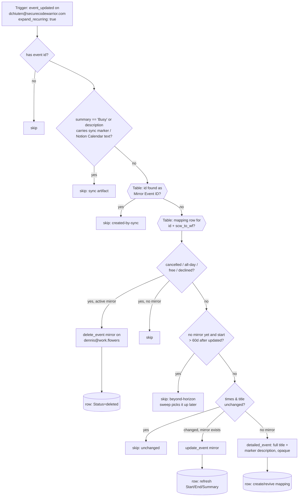

# scw-events-to-workflowers-block

One half of the two-way calendar-blocking pair between Dennis's two Google Calendars. Watches **dchiuten@securecodewarrior.com** (`event_updated`, per-occurrence via `expand_recurring: true`) and mirrors every timed, busy, non-declined occurrence onto **dennis@work.flowers** **with its full title**, so SCW meetings visibly block work.flowers time. Updates move/rename the mirror; cancellations delete it.

Siblings: [`workflowers-events-to-scw-busy`](../workflowers-events-to-scw-busy/) (the reverse direction, bare "Busy" blocks) and [`gcal-block-sweep`](../gcal-block-sweep/) (daily horizon backstop + cutover backfill). All three share the **GCal Sync Map** Zapier Table (`01M13QPJ5GRJV33096MBNSN1Q5`).

## Loop guards (why this never ping-pongs)

1. **Structural** — this Zap only reads SCW and only writes work.flowers; the reverse Zap does the opposite. A guard miss can travel at most one hop.
2. **Table** — every mirror's event id is recorded as `Mirror Event ID`; an incoming event whose id is found there is the sync's own output (this also catches the sparse cancelled tombstone of a mirror, which carries no summary/description).
3. **Content** — a bare `Busy` summary (the reverse direction's mirrors, and legacy Notion Calendar blocks) or a description containing `[gcal-block]` / `Event blocked with` is never mirrored.

## Maintainer notes

- **The horizon guard is load-bearing.** `expand_recurring: true` expanded a weekly series ~14 years (~730 instances) in one observed poll (2026-08-28). Without the 60-day create-horizon, one open-ended series would burn ~700 tasks. Zapier's dedupe means a skipped occurrence never re-fires — that gap is exactly what [`gcal-block-sweep`](../gcal-block-sweep/) exists to fill. Keep `HORIZON_DAYS` in lockstep across all three workflows.
- **Task cost per run**: 0 for every skip path (Table reads are free), 1 for a create/update/delete.
- **Change guard**: `event_updated` fires on every touch (other people's RSVPs, description edits, Gemini attaching notes — the meeting-note Zap sees ~60/day). Only a move or rename spends the update task.
- A mirror hand-deleted on work.flowers is recreated on the source's next edit (the `update_event` "not found" is caught inside the step, so it doesn't spin retries).
- Skip-worthy transitions (event declined later, changed to all-day, changed to Free) delete an existing mirror — they behave like cancellations.
- Never key anything on `iCalUID` — it's series-wide. `id` is the per-occurrence key (see [`gcal-event-updated-to-meeting-note`](../gcal-event-updated-to-meeting-note/)'s README for the war story).
- Mirrors created on work.flowers also fire [`gcal-event-updated-to-meeting-note`](../gcal-event-updated-to-meeting-note/); that Zap only updates meeting notes that already exist in its map table, so the mirrors fall through its `no-meeting-note-for-event` skip harmlessly.

## Verified cases (run-durable, 2026-08-28, pre-publish)

| Case | Result |
| --- | --- |
| New timed SCW event | mirror created on wf with title + marker, opaque, no reminders; row written |
| Same payload replayed | `skipped: unchanged`, 0 tasks |
| Time moved + renamed | mirror updated, row refreshed |
| Payload whose id is a known mirror id | `skipped: created-by-sync` |
| Occurrence starting 90d out | `skipped: beyond-horizon` |
| All-day / transparent / self-declined / summary "Busy" | skipped (correct reasons) |
| `status: cancelled` tombstone | mirror deleted, row marked `deleted` |
