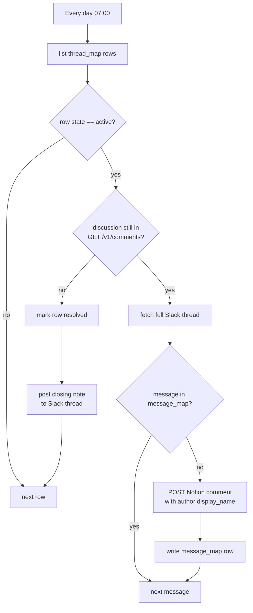

# slack-notion-thread-sync-sweep

Daily scheduled backstop behind the **Slack thread ↔ Notion discussion two-way sync** (TKT-825). Two jobs per active `thread_map` row:

1. **Resolve detection.** The Notion API cannot retrieve resolved comments — a resolved discussion simply vanishes from `GET /v1/comments` (indistinguishable from deleted). If the mapped `discussion_id` is gone, the row flips to `resolved` and a closing note posts into the Slack thread. This sweep is the *only* resolve-detection mechanism (real-time resolution would need `comment.updated` webhooks — deliberately not used in v1).
2. **Reply backstop.** Event subscriptions can drop deliveries silently. The sweep fetches the full Slack thread (`thread_replies`), diffs it against `message_map`, and mirrors anything missed — the mirror self-heals within a day, and a repo-ethos silent gap cannot persist. Idempotent: the event durable and the sweep converge on the same `slack_ts`-keyed rows.

Companions: [`slack-thread-to-notion-discussion`](../slack-thread-to-notion-discussion/) and [`notion-comment-to-slack-thread`](../notion-comment-to-slack-thread/).

## Trigger

`ScheduleCLIAPI@1.7.0` / `everyDay` at 07:00 (account timezone), weekends included.

## Behaviour notes

- The sequential per-thread iteration naturally serializes Notion writes under the ~3 req/s limit.
- Backstop mirrors at most 25 messages per thread per run (logged when hit — never silent); the remainder drains on subsequent sweeps.
- A `thread_map` row missing required fields **throws** — a corrupt mapping must surface as a red run, not rot quietly.
- Cost scales with *active* threads (~2 task-consuming actions per quiet thread per day). If that grows, add a `dormant` state for idle threads.
- v2 candidates: Slack-side edit reconciliation via text diff; real-time resolve via Notion webhooks.

## Data

| Store | ID |
| --- | --- |
| `thread_map` Table | `01M1DXXXH3E7K7JWDJYA1R50CF` |
| `message_map` Table | `01M1DXY3QEF60HX7HW8XYVE5AF` |

Design + spike evidence: [Notion task TKT-825](https://app.notion.com/p/3ce91b0711ac811aa266cfae9b977315).
