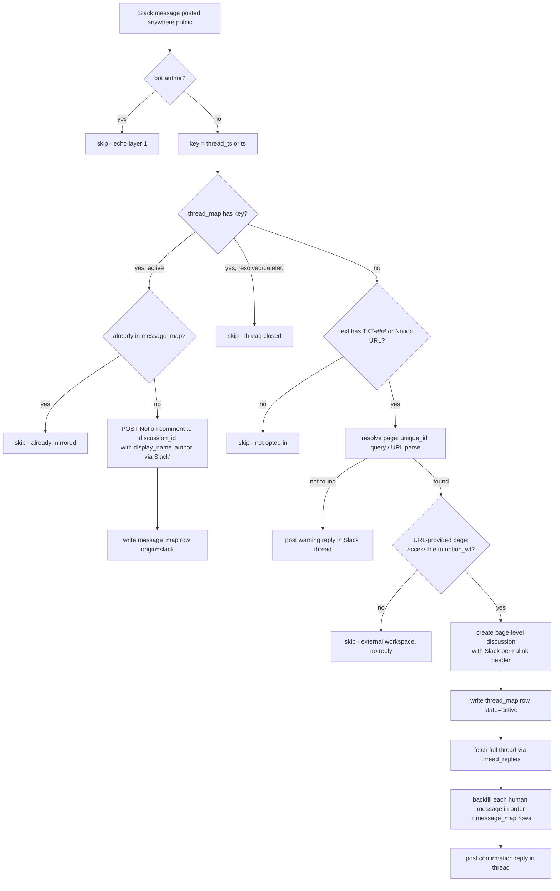

# slack-thread-to-notion-discussion

Slack → Notion half of the **Slack thread ↔ Notion discussion two-way sync** (TKT-825, modelled on Linear's Slack integration). Mention a ticket ID (`TKT-###`) or paste a Notion page URL in any public Slack thread and the thread links itself to that Notion page: a page-level discussion opens (on a page that already has an open page-level thread it joins the most recently created one — the API cannot open a second thread; accepted while TKT-825 is paused), the whole thread backfills into it, and from then on every human message in the thread mirrors as a Notion comment under the Slack author's own name (`display_name`, no name-prefix hack).

Companions: [`notion-comment-to-slack-thread`](../notion-comment-to-slack-thread/) (reverse direction) and [`slack-notion-thread-sync-sweep`](../slack-notion-thread-sync-sweep/) (resolve detection + self-healing backstop).

## Trigger

`SlackCLIAPI@1.40.1` / `anywhere_message` ("New Public Message Posted Anywhere") — **public channels only** (v1 scope). Deployed Slack triggers are event subscriptions: delivery in seconds, and thread replies DO fire with `thread_ts` (verified by deployed test 2026-09-01 — sample polls never show replies, which is documented test-time behaviour, not a limitation).

Every public message invokes the durable, but non-matching messages exit at the free guard path (plain code + Zapier Table reads consume no tasks).

## Behaviour notes

- **Opt-in is a mention, no emoji or command** — deliberate, Linear-style. The ticket ID can arrive mid-thread; the backfill covers everything before it.
- **Echo suppression** is two-layer: the companion Zap posts to Slack `as_bot`, so `user.is_bot` drops it here (the trigger's `listen_for_bots: no` is set too but has proven inconsistent — the code re-checks); `message_map` dedupe covers replays.
- **A `TKT-###` that doesn't resolve** posts a `:warning:` reply into the thread — visible to the person who typed it, never a silent drop or a red run for a typo.
- **A pasted Notion URL pointing at a page outside the work.flowers workspace** is checked with a `GET /v1/pages/{id}` against `notion_wf` before any discussion is opened; a 404 means the page isn't ours, and the thread is just left unlinked — no reply, since (unlike a mistyped `TKT-###`) pasting a link to another workspace isn't a mistake the poster needs to be told about. This also avoids posting into channels the sync bot isn't permitted to post in (e.g. Slack Connect channels the app isn't approved for) — a real failure mode hit in `#proj-notion-setup-sessions-ops` when an earlier version of this guard tried to reply.
- **Backfill caps at 50 messages** (newest kept), logged loudly when hit; the sweep can pick up stragglers.
- **Concurrency**: two first-messages racing the link can in theory both create a discussion (Tables have no atomic create-if-absent). Accepted as rare + cleanup-able per repo posture; everything is keyed on `thread_ts`.
- Slack `text` is sent as Notion markdown as-is; Slack mrkdwn syntax differences (e.g. `*bold*`) are accepted v1 roughness.
- Slack-side **edits and deletes do not propagate** (no Zapier trigger exists for them); the sweep may reconcile text later (v2).

## Data

| Store | ID |
| --- | --- |
| `thread_map` Table | `01M1DXXXH3E7K7JWDJYA1R50CF` |
| `message_map` Table | `01M1DXY3QEF60HX7HW8XYVE5AF` |
| Tasks data source (`Ticket ID` unique_id) | `27a91b07-11ac-81ed-973f-000ba6da1441` |

Design + spike evidence: [Notion task TKT-825](https://app.notion.com/p/3ce91b0711ac811aa266cfae9b977315).
