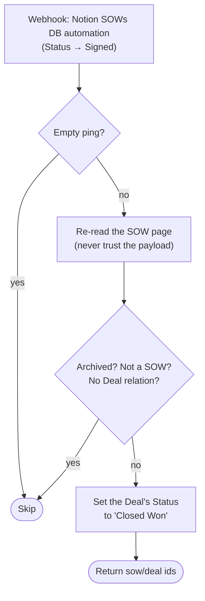

# sow-signed-to-deal-won

When an SOW reaches **Signed** in Notion, mark its related Deal **Closed Won**.

**Status:** enabled on Zapier. **Cutover pending** — the Notion SOWs automation
still posts to the classic Zap; see below.

Migration of the classic Zap **"SOW Signed -> Mark Deal as Won"**. The last hop
of the deal lifecycle these Zaps drive:
[`esignatures-send-for-signing`](../esignatures-send-for-signing/) sets the Deal
to *In signing* when the SOW goes out,
[`esignatures-status-to-notion`](../esignatures-status-to-notion/) advances the
SOW's own status, and — once a human or that Zap lands the SOW on **Signed** —
this one closes the Deal.

## What it does

1. Skips empty pings of the catch URL (`{skipped: "empty-payload"}` — wiring-up
   test clicks must not raise error alerts).
2. Re-reads the SOW page from Notion — never trusts the webhook snapshot; the
   payload may not carry the `Deal` relation at all, and it may be stale.
3. Skips if the page is archived/trashed, belongs to a data source other than
   SOWs, or has no `Deal` relation (normal — not every SOW hangs off a deal;
   parity with the classic Zap's "Related Deal Exists" filter).
4. Sets the Deal's `Status` to **Closed Won**. One SOW, one deal: the relation
   is limited to 1 in the schema; the first id is written, any extras are only
   reported in the run output (matching `esignatures-send-for-signing`).



## Trigger

Webhooks by Zapier Catch Hook (`WebHookCLIAPI@1.1.1` / `hook_v2`, no auth), fed
by a **Notion DB automation on the SOWs data source** that fires when `Status`
becomes `Signed`. A payload with content but no page id throws loudly.

## Cutover (pending)

1. Repoint the Notion SOWs automation at this workflow's catch URL:
   `https://hooks.zapier.com/hooks/catch/20495893/8DfHFErXShjCLRNn/`
2. Turn the classic Zap **"SOW Signed -> Mark Deal as Won"** off in the Zapier UI.

## Connections

| Alias | App key | Connection | Connection id |
|---|---|---|---|
| `notion_wf` | `NotionCLIAPI` | `work.flowers \| Dennis` | `02b73654-15c8-85c3-b16a-07304d2beb17` |

## Maintainer notes

- Costs ~1 task per real run (the Deal write; the SOW re-read is an `sdk.fetch`).
- The Deal status write is idempotent — re-marking a won deal is a no-op, so a
  duplicate delivery or a manual re-fire is safe.
- Verified live 2026-08-14 via `run-durable`: main path against the Terrascope
  SOW (deal already Closed Won, so the write changed nothing), no-deal skip
  (SCW Amendment), and the empty-ping skip.

## Test

```bash
SOURCE_FILES="$(jq -n --rawfile workflow workflow.ts '{"workflow.ts": $workflow}')"
zapier-sdk --experimental run-durable "$SOURCE_FILES" \
  --dependencies '{"@zapier/zapier-sdk":"0.99.0","zod":"4.4.3"}' \
  --zapier-durable-version '0.12.5' \
  --connections '{"notion_wf":{"connectionId":"02b73654-15c8-85c3-b16a-07304d2beb17"}}' \
  --input '{"data":{"id":"<sow-page-id>"}}' \
  --private
```

Use an SOW whose deal is **already Closed Won** so the live write is idempotent.
