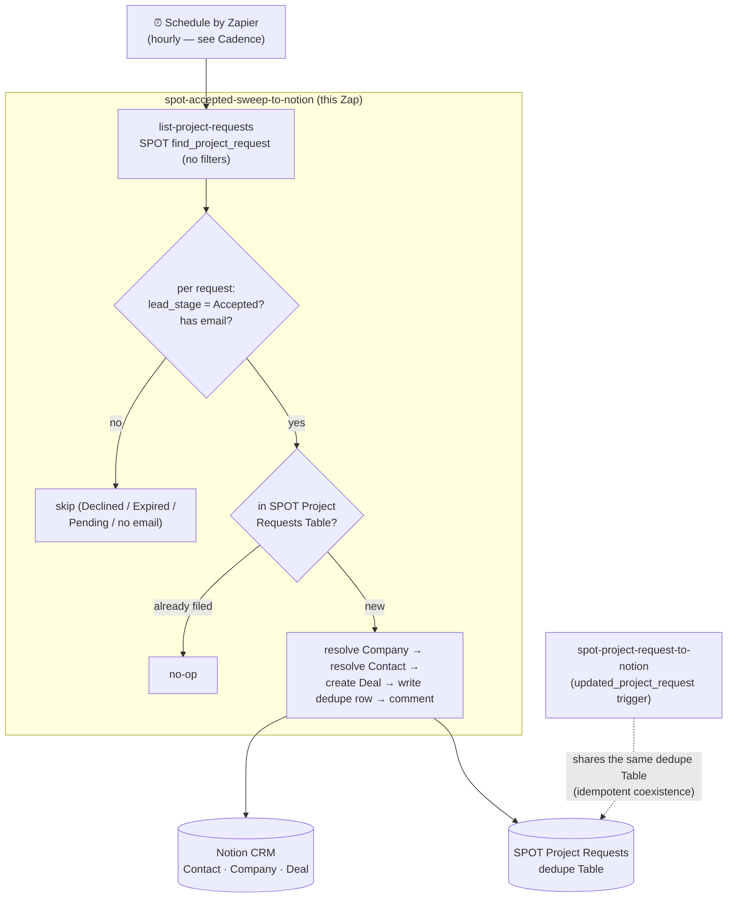

# spot-accepted-sweep-to-notion

A **scheduled reconciliation sweep** that files accepted Zapier **Solution Partner Operations Tool** (SPOT) project requests into the Notion CRM. On each run it lists *every* project request via the SPOT `find_project_request` search action and files any that are **`Accepted` but not yet in the shared dedupe Table** — creating a **Contact**, a **Company** and a **Deal**, upserted, exactly as [`spot-project-request-to-notion`](../spot-project-request-to-notion/) does for a single request.

**This is the reliable backstop for [`spot-project-request-to-notion`](../spot-project-request-to-notion/).** That Zap's `updated_project_request` polling trigger *cannot* deliver acceptances: Zapier's poller dedupes on the stable `project_request_id` (the trigger marks it the primary output field, which overrides the root-level composite `id` as the dedupe key), so a request fires once — at `Pending`, identity still withheld — and never again on the transition to `Accepted`. **Zapier Product Escalations confirmed this from their own dedup logs on 2026-08-26 (ticket `9NPEKP-739EJ`)**; the fix is on Zapier's side with no timeline, and a scheduled sweep is their own recommended workaround. See [`spot-project-request-to-notion/zap.json` → `acceptance_delivery_broken_2026_08_24`](../spot-project-request-to-notion/zap.json).

**Status:** 🅿️ **Parked, disabled, pending review + a `run-durable` test.** Authored as a `deploy: pending-create` Zap; on merge the pipeline creates and first-publishes it **disabled** (`enable_on_publish: false`). It has **not** been run — see [Before enabling](#before-enabling). Cutover is a single `enable-workflow <id>` once tested.

## How it fits with the trigger Zap

Both Zaps write the same records and share one dedupe Table (`01KYV1R8BWAZ697HQ8P1QV80AF`, *SPOT Project Requests*), keyed on the bare request id. So they are **safe to run side by side**: whichever files a given request first writes the dedupe row, and the other sees it and is a no-op. Nothing needs disabling.

- **Now:** the trigger Zap only ever skips (Pending), so the sweep does all the real filing.
- **If Zapier fixes the trigger:** real-time filing resumes on the trigger Zap, and the sweep becomes a pure backstop — still idempotent, still harmless.



## What it does, per run

1. **List** every project request — `find_project_request` with no filters ("leave both blank to return every project request"). One search action per run (see [Cadence](#cadence-and-cost)).
2. **Filter** to `lead_stage === "Accepted"` **and** a usable email — the same two gates the trigger Zap applies. `Declined`/`Expired`/`Pending` create nothing (policy, decided 2026-08-07); no email means no contact to key on. De-dupes by request id within the batch too.
3. **File** each Accepted-but-unfiled request, keyed by request id so every `ctx.step` name is unique in the run. The filing pipeline is copied from the trigger Zap and behaves identically: resolve/create Company (mirror Table → contact relation → live Notion query → create), resolve/fill/create Contact (email Table), create the Deal from the Deals default template at `Lead`, write the dedupe row **last**, and comment on the Deal when a company was created or matched by relation rather than domain.

Returns a summary: `{ dryRun, checked, acceptedWithEmail, filedCount, alreadyFiledCount, wouldFileCount, results }`.

## Trigger

`ScheduleCLIAPI@1.7.0` / `everyHour`, params `{ "moh": "00", "weekends": "yes" }` — Schedule by Zapier, top of the hour, weekends included. **No connection** (Schedule needs none); `moh` is the **string** `"00"`, not the integer. Config copied verbatim from the proven [`xero-invoice-alerts`](../xero-invoice-alerts/) trigger.

Unlike the trigger Zap, this workflow **calls the partner tool** (`find_project_request`), so the SPOT connection is bound as a `--connections` alias (`spot`), alongside `notion_wf`. Both are the work.flowers connections; never the Knoxx one.

## Cadence and cost

`everyHour` means **~24 `find_project_request` tasks/day** (≈720/month) as a baseline, for a workflow that files only a handful of acceptances a month. That is the **first thing to decide at review**: `everyDay` (~30/month) still catches every acceptance within a day and is far cheaper — but **verify its param fields** (`list-trigger-input-fields ScheduleCLIAPI everyDay`) before switching, because a wrong param shape makes the trigger claim fail *silently* at publish. Hourly is the default only because its param shape is already proven; nothing is spent until the Zap is enabled.

## Before enabling

Authored without a live run — the session had no CLI/durable runtime. `workflow.ts` **typechecks** (`tsc --skipLibCheck`, clean) but has **not executed**, and durable determinism violations don't surface until a real payload runs. So before the `pending-create` merges (merge = deploy = first publish):

1. **`run-durable` with `dryRun`** — lists and classifies against live SPOT data, writes nothing:
   ```bash
   run-durable "$SOURCE_FILES" \
     --connections '{"notion_wf":{"connectionId":"02b73654-15c8-85c3-b16a-07304d2beb17"},"spot":{"connectionId":"02a5085e-1d27-853d-89b7-115a57fc4d32"}}' \
     --input '{"dryRun":true}' --private
   ```
   Confirm `checked` / `acceptedWithEmail` look right and the already-filed requests (Yanolja, Commercial Laundry) report `status: already-filed`.
2. **One real run** (a fresh throwaway acceptance, or accept the dryRun evidence) to confirm a Deal is created and the dedupe row written.
3. **Cutover:** merge (publishes disabled) → `enable-workflow <id>`. No need to touch the trigger Zap; the shared dedupe Table keeps them idempotent.

## Idempotency & concurrency

The shared dedupe Table makes retries, overlapping runs, and the trigger Zap all safe. A scheduled run is a single execution (no concurrent trigger events), and each request is filed under keyed steps, so a durable retry re-runs only the steps that hadn't completed. As with the trigger Zap, a *failed* dedupe read rethrows rather than proceeding (a false "not seen" is how a duplicate Deal gets minted).

## Determinism

Same rules as every durable here: no `new Date` / `Date.now` / `Math.random` / global `fetch` / `setTimeout` in the workflow body — only inside a `ctx.step`. This Zap does no date arithmetic; the only clock-like value (`Created On`) comes straight off the request payload. The list, every lookup, and every write are inside `ctx.step`s.
