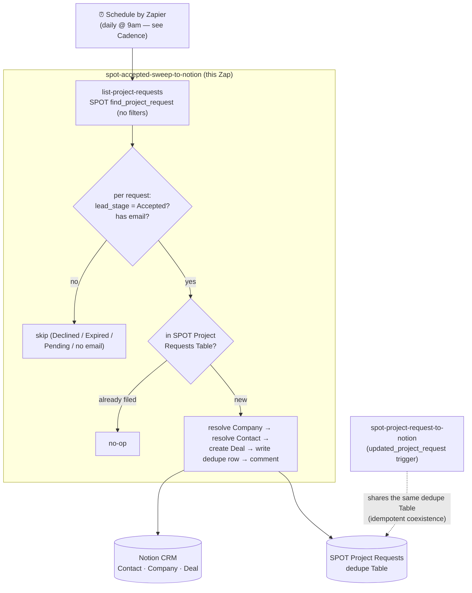

# spot-accepted-sweep-to-notion

A **scheduled reconciliation sweep** that files accepted Zapier **Solution Partner Operations Tool** (SPOT) project requests into the Notion CRM. On each run it lists *every* project request via the SPOT `find_project_request` search action and files any that are **`Accepted` but not yet in the shared dedupe Table** — creating a **Contact**, a **Company** and a **Deal**, upserted, exactly as [`spot-project-request-to-notion`](../spot-project-request-to-notion/) does for a single request.

**This is the reliable backstop for [`spot-project-request-to-notion`](../spot-project-request-to-notion/).** That Zap's `updated_project_request` polling trigger *cannot* deliver acceptances: Zapier's poller dedupes on the stable `project_request_id` (the trigger marks it the primary output field, which overrides the root-level composite `id` as the dedupe key), so a request fires once — at `Pending`, identity still withheld — and never again on the transition to `Accepted`. **Zapier Product Escalations confirmed this from their own dedup logs on 2026-08-26 (ticket `9NPEKP-739EJ`)**; the fix is on Zapier's side with no timeline, and a scheduled sweep is their own recommended workaround. See [`spot-project-request-to-notion/zap.json` → `acceptance_delivery_broken_2026_08_24`](../spot-project-request-to-notion/zap.json).

**Status:** ✅ **Live — enabled 2026-08-26, `everyDay` @ 9:00 AM, dryRun-verified.** Workflow `01a03cc8-85db-7ab5-9045-d8c2d2ed1707`. The `run-durable` gate was cleared on the deployed Zap via `run_workflow --input {dryRun:true}` (run `01a03cd4-0ed6-…`): it listed all 5 requests, kept the 2 `Accepted`-with-email, found both already-filed against the shared dedupe Table, and **wrote nothing** — no determinism fault. Enabled on `everyHour` and trimmed to `everyDay` the same day (Dennis, 2026-08-26) to save tasks while the trigger Zap's `@1.5.2` fix is unverified — see [Cadence and cost](#cadence-and-cost). Runs beside `spot-project-request-to-notion`; the shared dedupe Table keeps them idempotent, so the trigger Zap was left as-is. **Kept as backstop until `@1.5.2` is verified firing on a real acceptance, then retire.**

## How it fits with the trigger Zap

Both Zaps write the same records and share one dedupe Table (`01KYV1R8BWAZ697HQ8P1QV80AF`, *SPOT Project Requests*), keyed on the bare request id. So they are **safe to run side by side**: whichever files a given request first writes the dedupe row, and the other sees it and is a no-op. Nothing needs disabling.

- **Now:** the trigger Zap only ever skips (Pending), so the sweep does all the real filing.
- **If Zapier fixes the trigger:** real-time filing resumes on the trigger Zap, and the sweep becomes a pure backstop — still idempotent, still harmless.



## What it does, per run

1. **List** every project request — `find_project_request` with no filters ("leave both blank to return every project request"). One search action per run (see [Cadence](#cadence-and-cost)).
2. **Filter** to `lead_stage === "Accepted"` **and** a usable email — the same two gates the trigger Zap applies. `Declined`/`Expired`/`Pending` create nothing (policy, decided 2026-08-07); no email means no contact to key on. De-dupes by request id within the batch too.
3. **File** each Accepted-but-unfiled request, keyed by request id so every `ctx.step` name is unique in the run. The filing pipeline is copied from the trigger Zap and behaves identically: resolve/create Company (mirror Table → contact relation → live Notion query → create), resolve/fill/create Contact (email Table), create the Deal from the Deals default template at `Lead`, write the dedupe row **last**, and comment on the Deal when a company was created or matched by relation rather than domain.

Returns a summary: `{ dryRun, checked, acceptedWithEmail, filedCount, alreadyFiledCount, wouldFileCount, results }`.

## Trigger

`ScheduleCLIAPI@1.7.0` / `everyDay`, params `{ "hod": "9:00 AM", "weekends": "yes" }` — Schedule by Zapier, daily at 9:00 AM (account timezone), weekends included. **No connection** (Schedule needs none). `everyDay` takes `hod` (required), not `moh` (that's `everyHour`'s). Started on `everyHour` (params `{ "moh": "00", "weekends": "yes" }`, copied from [`xero-invoice-alerts`](../xero-invoice-alerts/)) and trimmed to daily on 2026-08-26.

Unlike the trigger Zap, this workflow **calls the partner tool** (`find_project_request`), so the SPOT connection is bound as a `--connections` alias (`spot`), alongside `notion_wf`. Both are the work.flowers connections; never the Knoxx one.

## Cadence and cost

Now on `everyDay` (**~30 `find_project_request` tasks/month**). It started on `everyHour` (~24 tasks/day ≈ 720/month), which was overkill for a workflow that files a handful of acceptances a month, so it was trimmed to daily on 2026-08-26 (Dennis) once the trigger Zap's `@1.5.2` fix landed — a negligible cost for a backstop kept only until that fix is verified. Changing the schedule is a trigger change but needs no out-of-band publish: `publish-changed-zaps.mjs` compares the declared trigger against the deployed one and republishes the declared one when different.

## How it was verified (2026-08-26)

Authored without a live run (the authoring session had no CLI/durable runtime), so the `run-durable` gate was cleared *after* deploy, on the live Zap, via a `dryRun` run — which lists and classifies against live SPOT data and writes nothing:

```
run_workflow / trigger-workflow  01a03cc8-85db-7ab5-9045-d8c2d2ed1707  --input '{"dryRun":true}'
```

Durable run `01a03cd4-0ed6-…` returned `checked: 5`, `acceptedWithEmail: 2`, and both Accepted requests (Commercial Laundry `02700000000003A00hE`, Yanolja `02700000000002X00hE`) `status: already-filed` against the shared dedupe Table — `filedCount: 0`, nothing written. The 3 Declined requests were filtered out, and the per-request keyed steps ran with no collision and no determinism fault. (Equivalently, `run-durable "$SOURCE_FILES" --connections '{"notion_wf":{"connectionId":"02b73654-15c8-85c3-b16a-07304d2beb17"},"spot":{"connectionId":"02a5085e-1d27-853d-89b7-115a57fc4d32"}}' --input '{"dryRun":true}' --private` runs the source ad hoc without touching the deployed Zap.)

The first *real* filing run will happen the first time a genuinely new acceptance appears that isn't already in the dedupe Table; watch that run's history for the created Deal + the written dedupe row.

## Idempotency & concurrency

The shared dedupe Table makes retries, overlapping runs, and the trigger Zap all safe. A scheduled run is a single execution (no concurrent trigger events), and each request is filed under keyed steps, so a durable retry re-runs only the steps that hadn't completed. As with the trigger Zap, a *failed* dedupe read rethrows rather than proceeding (a false "not seen" is how a duplicate Deal gets minted).

## Determinism

Same rules as every durable here: no `new Date` / `Date.now` / `Math.random` / global `fetch` / `setTimeout` in the workflow body — only inside a `ctx.step`. This Zap does no date arithmetic; the only clock-like value (`Created On`) comes straight off the request payload. The list, every lookup, and every write are inside `ctx.step`s.
