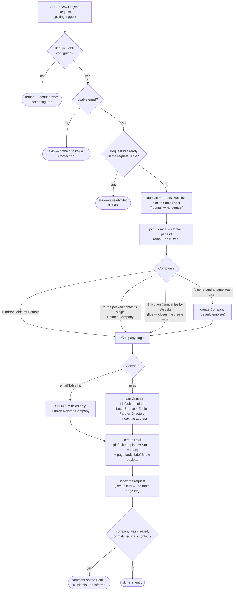

# spot-project-request-to-notion

A **new project request** in the Zapier **Solution Partner Operations Tool** (SPOT) — someone filling in the brief on the [partner directory](https://zapier.com/partnerdirectory/) listing — becomes a **Contact**, a **Company** and a **Deal** in the Notion CRM, upserted rather than duplicated, with the request's raw payload preserved on the Deal page.

Third workflow against the same private partner app. Its siblings are [`register-zapier-partner-lead`](../register-zapier-partner-lead/) (push a company *to* Zapier as a referral lead) and [`zapier-partner-lead-status-to-notion`](../zapier-partner-lead-status-to-notion/) (track what Zapier does with it). This one runs the other way: an inbound opportunity Zapier hands *us*.

**Status:** ✅ **Published and enabled, trigger `active`. It has now fired — once.** The first real project request arrived **2026-08-06T16:26:47** and the trigger picked it up **57 seconds later**, vindicating the decision to claim it early (a polling trigger banks its first poll as already-seen, so claiming after the cutover risked swallowing the first real request as backlog). The cutover itself landed on **2026-08-05**, not the ~08-03 originally assumed.

That run **skipped without writing anything**, and reading why is the most useful thing in this README — see [The first run](#the-first-run). The short version: SPOT withholds client identity until a request is accepted, and it does so with *prose in the field* rather than an empty field, which is a sharper trap than it sounds.

> ⚠️ **This directory is AHEAD of what is deployed.** `workflow.ts` here carries the fixes the first run exposed; deployed version `019fb620-…` does not. See [`zap.json`](zap.json) → `repo_vs_deployed`.

| | |
| --- | --- |
| Workflow | `019fb61c-c04e-7783-90ba-37a70bc3415c` ([editor](https://zapier.com/durables-editor/019fb61c-c04e-7783-90ba-37a70bc3415c)) |
| Version | `019fb620-080f-7626-b093-4b85554b5a4a` |
| Visibility | **account-visible** (`is_private: false`, repo rule 8) |
| Trigger | `App227952CLIAPI@1.5.0` / `new_project_request`, `status: active`, `error: null` |
| Dedupe Table | `01KYV1R8BWAZ697HQ8P1QV80AF` — *SPOT Project Requests*, created with this publish |

## The first run

Request `02700000000002800hE`, stage `Pending`, run `019fd7e6-f307-…`:

```json
{
  "id": "02700000000002800hE", "type": "match", "source": "Zapier Sales",
  "lead_stage": "Pending",
  "email":      "Please accept or secure the lead to see the email.",
  "first_name": "Please accept or secure the lead to see the first name.",
  "last_name":  "Please accept or secure the lead to see the last name.",
  "company": "Doecke Electrical", "website": "www.doeckeelectrical.com.au",
  "company_size": "1-10", "industry": "Retail & Wholesale",
  "location": "Oceania (Australia & New Zealand)",
  "timezone": "UTC+10:00 (Sydney/Melbourne)", "budget": "$0 - $250",
  "service_requested": "", "tool_requested": "",
  "project_description": "Hi I would love some help creating a zap from email to aroflow to monday.com please, it is not working as required"
}
```

Result: `{"skipped": true, "reason": "payload carried no usable email address"}`, `operations: []` — **no Notion write, no dedupe row**, so the request stays unfiled and a later stage-change run can still pick it up.

Three things it taught us, all now fixed in `workflow.ts`:

1. **Identity is withheld with prose, not empty fields.** The run skipped only because that email sentence has no `@` and fails `EMAIL_RE`. The two *name* sentences are ordinary non-empty strings — `firstString` took them — so had the address ever parsed, the Contact and Deal would have been titled *"Please accept or secure the lead to see the first name. Please accept or secure the lead to see the last name."* Now matched explicitly by `SENTINEL_RE` / `firstRealString`.
2. **Four candidate lists missed**, each silently emptying a field the payload was carrying: `country` ← **`location`**, `apps` ← **`tool_requested`**, `servicesNeeded` ← **`service_requested`**, `stage` ← **`lead_stage`**.
3. **Three value vocabularies disagree with Notion's.** `company_size: "1-10"` → `1-49`; `industry: "Retail & Wholesale"` → `Retail`; `location` is a *region* naming two countries, so the country now falls back to the website ccTLD (`.com.au` → Australia). All three were dropped by the guards — correct, no select option was minted, but three fields would have landed empty.

Note `source: "Zapier Sales"` / `type: "match"`: an internal sales referral competing against other partners, **not** a directory lead. Both sources feed this one trigger, which is why the PartnerPage-derived candidate spellings are kept rather than collapsed to the observed ones.

The design consequence — that a Pending request has nothing to build a Contact from, and needs a second workflow on `updated_project_request` — is worked up in [`two-trigger-design.md`](two-trigger-design.md).

## What is verified, and what is not

**Verified:** the trigger exists, takes no configuration, is reachable on the work.flowers partner connection (`02a5085e-…`), and now demonstrably fires within a minute of a request being created.

**Historic — why it sat empty until 2026-08-06.** Every project-request endpoint polled empty, checked repeatedly on 2026-07-31 — including after a real directory request had already arrived:

| Probe | Result |
| --- | --- |
| `new_project_request` (the trigger, run as a read action) | `{"results": []}` |
| `updated_project_request` (its stage-change sibling) | `{"results": []}` |
| `find_project_request`, no filter — "leave blank to … return all project requests" | `{"results": []}` |
| `find_project_request`, `email` = a converted client's address | `{"results": []}` |
| **Control:** `referral_lead_status_change` on the same connection | **247 leads, 118 KB** — the connection genuinely reads the partner account |

The control matters: empty is the account's real state, not a broken credential.

### The field set is known even though the key names are not

The delivery path being replaced tells us what the directory form collects. PartnerPage's "New contact request from Zapier" email (see below) lists it in full:

> First name · Last name · Email · Company name · Website · Phone number · Comments — then a **Request Details** table: Tools you are trying to connect · Your Country · Your Time Zone · Services needed · Project Budget · Zapier account email

That is the same underlying request object, so `extractRequest` is mapped against a **real field set** rather than guesswork. It changed three things versus the first draft:

1. **A phone number exists** — Contacts has `Primary Phone`, so it is mapped.
2. **The brief is called `Comments`**, not a description — now the first candidate key.
3. **The Zapier account email is a separate field from the contact email.** That is the useful one: it is exactly the input `register-zapier-partner-lead` needs, so a company this workflow creates lands with `Account Owner Email Override` already set and is immediately registerable from the Notion **Register Lead** button.

What remains unknown is only the **key spellings**. Each field is read from a list of candidate snake_case spellings in the style this app uses for `referral_lead_status_change`; a miss leaves a property empty rather than writing a wrong value; and the raw payload is preserved verbatim on the Deal page, in the request Table row and in the run output, so the first real request settles every spelling at once. A bare `title` key is deliberately read into nothing — it could be the person's job title or the project's name, and guessing wrong is a real data error.

**Two vocabularies for one concept, worth flagging:** Companies stores `Country` as ISO alpha-2 with eight options; Contacts stores full names with 64. The form supplies a full name ("United States"), so Companies gets it mapped down to `US` while Contacts takes it as-is. Writing the full name to Companies would silently mint a ninth option next to `US`.

## Where this came from: the last PartnerPage request, 2026-07-31

The morning this was designed, a real directory request arrived — as an email, because the cutover had not happened yet. It is the evidence behind the field set above, and it exposed something worse.

- **From** `no-reply@partnerpage.io`, subject **"New contact request from Zapier"**, `2026-07-30T23:02:49Z` (07:02 SGT).
- PartnerPage — the vendor behind the directory — calls it a **contact request**. SPOT calls its object a **project request**. After the cutover these should be the same thing arriving by a different road; before it, they were not, which is why SPOT stayed empty.
- A hidden `<input name="lead_id">` held a UUID, repeated in the "Update status" link with the solution-profile and partner ids.
- Gmail labels these **`Zapier Partner Leads`** (`Label_29`) — **15 messages, 14 threads** of history.

### The classic Zap that handles this today is broken

One minute after that email, Zapier sent `[ALERT] Possible error on your **Add Zapier Directory Leads to Contacts DB** Zap`:

> Notion — `Pipeline Stage is not a property that exists.`

There is no `Pipeline Stage` on Contacts, Companies **or** Deals. Deals has `Status` (a `status`-type property), so this looks like a rename the Zap was never updated for.

**Provenance, stated precisely:** that Zap has never been inspected. The evidence is the Zapier alert email in Gmail, which names the Zap and quotes its error summary — nothing more. What *is* directly confirmed is that it is **not a Durable**: all 30 durables on the account were enumerated via `list_workflows` and it is absent, so it is one of the classic Zaps. Classic Zaps cannot be listed or read from this repo's tooling at all — neither the SDK CLI's workflow commands nor the Zapier MCP connector expose them, both being Durables-only. So its trigger, its steps and which data source it writes `Pipeline Stage` to are all unknown here and need a look in the Zapier UI.

Confirmed in the CRM: **nothing landed** for that request. No contact matching the requester's address or name; newest Deal was Sea Group from `2026-07-28`; newest Company EBER from `2026-07-30 09:48`.

### Declining is a CRM action, not an intake filter

That request was declined in PartnerPage and nothing was recorded, which is exactly the gap this workflow closes. **The policy is to register every request** — Contact, Company and Deal — and let a human mark the Deal `Declined` in Notion if it is not worth pursuing. Notion's own description of that option is "deals that we have chosen to walk away from", which is precisely the semantics.

This is why there is **no adoption gate** here, unlike [`zapier-partner-lead-status-to-notion`](../zapier-partner-lead-status-to-notion/), which gates hard because its trigger's history is one bulk submission of ~247 event attendees. A directory request is one person who wrote a brief, and a declined one is worth a record.

It also sets a hard constraint the code honours: **nothing ever writes `Status` on a Deal that already exists.** `createDeal` only ever creates, and the request-id dedupe makes a re-delivery or a retry a no-op — so a Deal moved to `Declined` (or `Closed Won`) can never be dragged back to `Lead`.

## What it does



## Trigger

`App227952CLIAPI@1.5.0` / `new_project_request` — **New Project Request**, "Triggers when a new project request is created for your partner account." A **polling** trigger with **no input fields** (`get_trigger_fields` returns an empty schema), authenticated by connection `02a5085e-1d27-853d-89b7-115a57fc4d32` ("work.flowers").

The credential belongs on the **trigger**, not in `--connections`: like `zapier-partner-lead-status-to-notion`, the workflow code never calls the partner tool back. Only `notion_wf` is bound.

## What gets written

**Companies** (`21991b07-11ac-80b0-b787-000b3d3995f6`) — created only when the request names a company and no existing record matches:

| Property | From | Notes |
| --- | --- | --- |
| `Company Name` (title) | the request | Required to create at all — a company page titled after a domain, or untitled, is worse than none |
| `Website` (url) | `https://<domain>` | Normalised host, so the mirror Table's `Domain` column stays comparable |
| `Size` (select) | mapped from the request | Only the four existing options; the partner tool spells the top band `1,000+` |
| `Country` (select) | the request, **mapped to alpha-2** | `United States` → `US`. Eight options only; an unmapped country is dropped, never minted |
| `Industry` (select) | the request | **Exact option match only** — `Tech` does not become `Technology`, it becomes nothing |
| `Account Owner Email Override` (email) | the request's **Zapier account email** | **On create only.** Makes the new company immediately registerable via the Notion `Register Lead` button, which feeds [`register-zapier-partner-lead`](../register-zapier-partner-lead/). An existing company's override is left alone — it may have been set deliberately, and the value is on the Deal page either way |

**Contacts** (`21991b07-11ac-81a6-a894-000be4a09a67`) — found by email, else created:

| Property | On create | On an existing contact |
| --- | --- | --- |
| `Name` (title) | request name, else the email's local part | untouched |
| `Primary Email` | the request | untouched |
| `First Name` · `Last Name` · `Job Title` | the request | **only if empty** |
| `Primary Phone` | the request's phone number | **only if empty** |
| `Country` (select) | the request, as a **full name** | **only if empty.** `United States` stays `United States` here — the opposite of Companies |
| `Lead Source` | `Zapier Partner Directory` | **only if empty** — it records how we *first* met someone, so an earlier value is the truer one |
| `First Contacted` | the request's `created_on` | **only if empty** |
| `Related Company` | the resolved company | **unioned**, never replaced |

`Zapier Partner Directory` was already an option on `Lead Source` before this workflow existed — the flow was manual. Nothing new is minted.

**Deals** (`21a91b07-11ac-808d-9657-000b1390d20b`) — always created, one per request:

| Property | Value |
| --- | --- |
| `Deal Name` (title) | the request's project name, else `<Company> — Zapier Partner Directory request` |
| `Company` · `Contact` (relation, limit 1) | the resolved pages |
| `Description` | the brief (`Comments`), with services needed, tools to connect, budget and timeline appended |
| page body | the brief rendered as markdown, then the **raw payload** in a fenced JSON block |
| `Status` | **`Lead`, from the default template — never written by this workflow** |

### What is deliberately left empty

- **`Status`.** The Deals default template (`21a91b07-11ac-80a9-…`) already sets it to `Lead`, which is exactly right for an unqualified inbound. That is worth stating because it also means the `properties|||Status|||status` key form — unproven anywhere in this repo, and unverifiable here because `create_database_item`'s dynamic property schema would not resolve for this data source over MCP — is never needed. The template also assigns `Owner`.
- **`Type`.** Full Retainer / Project / Support Retainer / Vanta Subscription / Workshop name a *commercial model* chosen while scoping. A brief does not state one — and specifically, `Services needed: Technical support/troubleshooting` is **not** mapped to `Support Retainer`. Asking for troubleshooting help is not agreeing to a retainer, and the difference is a pricing decision.
- **`Value`** and **`Deal Currency`.** A stated budget is a band ("$5k–$10k"), not a number, and `Deal Currency` is a relation to an FX Rates row needing its own lookup. Whatever the request said is in `Description` and on the page body; the number is for whoever scopes it. (The Deals template's own body callout spells out the three-step multi-currency convention — worth not half-doing.)
- **`Expected Close`.** A brief's timeline is a *delivery* timeline, not a close date.
- **`Size` / `Country` / `Industry` when the value doesn't match an option exactly.** Writing an unrecognised option into a Notion select is how you silently mint schema. `Tech` does not become `Technology`; it becomes nothing, and a human sees a blank.

## Idempotency

Zapier Table `01KYV1R8BWAZ697HQ8P1QV80AF` (*SPOT Project Requests*), keyed on the request id → the three page ids it produced. Written **last**, so a row can never claim a request is filed before its Deal exists.

Two things make it necessary rather than belt-and-braces: a durable retries a failed run, and a polling trigger can re-deliver after its trigger is re-claimed. Either would mint a second Contact/Company/Deal for one request. A failed dedupe *read* therefore **rethrows** rather than falling through as "not seen" — treating a lookup failure as absence is precisely how you get the duplicate the step exists to prevent.

**A Table, not a Notion property on Deals.** The repo's usual reason to prefer a Table (free reads) is only half of it here — a `Zapier Project Request Id` property would also have to be *added* to Deals, and would then be addressed through `update_database_item`'s cached schema, which is exactly the staleness that pushed both sibling workflows onto the raw Notion API. The Table needs no schema change and no cache. The request id is still visible to a human: it is on the Deal's page body.

## The create race, and why the Notion query is not redundant

Both mirror Tables this workflow reads (`notion-companies-to-zapier-table`, `contact-emails-to-zapier-table`) are populated *by* Notion webhooks, so a company created seconds ago is not in them yet. Two requests from the same new domain arriving back to back would create that company twice.

Resolution path 3 — querying Notion Companies by `Website` — reads the live data source, so it sees the first create. That is its whole job; it is the last lookup before a create for that reason, not because it is cheap. The same argument is why a newly created contact's address is indexed into the email Table immediately rather than left to `contact-emails-to-zapier-table` to notice.

## Cost

Nothing here uses AI. Zapier Table reads and writes are free; a Notion `runAction` **or** a raw `sdk.fetch` through the connection each cost one task.

| Path | Tasks |
| --- | --- |
| Already filed, or no email | **0** — both answers come from a free Table read |
| Existing contact, company found in the mirror Table | 3–4 (contact read, optional fill, deal create, page body) |
| Everything new | **6** (Companies query, create Company, create Contact, create Deal, page body, comment) |

## What is still unproven

Two things, and both resolve themselves on the first real request.

**1. The payload key spellings.** The field *set* is evidenced (above), but the snake_case keys SPOT uses are inferred, so `extractRequest` reads each field from a candidate list. A miss leaves a property empty rather than writing a wrong value, and the raw payload is preserved three ways — the Deal page body, the request Table's `Payload` column, and the run output — so the true spellings are readable off the first run without opening Notion.

**2. The `properties|||<name>|||<type>` key forms** for `Primary Phone` (`phone_number`), `Country` (`select`, on both data sources), `Account Owner Email Override` (`email`) and `First Contacted` (`date__start`). These go through `create_database_item`'s **cached** schema, which is the staleness that pushed both sibling workflows onto the raw Notion API for *updates*. Creates still need the action, because it is what applies the default template (repo rule 5).

An attempt was made to prove those key forms without writing anything, by resolving the action's `dynamic_properties_schema` for each data source. It came back **empty** — which means the Zapier MCP server's own Notion connection cannot see Core CRM Objects, **not** that the keys are wrong. The forms themselves (`title`, `rich_text`, `select`, `email`, `phone_number`, `url`, `checkbox`, `relation`, `date__start`) are all used by other Zaps in this repo; what is unverified is whether the cache lists these *specific properties* for these data sources.

### First-run checklist

When the first request lands, three things are worth two minutes:

1. **Read the run output.** It echoes the raw payload, so every true key spelling is visible at once.
2. **Compare the Deal page's "Raw request payload" block against the mapped properties.** An empty property next to a populated payload key means a candidate spelling missed — fix `extractRequest` and republish.
3. **Confirm no new select option appeared** on Companies `Country` / `Industry` / `Size`, or Contacts `Country`. Nothing should have been minted; that is what the exact-match rules are for.

If you would rather not wait, a smoke test costs one run and writes real records — see [`zap.json`](zap.json) → `first_run` and `still_unproven`. Use a payload that reaches the main path (a request id *and* a real email); a skip-path test proves nothing about the code after the guard, which is how `drive-invoice-to-xero` shipped a bug that killed 100% of its runs. **The one real run so far was a skip-path run**, so everything past the email guard — company resolution, contact resolution, deal creation, the `properties|||…` key forms — is still entirely unexercised. Then delete the Deal and its Table row.

## How it was published

For the record, since the publishing session could not reach the SDK CLI — no stored `zapier-sdk` credentials and no browser to `login` with — everything went through the Zapier MCP connector instead, which the repo sanctions as the fallback. `workflows-doctor`'s compatibility gate could therefore **not** be run; worth running once in a session with CLI access.

Steps taken, in order:

1. `TableCLIAPI` / `create_table` — created *SPOT Project Requests* (`01KYV1R8BWAZ697HQ8P1QV80AF`) with all nine fields. `Created On` is deliberately **Text**, not Date & Time: Tables coerces a bare `YYYY-MM-DD` into the account timezone and stores `T16:00:00Z` on the *previous* day, the trap `register-zapier-partner-lead` had to pin `T00:00:00Z` around.
2. `create_workflow` with `private: false` — repo rule 8, and **visibility cannot be changed afterwards**, so this was the only chance.
3. `publish_workflow_version` with `zapierDurableVersion: "0.10.1"`, `dependencies: {"@zapier/zapier-sdk": "0.91.0", "zod": "4.4.3"}`, `connections: {"notion_wf": …}`, and the trigger **version-pinned to `App227952CLIAPI@1.5.0`**. The pin matters: a bare `App227952CLIAPI` makes the trigger claim fail *silently* — publish returns success and the workflow just stays disabled.
4. Verified: `enabled: true`, `disabled_reason: null`, trigger `status: active` / `error: null`, `list_workflow_runs` empty, and the deployed `source_files["workflow.ts"]` byte-identical to this directory's copy.

To republish after a change, the CLI path in the sibling READMEs applies unchanged; only `--trigger` needs the same version pin.

## Maintainer notes

- **All three CRM data sources now have a default template**, so `template_mode: "default"` applies on every create here and the `no default template` fallback should never fire: Contacts `33b91b07-…`, Companies `21991b07-11ac-807d-…`, Deals `21a91b07-11ac-80a9-…`. (CLAUDE.md's note that only Contacts had one is a 2026-07-25 snapshot; Companies and Deals have since gained theirs.) The fallback is kept regardless — it is what lets a template be added or removed in Notion with no code change.
- **The company domain is dropped for consumer mailboxes.** A `@gmail.com` requester's email host is the mailbox provider's, not their employer's; treating it as a domain would file every Gmail requester under a company called Gmail. The freemail list is copied from `enrich-contact-records`, which asks the same question. Such a request still resolves a company if the requester is already in the CRM (path 2) or named a website.
- **An existing contact is only ever filled in, never overwritten.** Someone curated those fields; a lead form did not. `Related Company` is unioned for the same reason — a person can legitimately sit against more than one company.
- **A skip is a `return`, not a `throw`.** No email, or a request already filed, are permanent conditions; throwing would spin the durable's retry loop to no purpose. The one place that *does* throw is the dedupe read, and the Deal create.
- **No `new Date` anywhere.** `First Contacted` comes from the payload's own `created_on`, which is both deterministic and truer than "when this Zap happened to run" — so this workflow needs no clock read at all, and cannot hit the `DeterminismViolation` that cost `drive-invoice-to-xero` 100% of its runs.
- **Ambiguity is never resolved by picking.** Two companies on one domain, or a contact linked to several companies, both fall through rather than choosing.

## Open questions

- **Confirm the cutover actually happened.** From ~2026-08-03 requests should arrive via SPOT. Poll `new_project_request` after that date; if it is still empty while directory requests are still landing as PartnerPage emails, the cutover slipped and the trigger has nothing to claim.
- **What are the request's stages?** `updated_project_request` ("Triggers when a project request stage changes") is the natural sibling — it would move the Deal's `Status` along the pipeline. It needs the stage vocabulary, unknowable until a real request exists. Out of scope here; the request Table already carries a `Stage` column for it. Note it would be the *only* thing allowed to write `Status` on an existing Deal, and it must not undo a human's `Declined`.
- **What does the classic Zap do that this does not?** `Add Zapier Directory Leads to Contacts DB` has not been read (see above — classic Zaps are invisible to this repo's tooling). Before turning it off, someone should open it in the Zapier UI and check nothing it does is missing here.
- **Should the ~14 historical PartnerPage requests be backfilled?** They are all still in Gmail under `Zapier Partner Leads`, and the broken Zap means some number of them never reached the CRM. Not attempted: they are stale, and a backfill would need an email parser this workflow does not have now that the intake path is SPOT.

## Verified

Everything below was checked live on 2026-07-31 through the Zapier MCP connector — the SDK CLI could not be used (this container has no stored `zapier-sdk` credentials and no browser for `login`).

| What | How | Result |
| --- | --- | --- |
| The trigger exists and is not hidden | `search_triggers App227952CLIAPI` | `new_project_request` · `is_hidden: false` · app version `1.5.0`, alongside `updated_project_request` and the sibling's `referral_lead_status_change` |
| It takes no configuration | `get_trigger_fields` on the work.flowers connection | `{"type":"object","properties":{}}` |
| **No project requests exist** | the four probes in the table above, with `referral_lead_status_change` as the control | All empty; control returned 247 leads. **This is the blocker** |
| Notion Contacts / Companies / Deals schemas | `notion-fetch` on all three data sources | Property names, types, relation targets, select options and default templates as documented above |
| `Lead Source` already offers `Zapier Partner Directory` | Contacts schema | Present — no new option minted |
| Deals default template sets `Status: Lead` and `Owner` | `notion-fetch` on `21a91b07-11ac-80a9-…` | `"Status": "Lead"`, `Owner` = Dennis. Removes the need to write a `status`-typed property at all |
| Proven `properties\|\|\|…\|\|\|<type>` key forms | grep across every `workflow.ts` in this repo | `title` · `rich_text` · `select` · `multi_select` · `email` · `phone_number` · `url` · `checkbox` · `relation` · `date__start` · `date__end`. **No `status`** — hence the design above |
| Table filter operators | `@zapier/zapier-sdk@0.91.0` README | `exact` and `icontains` both available; `icontains` is what makes the `Domain` link-field lookup work |
| **The field set the directory form collects** | The last PartnerPage delivery of a real request (2026-07-31) | First/Last name · Email · Company name · Website · Phone · Comments · Tools to connect · Country · Time zone · Services needed · Project Budget · Zapier account email. Grounds `extractRequest` in a real field set; only the SPOT key *spellings* remain inferred |
| Contacts vs Companies `Country` vocabularies | Both data-source schemas | Contacts = 64 **full names** (incl. `United States`); Companies = 8 **alpha-2** codes. Hence the explicit name→code map |
| `Add Zapier Directory Leads to Contacts DB` is **not** a Durable | `list_workflows` — all 30 durables on the account enumerated | Absent, so it is a classic Zap. Its contents remain **uninspected**: the alert email is the only evidence, and classic Zaps are not exposed by the SDK CLI or the MCP connector |
| Nothing landed for the 2026-07-31 request | Notion queries across all three data sources | No contact for the requester; newest Deal `2026-07-28`; newest Company `2026-07-30 09:48` |
| Types | `tsc --strict` against durable `0.10.1` + sdk `0.91.0` | Clean |
| **Published account-visible** | `create_workflow` with `private: false`, read back via `get_workflow` | `is_private: false`. Repo rule 8 — and unchangeable after creation |
| **Trigger actually claimed** | `get_workflow` after publishing | `status: "active"`, `error: null`, `enabled: true`, `disabled_reason: null`. The version-pinned `selected_api` is what makes this work |
| **Deployed source matches this repo** | Diffed `get_workflow` → `current_version.source_files["workflow.ts"]` against the local file | **Byte-identical**, 47,549 bytes |
| No runs after claiming | `list_workflow_runs` | Empty — as expected, nothing can fire it before the cutover |
| Dedupe Table shape | `create_table` response | All nine fields created as specified; `Created On` is Text, `Payload` is Long Text, `Email` is Email |

**Not verified:** everything at run time. See [What is still unproven](#what-is-still-unproven) — the payload key spellings, and whether `create_database_item`'s cached schema lists the specific properties this Zap addresses. Both settle on the first real request, which is why the raw payload is captured three ways.
