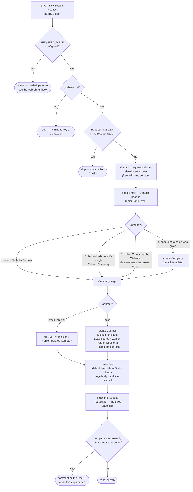

# spot-project-request-to-notion

A **new project request** in the Zapier **Solution Partner Operations Tool** (SPOT) — someone filling in the brief on the [partner directory](https://zapier.com/partnerdirectory/) listing — becomes a **Contact**, a **Company** and a **Deal** in the Notion CRM, upserted rather than duplicated, with the request's raw payload preserved on the Deal page.

Third workflow against the same private partner app. Its siblings are [`register-zapier-partner-lead`](../register-zapier-partner-lead/) (push a company *to* Zapier as a referral lead) and [`zapier-partner-lead-status-to-notion`](../zapier-partner-lead-status-to-notion/) (track what Zapier does with it). This one runs the other way: an inbound opportunity Zapier hands *us*.

**Status:** ⚠️ **Design and source only — not created on Zapier, not published.** `tsc --strict` is clean against durable `0.10.1` + sdk `0.91.0`; the [Publish runbook](#publish-runbook) below is the copy-paste path from here to deployed, for a session that can reach the CLI. One thing about it is a genuine blocker, and it is the next section.

## The blocking unknown: nobody has ever sent us a project request

**The `new_project_request` payload shape is unverified, because the work.flowers partner account has no project requests to sample.** Checked three ways on 2026-07-31, all against the live `work.flowers` partner connection (`02a5085e-…`):

| Probe | Result |
| --- | --- |
| `new_project_request` (the trigger, run as a read action) | `{"results": []}` |
| `updated_project_request` (its stage-change sibling) | `{"results": []}` |
| `find_project_request`, no filter — "leave blank to … return all project requests" | `{"results": []}` |
| `find_project_request`, `email` = a converted client's address | `{"results": []}` |
| **Control:** `referral_lead_status_change` on the same connection | **247 leads, 118 KB** — so the connection genuinely reads the partner account |

The control matters: the empty results are the account's real state, not a broken credential or a dedupe artefact. So there is no sample payload, and no way to force one — a project request is created by a *customer* on Zapier's side.

Every field name in `extractRequest` is therefore **inferred** from the naming style the same app version uses for `referral_lead_status_change` (snake_case; `first_name` / `last_name` / `email` for the person; `*_on` for timestamps) plus the two filters `find_project_request` exposes (`id`, `email`). Three things keep that from being reckless:

1. **Every field reads a list of candidate spellings.** A miss leaves a property empty. It never writes a value into the wrong property.
2. **The raw payload is preserved three times over** — verbatim in a fenced JSON block on the Deal page, in the request Table row's `Payload` column, and echoed in the run output. If every mapping missed, the first real request is still fully recoverable and its exact shape is readable off the run.
3. **A bare `title` key is deliberately read into nothing.** It could plausibly be the requester's job title *or* the project's name; guessing wrong writes a real data error, so it feeds neither.

The corollary is a scheduling argument, not just a caveat: **a polling trigger records its first poll after being claimed as already-seen rather than firing it** (verified on the sibling — claiming its trigger did not replay the account's 247 historical leads). A project request that lands *before* this workflow's trigger is claimed is therefore never delivered. If inbound directory requests matter, claiming the trigger sooner is worth more than waiting for a payload to design against.

## What it does



## Trigger

`App227952CLIAPI@1.5.0` / `new_project_request` — **New Project Request**, "Triggers when a new project request is created for your partner account." A **polling** trigger with **no input fields** (`get_trigger_fields` returns an empty schema), authenticated by connection `02a5085e-1d27-853d-89b7-115a57fc4d32` ("work.flowers").

The credential belongs on the **trigger**, not in `--connections`: like `zapier-partner-lead-status-to-notion`, the workflow code never calls the partner tool back. Only `notion_wf` is bound.

## What gets written

**Companies** (`21991b07-11ac-80b0-b787-000b3d3995f6`) — created only when the request names a company and no existing record matches:

| Property | From | Notes |
| --- | --- | --- |
| `Company Name` (title) | the request | Required to create at all — a company page titled after a domain, or untitled, is worse than none |
| `Website` (url) | `https://<domain>` | Normalised host, so the mirror Table's `Domain` column stays comparable |
| `Size` (select) | mapped from the request | Only the four existing options; the partner tool spells the top band `1,000+` |
| `Country` · `Industry` (select) | the request | **Exact option match only** — see below |

**Contacts** (`21991b07-11ac-81a6-a894-000be4a09a67`) — found by email, else created:

| Property | On create | On an existing contact |
| --- | --- | --- |
| `Name` (title) | request name, else the email's local part | untouched |
| `Primary Email` | the request | untouched |
| `First Name` · `Last Name` · `Job Title` | the request | **only if empty** |
| `Lead Source` | `Zapier Partner Directory` | **only if empty** — it records how we *first* met someone, so an earlier value is the truer one |
| `First Contacted` | the request's `created_on` | **only if empty** |
| `Related Company` | the resolved company | **unioned**, never replaced |

`Zapier Partner Directory` was already an option on `Lead Source` before this workflow existed — the flow was manual. Nothing new is minted.

**Deals** (`21a91b07-11ac-808d-9657-000b1390d20b`) — always created, one per request:

| Property | Value |
| --- | --- |
| `Deal Name` (title) | the request's project name, else `<Company> — Zapier Partner Directory request` |
| `Company` · `Contact` (relation, limit 1) | the resolved pages |
| `Description` | the brief, with the stated budget and timeline appended |
| page body | the brief rendered as markdown, then the **raw payload** in a fenced JSON block |
| `Status` | **`Lead`, from the default template — never written by this workflow** |

### What is deliberately left empty

- **`Status`.** The Deals default template (`21a91b07-11ac-80a9-…`) already sets it to `Lead`, which is exactly right for an unqualified inbound. That is worth stating because it also means the `properties|||Status|||status` key form — unproven anywhere in this repo, and unverifiable here because `create_database_item`'s dynamic property schema would not resolve for this data source over MCP — is never needed. The template also assigns `Owner`.
- **`Type`.** Full Retainer / Project / Support Retainer / Vanta Subscription / Workshop name a *commercial model* chosen while scoping. A brief does not state one.
- **`Value`** and **`Deal Currency`.** A stated budget is a band ("$5k–$10k"), not a number, and `Deal Currency` is a relation to an FX Rates row needing its own lookup. Whatever the request said is in `Description` and on the page body; the number is for whoever scopes it. (The Deals template's own body callout spells out the three-step multi-currency convention — worth not half-doing.)
- **`Expected Close`.** A brief's timeline is a *delivery* timeline, not a close date.
- **`Size` / `Country` / `Industry` when the value doesn't match an option exactly.** Writing an unrecognised option into a Notion select is how you silently mint schema. `Tech` does not become `Technology`; it becomes nothing, and a human sees a blank.

## Idempotency

A new Zapier Table, `SPOT Project Requests`, keyed on the request id → the three page ids it produced. Written **last**, so a row can never claim a request is filed before its Deal exists.

Two things make it necessary rather than belt-and-braces: a durable retries a failed run, and a polling trigger can re-deliver after its trigger is re-claimed. Either would mint a second Contact/Company/Deal for one request. A failed dedupe *read* therefore **rethrows** rather than falling through as "not seen" — treating a lookup failure as absence is precisely how you get the duplicate the step exists to prevent.

**A Table, not a Notion property on Deals.** The repo's usual reason to prefer a Table (free reads) is only half of it here — a `Zapier Project Request Id` property would also have to be *added* to Deals, and would then be addressed through `update_database_item`'s cached schema, which is exactly the staleness that pushed both sibling workflows onto the raw Notion API. The Table needs no schema change and no cache. The request id is still visible to a human: it is on the Deal's page body.

## The create race, and why the Notion query is not redundant

Both mirror Tables this workflow reads (`notion-companies-to-zapier-table`, `contact-emails-to-zapier-table`) are populated *by* Notion webhooks, so a company created seconds ago is not in them yet. Two requests from the same new domain arriving back to back would create that company twice.

Resolution path 3 — querying Notion Companies by `Website` — reads the live data source, so it sees the first create. That is its whole job; it is the last lookup before a create for that reason, not because it is cheap. The same argument is why a newly created contact's address is indexed into the email Table immediately rather than left to `contact-emails-to-zapier-table` to notice.

## Cost

Nothing here uses AI. Zapier Table reads and writes are free; a Notion `runAction` **or** a raw `sdk.fetch` through the connection each cost one task.

| Path | Tasks |
| --- | --- |
| Already filed, or no email | **0** — both answers come from a free Table read |
| Existing contact, company found in the mirror Table | 3–4 (contact read, optional fill, deal create, page body) |
| Everything new | **6** (Companies query, create Company, create Contact, create Deal, page body, comment) |

## Publish runbook

Nothing here has been done — the session that wrote this had no `zapier-sdk` credentials and no browser to `login` with, so it could not reach the CLI at all (`workflows-doctor`'s compatibility gate included; **run that first** in a session that can). Every command below is for a local, logged-in session, run from this directory.

The workflow **refuses to run** until step 1 is done, returning `skipped: true` with the reason rather than proceeding. An unconfigured dedupe store is not something to discover from duplicate deals.

### 1. Create the dedupe Table

```bash
TABLE_ID="$(npx zapier-sdk create-table "SPOT Project Requests" \
  --description "Zapier partner-directory project request id -> the Notion Contact/Company/Deal it produced. Written by spot-project-request-to-notion." \
  --json | jq -r '.data.id')"

npx zapier-sdk create-table-fields "$TABLE_ID" '[
  {"type":"string","name":"Request Id"},
  {"type":"string","name":"Deal Page ID"},
  {"type":"string","name":"Contact Page ID"},
  {"type":"string","name":"Company Page ID"},
  {"type":"email","name":"Email"},
  {"type":"string","name":"Company Name"},
  {"type":"string","name":"Stage"},
  {"type":"string","name":"Created On"},
  {"type":"text","name":"Payload"}
]' --json

npx zapier-sdk list-table-fields "$TABLE_ID"   # check what starter fields came with it
echo "$TABLE_ID"                               # -> REQUEST_TABLE in workflow.ts
```

Two deliberate choices in those types. **`Created On` is a `string`, not a `datetime`** — Tables coerces a bare `YYYY-MM-DD` into the account timezone and stores `T16:00:00Z` the *previous* day, which is the bug `register-zapier-partner-lead` had to pin `T00:00:00Z` to work around. Here the value is only ever read back as a date, so keeping it a plain string sidesteps it. **`Payload` is `text`, not `string`**, because it holds a whole JSON document.

Then set `REQUEST_TABLE` in `workflow.ts` and re-run `tsc`.

### 2. Optional: exercise the main path first

There is no real payload, so a `run-durable` test needs a hand-made one — and **it must reach the main path.** A payload that returns at an early guard proves nothing about the code after it, which is exactly how `drive-invoice-to-xero` shipped a `DeterminismViolation` that killed 100% of its runs. So include a request id *and* an email:

```bash
SOURCE_FILES="$(jq -n --rawfile w workflow.ts '{"workflow.ts": $w}')"

npx zapier-sdk --experimental run-durable "$SOURCE_FILES" \
  --dependencies '{"@zapier/zapier-sdk":"0.91.0","zod":"4.4.3"}' \
  --zapier-durable-version '0.10.1' \
  --connections '{"notion_wf":{"connectionId":"02b73654-15c8-85c3-b16a-07304d2beb17"}}' \
  --input '{"id":"TEST-0001","email":"dennis@work.flowers","first_name":"Dennis","last_name":"Chiuten","company_name":"work.flowers","website":"https://work.flowers","description":"Smoke test for spot-project-request-to-notion.","budget":"$5k-$10k","timeline":"Q4","created_on":"2026-07-31T00:00:00"}' \
  --json
```

**This writes to production Notion** — it will create a real Deal, and link it to the existing contact and company that address already resolves to (so it exercises the *existing*-record branches, which are the ones with the fill-only-empty-fields logic). Delete the Deal and its Table row afterwards. Poll `get-durable-run <run-id> --json` until `status: "finished"`; the run output echoes the raw payload, so you can confirm extraction without opening Notion.

### 3. Create the workflow — account-visible

```bash
npx zapier-sdk --experimental create-workflow "spot-project-request-to-notion" \
  --description "New Zapier Solution Partner project request -> upsert a Notion Contact, Company and Deal. Company resolves via the companies mirror Table by domain, then the contact's existing Related Company, then a live Notion query by Website, then create. An existing Contact is only filled in, never overwritten. The Deal opens at Lead from the Deals default template; Type, Value and Expected Close are left for whoever scopes it. Raw payload preserved on the Deal page." \
  --json
```

**No `--private`** — repo rule 7, and this deliberately overrides the `workflows-create` skill's EA default. **Visibility cannot be changed after creation**, so this is the only chance to get it right. Record it as `is_private: false` in `zap.json`.

### 4. Publish with the trigger claimed

```bash
SOURCE_FILES="$(jq -n --rawfile w workflow.ts '{"workflow.ts": $w}')"

npx zapier-sdk --experimental publish-workflow-version <workflow-id> "$SOURCE_FILES" \
  --dependencies '{"@zapier/zapier-sdk":"0.91.0","zod":"4.4.3"}' \
  --zapier-durable-version '0.10.1' \
  --connections '{"notion_wf":{"connectionId":"02b73654-15c8-85c3-b16a-07304d2beb17"}}' \
  --trigger '{"selected_api":"App227952CLIAPI@1.5.0","action":"new_project_request","authentication_id":"02a5085e-1d27-853d-89b7-115a57fc4d32","params":{}}' \
  --enabled \
  --json
```

`selected_api` **must** carry the `@1.5.0` version pin. A bare `App227952CLIAPI` makes the trigger claim fail **silently** — publish returns success, and the workflow just stays disabled with nothing saying why.

Pin `@zapier/zapier-durable` to **0.10.1**, as both siblings do. A publish on 0.11.0 failed at run time with `Dependency installation failed`: the durable runtime's pnpm enforces a 24-hour minimum release age and 0.11.0 was under a day old. The same guard applies to `@zapier/zapier-sdk` and `zod`, which publish often — check a version's publish date before bumping any of the three.

### 5. Verify, then sync back

```bash
npx zapier-sdk --experimental get-workflow <workflow-id> --json          # enabled MUST be true
npx zapier-sdk --experimental list-workflow-versions <workflow-id> --json
npx zapier-sdk --experimental list-workflow-runs <workflow-id> --json    # expect empty
```

`enabled: false` after publishing with `--enabled` means the trigger claim failed — almost always the unpinned `selected_api` above. Don't call it deployed until that reads `true`.

`list-workflow-runs` should be **empty**. A polling trigger's first poll after being claimed is recorded as already-seen, and there are no project requests anyway — but check, because a surprise here would mean the account has history the four probes above did not see.

Then write `zap.json` (this directory does not have one yet), following the sibling's shape: `workflow_id`, `current_version_id`, `trigger_url`, `enabled`, `is_private: false`, the trigger block, `connections`, `zapier_durable_version`, `dependencies`, `tables`, and a `partner_app` block. Update the root README's status column, and this file's — from ⚠️ to ✅.

## Maintainer notes

- **All three CRM data sources now have a default template**, so `template_mode: "default"` applies on every create here and the `no default template` fallback should never fire: Contacts `33b91b07-…`, Companies `21991b07-11ac-807d-…`, Deals `21a91b07-11ac-80a9-…`. (CLAUDE.md's note that only Contacts had one is a 2026-07-25 snapshot; Companies and Deals have since gained theirs.) The fallback is kept regardless — it is what lets a template be added or removed in Notion with no code change.
- **The company domain is dropped for consumer mailboxes.** A `@gmail.com` requester's email host is the mailbox provider's, not their employer's; treating it as a domain would file every Gmail requester under a company called Gmail. The freemail list is copied from `enrich-contact-records`, which asks the same question. Such a request still resolves a company if the requester is already in the CRM (path 2) or named a website.
- **An existing contact is only ever filled in, never overwritten.** Someone curated those fields; a lead form did not. `Related Company` is unioned for the same reason — a person can legitimately sit against more than one company.
- **A skip is a `return`, not a `throw`.** No email, or a request already filed, are permanent conditions; throwing would spin the durable's retry loop to no purpose. The one place that *does* throw is the dedupe read, and the Deal create.
- **No `new Date` anywhere.** `First Contacted` comes from the payload's own `created_on`, which is both deterministic and truer than "when this Zap happened to run" — so this workflow needs no clock read at all, and cannot hit the `DeterminismViolation` that cost `drive-invoice-to-xero` 100% of its runs.
- **Ambiguity is never resolved by picking.** Two companies on one domain, or a contact linked to several companies, both fall through rather than choosing.

## Open questions

- **Should an unqualified inbound really open a Deal?** The task said so and the design does it, but it is worth naming the contrast with `zapier-partner-lead-status-to-notion`, which gates adoption *hard* because that trigger's history is one bulk event submission of ~247 attendees. This trigger is different in kind — a project request is a customer who found the directory listing, read it, and wrote a brief — and the account has received **zero** so far, so there is no volume argument for a gate. If directory volume ever turns out to be junk, the gate goes in the same place the sibling's does.
- **Is `Lead Source: Zapier Partner Directory` right, or should the Deal carry the provenance too?** Deals has no lead-source property. Right now the provenance lives on the Contact and in the Deal's title and page body.
- **What are the request's stages?** `updated_project_request` ("Triggers when a project request stage changes") is the natural sibling to this workflow — it would move the Deal's `Status` along the pipeline. It needs the stage vocabulary, which is unknowable until a real request exists. Out of scope here; the request Table already carries a `Stage` column for it to update.

## Verified

Everything below was checked live on 2026-07-31 through the Zapier MCP connector — the SDK CLI could not be used (this container has no stored `zapier-sdk` credentials and no browser for `login`).

| What | How | Result |
| --- | --- | --- |
| The trigger exists and is not hidden | `search_triggers App227952CLIAPI` | `new_project_request` · `is_hidden: false` · app version `1.5.0`, alongside `updated_project_request` and the sibling's `referral_lead_status_change` |
| It takes no configuration | `get_trigger_fields` on the work.flowers connection | `{"type":"object","properties":{}}` |
| **No project requests exist** | the four probes in the table above, with `referral_lead_status_change` as the control | All empty; control returned 247 leads. **This is the blocker** |
| Notion Contacts / Companies / Deals schemas | `notion-fetch` on all three data sources | Property names, types, relation targets, select options and default templates as documented above |
| `Lead Source` already offers `Zapier Partner Directory` | Contacts schema | Present — no new option minted |
| Deals default template sets `Status: Lead` and `Owner` | `notion-fetch` on `21a91b07-11ac-80a9-…` | `"Status": "Lead"`, `Owner` = Dennis. Removes the need to write a `status`-typed property at all |
| Proven `properties\|\|\|…\|\|\|<type>` key forms | grep across every `workflow.ts` in this repo | `title` · `rich_text` · `select` · `multi_select` · `email` · `phone_number` · `url` · `checkbox` · `relation` · `date__start` · `date__end`. **No `status`** — hence the design above |
| Table filter operators | `@zapier/zapier-sdk@0.91.0` README | `exact` and `icontains` both available; `icontains` is what makes the `Domain` link-field lookup work |
| Types | `tsc --strict` against durable `0.10.1` + sdk `0.91.0` | Clean |

**Not verified, and not verifiable yet:** the payload field names, and therefore every property this workflow maps *from* the request. The first real request settles all of it at once — which is why the raw payload is captured three ways.
