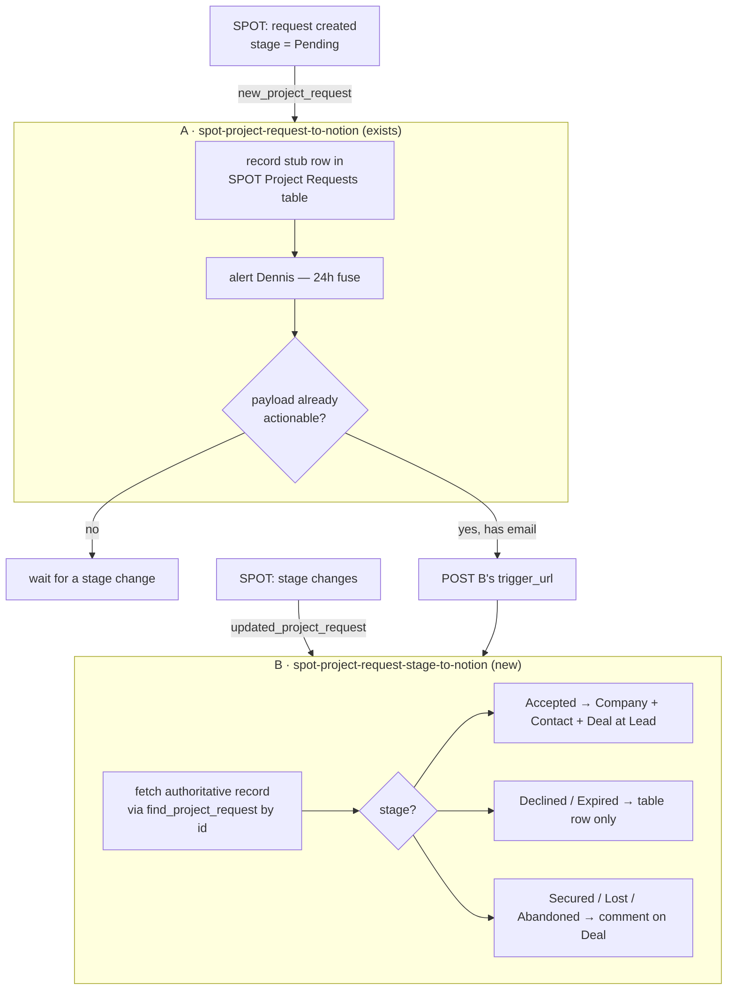

# Two-trigger design: `new_project_request` + `updated_project_request`

Status: **proposal, nothing built.** Written 2026-08-06 after `spot-project-request-to-notion`
sat at zero runs through the Partner Deal Exchange cutover.

## Why this exists

The deployed Zap assumes one delivery carries a complete project request — contact
name, email, company, brief — the shape the old PartnerPage directory form had. The
Deal Exchange lifecycle does not work that way, so a single trigger on
`new_project_request` cannot file a usable Deal.

## Established facts

Everything in this section was verified on 2026-08-06, not inferred.

| Fact | Evidence |
|---|---|
| A workflow version carries **one** trigger | `publish-workflow-version --trigger` takes a single JSON object; `get-workflow` returns `trigger` (singular) on the version |
| `new_project_request` — "Triggers when a new project request is created for your partner account" | `search_triggers App227952CLIAPI` |
| `updated_project_request` — "Triggers when a project request **stage** changes" | `search_triggers App227952CLIAPI` |
| Neither trigger takes input params | `get_trigger_fields` returns `{"properties": {}}` for both |
| A `find_project_request` **search** action exists — filter by `id` or `email`, or return all | `inspect_zapier_actions` |
| SPOT currently holds **zero** project requests | `find_project_request` with no filter returned `{"results": []}` |
| Lifecycle: Pending → Accepted/Declined → Expired (24h) → Secured/Lost → Abandoned | Notion: Zapier Co-Selling 101, Monthly Partner Touchpoint |
| "Client name and contact info are **hidden until acceptance**" | Notion: Zapier Co-Selling 101 |
| Only portal admins/owners can accept; 24h window; automating acceptance is discouraged | Notion: Co-Selling 101, Touchpoint |

The empty `find_project_request` result is the important one: the Zap has zero runs
because **SPOT has nothing to deliver**, not because the trigger is misconfigured.

## The constraint

One trigger per version means "two triggers" is necessarily **two workflows**. The
question is how to split the work without duplicating the ~700 lines of company /
contact / deal resolution that already exist.

## Proposed shape

Two workflows, with all CRM logic in exactly one of them.



### A — `spot-project-request-to-notion` (the existing Zap, reduced)

Keeps its trigger. **Stops writing to Notion.** New job:

1. Write a stub row to the requests table (`Request Id`, `Stage`, `Payload`, first-seen).
2. Alert — a Pending request has a 24-hour fuse and only a human can accept it in
   the portal. This is arguably the highest-value thing the whole system does, and
   the current design does not do it at all.
3. If the payload is *already actionable* (carries an email and a stage past
   Pending — a Direct lead may arrive this way), POST to B's internal `trigger_url`
   so B does the CRM work. This closes the gap where a request is born Accepted and
   no stage change ever follows.

### B — `spot-project-request-stage-to-notion` (new)

Trigger: `updated_project_request`, same connection (`02a5085e-…`), `params: {}`.
Owns every Notion write. Inherits `extractRequest`, `resolveCompany`,
`resolveContact`, `createDeal`, `createItemWithTemplate` from A's source verbatim.

Because `updated_project_request` may deliver only a delta, B's first step fetches
the authoritative record:

```ts
const record = await ctx.step(`fetch-${requestId}`, async () =>
  sdk.runAction({
    appKey: "App227952CLIAPI",
    actionType: "search",
    actionKey: "find_project_request",
    connection: SPOT_CONNECTION,
    inputs: { id: requestId },
  }),
);
```

This makes B correct whether the trigger sends the whole record or just
`id` + `stage`. Note this adds a connection binding A does not have: the partner-tool
credential currently lives only on the trigger, never in `--connections`. B needs it
in **both** places.

### Stage → behaviour

| Stage | Notion | Table |
|---|---|---|
| Pending | *nothing* | stub row, alert |
| Accepted | Company + Contact + Deal at Lead (today's logic) | fill page ids |
| Declined, Expired | *nothing* | close row, reason |
| Secured | **comment** on the Deal | update |
| Lost, Abandoned | **comment** on the Deal | update |

Deliberately no status write on an existing Deal at Secured/Lost — that preserves the
existing invariant ("a human's Declined cannot be undone") recorded in `zap.json`.

## Why no Notion write at Pending

Three reasons, in order of weight:

1. **There is nothing to write.** Contact info is hidden until acceptance, so the
   Contact — which the whole graph keys on — cannot be resolved.
2. **Most Pending requests may never become anything.** A 24-hour expiry with no
   penalty for declining means orphaned Deals would accumulate at Lead.
3. The existing code already half-agrees: line 1089 returns `skipped` on a missing
   email rather than throwing, and — correctly — writes **no** dedupe row, so the
   request is not marked as filed. That behaviour is right; it just has no second act.

## State model

The requests table (`01KYV1R8BWAZ697HQ8P1QV80AF`) changes from a write-once index to a
row updated across stages. `sdk.updateTableRecords` exists (CLI: `update-table-records`,
`--key-mode names`), so a row can be mutated in place using the record id from
`listTableRecords`.

Fields to add: `First Seen`, `Last Stage`, `Stage History`, `Alerted`.

**Dedupe keys.** A dedupes on `Request Id` (one stub per request). B must dedupe per
*transition*, not per request, or a re-poll of one stage redoes work while a genuine
later transition is swallowed. Use `<request_id>_<stage>` — exactly the composite
`zapier-partner-lead-status-to-notion` already uses (`<lead_id>_<lead_status_modified_on>`).

## The first real request (2026-08-06)

Request `02700000000002800hE` arrived at 16:26:47 and the trigger fired at
16:27:44 — inside a minute. It **confirmed the central premise of this design**
and answered one of the four open questions outright.

```json
{
  "id": "02700000000002800hE", "project_request_id": "02700000000002800hE",
  "type": "match", "source": "Zapier Sales", "lead_stage": "Pending",
  "email":      "Please accept or secure the lead to see the email.",
  "first_name": "Please accept or secure the lead to see the first name.",
  "last_name":  "Please accept or secure the lead to see the last name.",
  "company": "Doecke Electrical", "website": "www.doeckeelectrical.com.au",
  "company_size": "1-10", "industry": "Retail & Wholesale",
  "location": "Oceania (Australia & New Zealand)", "language": "English",
  "timezone": "UTC+10:00 (Sydney/Melbourne)", "budget": "$0 - $250",
  "service_requested": "", "tool_requested": "",
  "project_description": "Hi I would love some help creating a zap from email to aroflow to monday.com please, it is not working as required",
  "created_on": "2026-08-06T16:26:47.423", "modified_on": "2026-08-06T16:26:47.423",
  "client_id": "", "modified_by_id": "7NT00000000001F00hE",
  "partner_account": "00100000000004F00hE", "partner_contact": "00500000000005d00hE"
}
```

The run returned `{"skipped": true, "reason": "payload carried no usable email
address"}` with `operations: []` — **no Notion write, no dedupe row.** Exactly
the behaviour "Why no Notion write at Pending" argues for, though arrived at by
accident rather than by design.

**Identity is withheld with prose, not empty fields.** That is worse than this
note assumed. The email sentence fails `EMAIL_RE` only because it has no `@`;
the two name sentences are ordinary non-empty strings, so `firstString` took
them, and had the address ever parsed, the Contact and Deal would have been
titled *"Please accept or secure the lead to see the first name. Please accept
or secure the lead to see the last name."* Now caught explicitly by
`SENTINEL_RE` / `firstRealString`.

**Four candidate lists missed**, each silently emptying a field the payload was
carrying: `location` (country — and it holds a *region*), `tool_requested`
(apps), `service_requested` (services), `lead_stage` (stage). All four now read.

**Three value vocabularies disagree with Notion's** and were dropped by the
guards — correct, but lossy. `company_size: "1-10"` now maps to `1-49`;
`industry: "Retail & Wholesale"` to `Retail`; `location` names two countries, so
the country is recovered from the website's ccTLD (`.com.au` → Australia).

Note also `source: "Zapier Sales"` with `type: "match"` — an internal sales
referral competing against other partners, not a directory lead. Both sources
feed the same trigger, which is why the PartnerPage-derived candidate spellings
are kept rather than collapsed.

## Open questions

Narrowed by the first run, but not closed.

1. **Does `updated_project_request` fire on Pending → Accepted?** Still the
   question the whole design rests on. Nothing in the first run speaks to it. If
   it only fires on later stages, B never creates anything and A's trigger_url
   handoff becomes the primary path rather than the fallback.
2. **Does the payload carry the full record or a delta?** Still open. The sibling
   `referral_lead_status_change` delivers the *whole* record (id, name, email,
   status, dates, commission) — good precedent, not proof. The
   `find_project_request` fetch makes B correct either way.
3. ~~**Real key spellings.**~~ **Answered** — see above.
4. **Does an Accepted payload actually carry the contact email?** Still open, and
   now sharper: the field is *present* at Pending but filled with a sentinel, so
   the question is whether acceptance replaces that sentence with an address or
   leaves it standing. If it never resolves, the Contact must be resolved from the
   client introduction email to `leads@work.flowers` instead — a different design.

Question 4 is answerable the moment any request is accepted: re-read
`find_project_request` and look at `email`.

## Rollout

1. Build B; publish **disabled**, trigger unclaimed.
2. Reduce A to record + alert. Republish. Sync `zap.json`.
3. Wait for a genuine project request. Read A's run output — it echoes the raw
   payload, which answers questions 3 and 4 without opening Notion.
4. Only then claim B's trigger and enable.

Do not claim B's trigger before a payload has been seen. A polling trigger banks its
first poll as already-seen, so claiming early is free — but publishing CRM logic
against a guessed payload shape is not.
