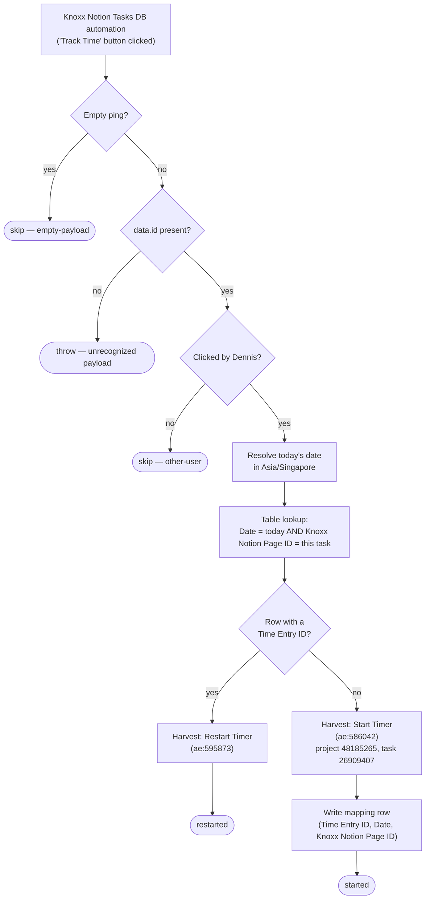

# start-a-timer-from-knoxx-notion-task

Clicking **Track Time** on a task in the **Knoxx** Notion workspace starts a Harvest timer for it. Every entry goes to one fixed project and task, **Knoxx Foods - AI Ops Retainer** / **Build**, and carries a Notion external reference so the entry links back to the page.

It runs one timer per task per day. The `(task, day) → Harvest time entry` mapping lives in Zapier Table `01K5060J1B1FHCJEWVVH597B71` (column `Knoxx Notion Page ID`), so a second click on the same day **restarts** the existing entry instead of opening a duplicate.

This is the Knoxx twin of [`start-a-timer-from-notion-task`](../start-a-timer-from-notion-task/), which does the same for the work.flowers workspace. The two share the Harvest actions and the mapping Table but write different columns.

**Status:** ⏳ Pending first publish, which happens on merge and enables the workflow. It replaces the classic Zap **(Knoxx) Start a Timer From Linear Description Emoji**. Despite that name, the classic Zap is triggered by a Notion button, not by Linear. Dennis is disabling it by hand.

## What it does

## Trigger

The trigger is a Webhooks by Zapier Catch Hook (`hook_v2`). A Notion database automation on the Knoxx workspace's **Tasks Database** (data source `3d58094c-3d8a-82fb-9bd8-07fbdf40b4cc`) posts the page when the button is clicked.

The automation must POST to the **catch URL**, which is `trigger.webhook_url` in `zap.json` and gets filled in by the first publish. Do **not** use the `code-substrate-workflows.zapier.com` `trigger_url`, which is Zapier-internal.

The workflow reads four fields from the standard Notion automation payload `{ data: { id, url, properties }, source: { user_id } }`:

- the page id
- the page url
- `Task ID` (a `unique_id` property, rendered `PREFIX-123`)
- `source.user_id`

It makes no Notion API calls, so it needs no Knoxx Notion connection.

## Cutover

1. Merge the PR. The publish pipeline creates the workflow, enables it, and writes the catch URL into `zap.json`.
2. Disable the classic Zap in the Zapier UI.
3. In the Knoxx Notion Tasks Database, repoint the **Track Time** button automation to the new catch URL.
4. Record the date in `zap.json` under `cutover.classic_zap_disabled`.

Between steps 2 and 3, clicks reach neither Zap, so keep the gap short. On cutover day, the first click on a task that the classic Zap already timed today starts a **second** entry instead of restarting the first. That happens because of the date format change described below. It only affects that one day.

## Maintainer notes

- **Only Dennis's clicks count.** Every entry is written against Harvest user `5171104`, so the workflow checks `source.user_id` against Dennis's Notion user id and skips everyone else. Notion user ids are global, so this id is the same one the work.flowers twin uses. It was confirmed in the Knoxx workspace's `/v1/users` list.
- **"Today" is the Singapore day, which changes behaviour from the classic Zap.** The classic Zap formatted the date in UTC, so it booked every timer started before 08:00 SGT to the previous day. This workflow uses a fixed +8 offset, the same as its twin.
- **The Table's `Date` column is pinned to `YYYY-MM-DDT00:00:00Z`, which also changes behaviour from the classic Zap.** The classic Zap wrote a bare date, and Zapier Tables coerces a bare date in the account's timezone. As a result, its 110 Knoxx rows store the previous day at `T16:00:00Z`. Pinning midnight UTC matches the twin and the Linear-era rows. An `exact` search in one form never matches the other form, which is why the cutover-day caveat above exists.
- **Empty pings are skipped. Any other unreadable payload throws.** Those are `{}`, `""`, `null`, and wrapper-only bodies such as `{"querystring":{}}`. A non-empty payload with no `data.id` raises an error, so a Notion payload change shows up as a red run.
- **The start-timer output contract is inferred.** The Harvest actions are UI-authored custom actions (`ae:` prefix), so their output isn't introspectable. `timeEntryIdFrom()` reads `result.id` first, which is what the classic Zap mapped, then tries a few fallbacks. If none of them match, the run throws with the raw response rather than writing a broken row. The timer keeps running either way.

## Verified cases

`run-durable` against the live runner on 2026-09-30. None of these reach a write:

| Input | Outcome |
| --- | --- |
| `{}`, `null`, `""`, `{"querystring":{}}` | `{ skipped: "empty-payload" }` |
| `{"foo":1}`, `{"data":{}}`, `{"data":{"id":""}}` | throws `Unrecognized payload (no data.id)` |
| a real-shaped payload with another user's `source.user_id` | `{ skipped: "other-user" }` |

The **start** and **restart** paths have not run yet, because each one starts a real Harvest timer.
