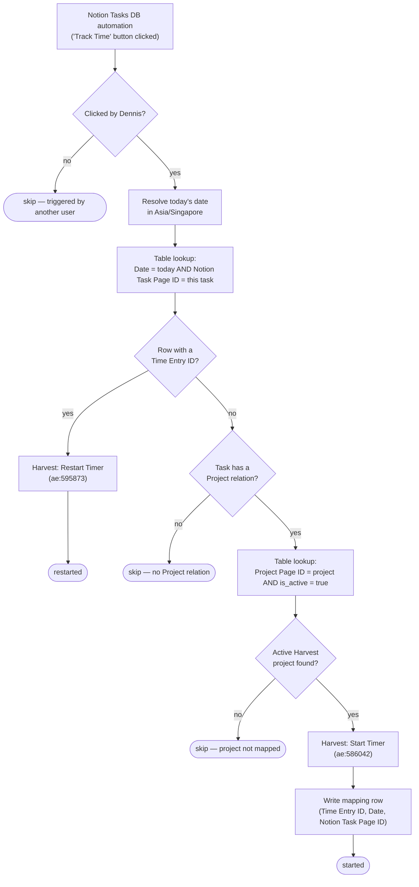

# start-a-timer-from-notion-task

Clicking **Track Time** on a Notion task starts a Harvest timer for it — booked to the Harvest project mapped to that task's Notion **Project**, against the `Automations (Standard)` task, and stamped with a Notion external reference so the entry links back to the page.

One timer per task per day. The `(task, day) → Harvest time entry` mapping lives in Zapier Table `01K5060J1B1FHCJEWVVH597B71`, so clicking the button again later the same day **restarts** the existing entry rather than opening a duplicate.

**Status:** ✅ Enabled on Zapier, trigger claimed, and the Notion Tasks DB automation posts to the catch URL. Cutover completed 2026-07-27. One thing is still unconfirmed — see [Remaining work](#remaining-work).

## What it does



## Trigger

Webhooks by Zapier Catch Hook (`hook_v2`). A Notion database automation on the **Tasks** data source (`27a91b07-11ac-81ed-973f-000ba6da1441`, in *Project Management DB*) posts the page on button click.

The automation must POST to the **catch URL**:

```
https://hooks.zapier.com/hooks/catch/20495893/C5myxfQnjplFgaa56/
```

Not the `code-substrate-workflows.zapier.com` `trigger_url` in `zap.json`, which is Zapier-internal. Disabling the workflow moves the trigger to `status: "released"` but keeps this URL; re-enabling restores it.

The payload is the standard Notion automation shape — `{ data: { id, url, properties }, source: { user_id } }` — and the workflow reads four things from it: the page id, the page url, `Ticket ID` (a `unique_id` property, rendered `TKT-216`), and the first entry of the `Project` relation.

## Maintainer notes

- **Only Dennis's clicks count.** Every entry is written against Harvest user `5171104`, so a click by anyone else would silently bill time to him. `source.user_id` is checked against his Notion user id and everything else short-circuits.
- **Timezone is load-bearing.** "Today" is the Singapore day, not the UTC day — the UTC date rolls over at 08:00 SGT, so a UTC-based date would book every pre-8am timer to yesterday *and* miss the same day's existing mapping row. Singapore has had no DST since 1982, so the code uses a fixed +8 offset rather than depending on the durable runtime carrying a full ICU timezone database.
- **The Table's `Date` column is a datetime, and Zapier Tables coerces bare dates in the account's timezone.** Writing `"2026-07-27"` stores `2026-07-26T16:00:00Z`. Reads coerce the same way so bare-in/bare-out does round-trip, but it records the wrong UTC day and disagrees with the 100 Linear-era rows already in the table. The workflow pins `YYYY-MM-DDT00:00:00Z` explicitly on both the write and the search. An `exact` search for a bare `YYYY-MM-DD` does **not** match a stored `T00:00:00Z` — verified against a scratch table.
- **`find_record` returns `{ data: [] }` on a miss**, not a row of nulls. Both lookups go through `firstRow()`, which returns `null` rather than throwing.
- **Both Harvest actions are UI-authored custom actions** (`ae:` prefix), so their input and output shapes are not introspectable from the SDK. Inputs were confirmed via `list-action-input-fields`. The *output* contract — where the new time entry id lives — is inferred from the classic Zap's `result__id` reference; `timeEntryIdFrom()` checks several paths and throws with the raw payload if none hit. **This is the one contract still unverified against a real run.**
- If the timer starts but its id can't be read back, the workflow throws rather than writing a broken row: the timer is running either way, and a row without an id would let tomorrow's click start a duplicate.
- A missing project mapping returns a skip result instead of throwing — it's a permanent condition, and throwing inside `ctx.step` would spin the durable's retry loop.
- Table `f5` ("Knoxx Notion Page ID") belongs to a different workspace and is **not** written. The migration wrote the task page id into both `f5` and `f6`; only `f6` is searched. Both columns are empty across all 100 existing rows.

## Migration state

Migrated from the classic Zap **Start a Timer from Notion Task** using the Durables UI on 2026-07-27. **The migration output was not functional.** It is preserved as version `019fa2be-e092-75b2-a57e-952f18721d3b`; `workflow.ts` here is a rewrite, published the same day as `019fa2d9-d958-7251-9da4-1ee8d8811b58`.

What was wrong with the migrated source:

| # | Issue | Effect |
| --- | --- | --- |
| 1 | Does not parse — `const harvestAe:586042 = …` is not a valid binding, and `${input.data.properties.Ticket ID.unique_id.prefix}` has an unquoted key with a space inside a template literal | `tsc` fails with TS1005 / TS1160. The version published, because publishing doesn't typecheck |
| 2 | `String(input.source.user_id).toLowerCase() === "{{=components.variables['019d9007-…']}}"` — a Zapier template left as a literal string | The user filter can never be true, so the workflow returns immediately on every run |
| 3 | `userId: "{{=Components.variables['019d489c-…']}}"` — same, for the Harvest user | Harvest would reject the start-timer call |
| 4 | `lookup_value: "{{=output[\"364625177\"][…][\"Project\"][\"relation\"][0][\"id\"]}}"` — a reference to the classic Zap's trigger node, which has no equivalent in the durable | The project lookup can never match |
| 5 | `"{{zap_meta_human_now}}"` fed into a 40-line generated `dayjs` shim | Falls through to the shim's "unparseable → now" branch and yields **today in UTC**, not in Singapore. Wrong day for anything started before 08:00 SGT |
| 6 | `projectId: input.old__data__f1` | The project id from the `findProjectId` step, mis-bound to a field that doesn't exist on the input |
| 7 | `new__data__f3: input.result__id` | The Harvest time entry id from the start-timer step, same mis-binding |
| 8 | `(findTimeEntryRecord.data[0] as Record<string, unknown>).old.data.f3` with no length check | `find_record` returns `{ data: [] }` on a miss, so `data[0].old` throws — on the *primary* path, the first click of the day |
| 9 | `getCurrentDate.output` (bare `YYYY-MM-DD`) used against the datetime column `f4` | Self-consistent, but stores the wrong UTC day and never matches the existing rows' `T00:00:00Z` form |
| 10 | `new__data__f5: input.data.id` | Writes the task page id into "Knoxx Notion Page ID", a different workspace's column |
| 11 | No `// Source of truth:` header | Repo rule 2 |

Also fixed at publish time: **the trigger was unclaimed** (`status: "unclaimed"`, `details: null`), so no catch URL existed and nothing could reach the workflow. Publishing with `--trigger` claimed it.

### How it was published

```bash
zapier-sdk --experimental publish-workflow-version 019fa2be-dd13-7d17-bdef-356eb7605c65 "$SOURCE_FILES" \
  --dependencies '{"@zapier/zapier-sdk":"0.91.0","zod":"4.4.3"}' \
  --zapier-durable-version '0.10.1' \
  --connections '{"harvestcliapi_connection":{"connectionId":"02df9d5d-89ea-8dab-bb40-8ee0c2ac4362"}}' \
  --trigger '{"selected_api":"WebHookCLIAPI@1.1.1","action":"hook_v2","authentication_id":null,"params":{}}'
```

`--enabled false` is documented but does **not** work — the publish enables the workflow regardless. Use `disable-workflow` afterwards if you need it off.

## Remaining work

**Confirm the first real run.** As of the cutover the workflow has never fired (`list-workflow-runs` returns empty), so one contract is still untested: `timeEntryIdFrom()`, which reads the new Harvest time entry id out of the custom action's response. The action is UI-authored, so its output shape isn't introspectable from the SDK, and verifying it means starting a live timer.

On the first click, check the run output carries a `timeEntryId`. If the shape is wrong the run throws with the raw payload — which will show where the id actually lives — and the timer is left running in Harvest but unindexed, so the next day's click would start a duplicate until the row is added.

Accepted, not blocking:

- **The Notion actor id is inferred.** `121d872b-594c-810b-ba5a-000206eeef1e` is Dennis's user id in the work.flowers workspace and matches what a button-click automation sends, but the classic Zap's `components.variables` values aren't readable through the SDK, so it hasn't been checked against the original. Fails safe: if wrong, every run returns `{ skipped: true, reason: "triggered by another user" }` and nothing is written. The Harvest user id `5171104` *is* confirmed, from `/v2/users/me` on the bound connection.
- **Harvest task `23938620` ("Automations (Standard)") has `is_active: false`.** Not yet confirmed that a running timer can be booked against it.
- **Zapier Table `01K8A2KV9X1W95GAB6Y69D7G4C` has a bad row** — "SCW - AI Ops Retainer" carries `project_id: "WF-10"`, the Notion *Project ID*, where a numeric Harvest project id belongs. Starting a timer on that one project will fail. Known and deliberately left as-is (2026-07-27); fix the row if that project ever needs time tracked against it.
