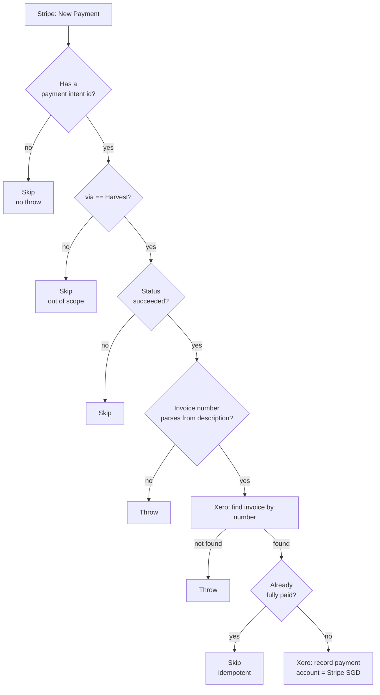

# Stripe payment → Xero invoice marked paid

When a client pays a **Harvest-issued invoice** via Stripe, records that payment against the
matching sales invoice in Xero (bank account: **Stripe SGD**) — closing the loop so the
invoice shows as paid without anyone touching Xero by hand.

Migration of the classic Zap **"Mark Harvest Invoice Paid in Xero when Stripe Payment
Received"**.

## Trigger

Stripe **New Payment** (`new_payment`, polling), no filter params — fires on every completed
Stripe payment. All Harvest-specific scoping happens in workflow code, matching the classic
Zap's design (its own filter step ran after the trigger, not as part of it).

## What it does

1. Reads the Stripe payment off the trigger payload. Skips cleanly (no throw) if there's no
   payment intent id — an empty or test delivery.
2. Skips (no throw) if the payment's `charge.metadata.via` isn't `"Harvest"` (case-insensitive)
   — most Stripe payments in this account are subscriptions or direct Stripe invoices, not
   Harvest ones, and that's expected, not an error.
3. Skips (no throw) if the payment's status isn't `succeeded`, when present.
4. Extracts the Harvest invoice number from the charge's description (`"Charge for Invoice
   HAR-13"` → `"HAR-13"`). **Throws** if this doesn't parse — a Harvest-tagged payment we can't
   read the invoice number from is a real problem, not something to silently drop.
5. Looks up the invoice in Xero by number. **Throws** if it isn't found — same reasoning.
6. **Idempotency guard**: if the invoice is already `Status: PAID` or `AmountDue <= 0`, skips
   cleanly. This is the substantive fix over the classic Zap (see below).
7. Records the payment: `invoice_type: "Invoice"`, `account_id`: Stripe SGD, `date` from the
   Stripe charge's timestamp, `amount` from the Stripe payment (no cents conversion — see
   Maintainer notes), `reference`: the Stripe payment intent id.

## Cost

- Non-Harvest payment: **0 tasks** (skipped in code before any app action).
- Harvest payment, invoice already paid: **1 task** (the Xero lookup; the idempotency guard
  fires before any write).
- Harvest payment recorded: **2 tasks** (lookup + record payment).

## Maintainer notes — this one writes real money-adjacent records

Given the stakes, this workflow's design was discussed and confirmed rather than assumed:

- **Idempotency guard added.** The classic Zap had zero validation — it would have blindly
  attempted to create a payment on every matching delivery, with no check for whether one
  already existed. This durable looks the invoice up first and skips if it's already fully
  paid. **Verified against real data**: invoice `HAR-13` is already `PAID` in the live org, with
  its recorded `Payment.Reference` exactly matching the Stripe payment intent id
  (`pi_3TbFjkJYWXjnDZq80rolzF1Q`) used in testing — a real, already-settled case that exercises
  this guard precisely.
- **No currency/amount cross-check against the invoice, by design.** Confirmed with Dennis:
  keep this close to the classic Zap rather than add extra validation the classic Zap never
  had.
- **Unresolvable payments throw, not skip — also confirmed.** A Harvest-tagged payment whose
  description doesn't match `"Charge for Invoice <number>"`, or whose invoice number doesn't
  exist in Xero, raises a Zapier error alert rather than silently doing nothing. The classic
  Zap would have failed in some undefined way on either case (never tested); this makes the
  failure loud and diagnosable.
- **Stripe's `amount_received` is used as-is — no `/100` cents conversion.** This was verified,
  not assumed: Stripe's raw REST API is normally cents-based, but Zapier's Stripe app exposes
  `amount_received`/`amount_received_formatted` **already scaled to the real currency amount**
  for this trigger. Cross-checked against the same already-paid `HAR-13` case — Stripe's
  `amount_received: 900` (`amount_received_formatted: "SGD 900.00"`) exactly matches the
  **already-recorded** Xero `Payment.Amount: "900.00"`. Dividing by 100 here would have been a
  real bug.
- **`Stripe SGD` is the only Stripe-related account in Xero** (confirmed against all 27 bank/
  clearing accounts) — used for every Harvest payment regardless of the invoice's own currency
  (USD Harvest invoices exist: `HAR-9`, `HAR-10`). `currency_rate` is left unset, matching the
  classic Zap; Xero applies its own day rate for non-base-currency invoices.
- **No live payment has been recorded by this workflow yet.** Every Harvest invoice currently
  in the live org (`HAR-1`, `HAR-2`, `HAR-4`, `HAR-9`, `HAR-10`, `HAR-13`) is already `PAID`, so
  there was no safe real case to exercise the actual write step against — only dry-run
  composition against a real currently-unpaid invoice (`INV-0083`, not itself a Harvest
  invoice, used only to prove the field mapping). **Watch the first real Harvest payment after
  this publish.**
- **The classic Zap's filter, formatter and Xero payment steps were ALL `paused: true`** in the
  export — only its trigger was live. **Turn the classic Zap off** in the Zapier UI (don't
  unpause its steps), or both would attempt to record the same payment.
- A manual run accepts the Stripe payload plus `{"dryRun": true}` and returns the composed
  payment without recording it. The Stripe trigger itself never sets `dryRun`.
