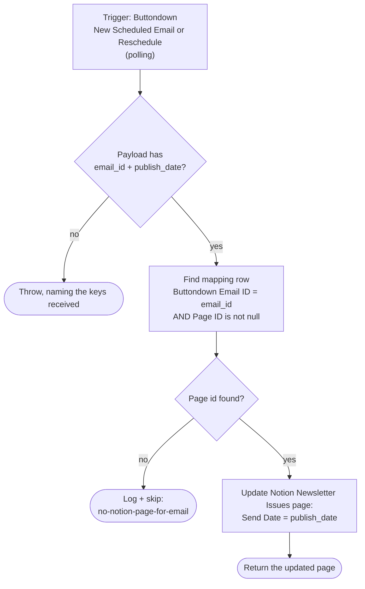

# update-notion-when-rescheduled-in-buttondown

Keeps the Notion **Newsletter Issues** `Send Date` in step with Buttondown. When an
email's send date is set or changed in Buttondown, this writes that date back onto the
Notion page the email came from.

**Status:** enabled on Zapier, waiting for its first real reschedule. Migrated from a
classic Zapier UI Zap to a Durable via the Durables UI migration tool (2026-08-07),
then fixed and republished into a fresh **account-visible** container the same day —
see [History](#history).

This is the reverse leg of [`notion-newsletter-to-buttondown`](../notion-newsletter-to-buttondown/):
that Zap pushes Notion → Buttondown on a button press, this one pulls a Buttondown
reschedule back into Notion.

## What it does

Looks the Buttondown email id up in the shared **Email Newsletter ID Mapping** Zapier
Table (`01KNJN2MSBAJVXRME6M1Y65F5B`), which the outbound Zap writes on every send, and
patches `Send Date` on the Notion page the matching row points at. Nothing else on the
page is touched. An email with no mapping row is skipped, not an error — see
[Why a miss must skip](#why-a-miss-must-skip).

## Workflow



## Trigger

`new_email_reschedule` on the private **Buttondown Unofficial #2** app
(`App240106CLIAPI@1.0.4`, auth `63956850`; integration source lives in
`~/Repos/zapier-buttondown`). A **polling** trigger, not a webhook — so there is no
external catch URL, and nothing needs configuring on the Buttondown side.

It polls `GET /v1/emails?status=scheduled&ordering=-creation_date&page=1`, keeps rows
that have a `publish_date`, and dedupes on `` `${id}:${publish_date}` `` — that composite
key is what makes a *re*schedule a new event rather than a duplicate of the first one.
The payload carries `email_id` and `publish_date` alongside subject/body/status/slug.

Two consequences worth knowing:

- **Durable triggers can't set a polling interval**, so this runs at the account
  default. If the classic Zap had a custom interval, it was silently dropped by the
  migration.
- **Unscheduling is invisible.** Moving an email back to draft removes it from the
  `status=scheduled` list, which produces no event, so the Notion `Send Date` is never
  cleared. Only sets and changes propagate.

## The mapping table

Zapier Table `01KNJN2MSBAJVXRME6M1Y65F5B` ("Email Newsletter ID Mapping"), written
best-effort by [`notion-newsletter-to-buttondown`](../notion-newsletter-to-buttondown/):

| Field | Name | Holds |
| --- | --- | --- |
| `f1` | Page ID | Notion Newsletter Issues page id |
| `f2` | Buttondown Email ID | `em_…` |
| `f3` | Created at | datetime |

The lookup filters on `f2 exact <email_id>` **and** `f1 isnull false`, so the legacy
rows with a null Page ID (there is at least one, from 2026-04-08) can't produce a write
against `undefined`. Table reads cost no tasks and need no connection.

`find_record` wraps each hit as `{new, old, record_id, table_id}` — on a plain search
`new` is `null` and the stored values live at `old.data.<fieldId>` — and returns
`{data: []}` on a miss.

## Why a miss must skip

The trigger polls **every** scheduled Buttondown email, not only ones sent from Notion.
So an email scheduled directly in Buttondown legitimately has no mapping row, and that
is a non-event, not a failure. The migrated version read `data[0].old.data.f1`
unguarded, which threw `TypeError: Cannot read properties of undefined (reading 'old')`
and burned all five step retries — turning routine Buttondown use into Zapier error
alerts, the alert-fatigue failure mode the repo's *skip, never throw* rule exists to
prevent. A miss now logs a line (so the run history still shows the email was seen) and
returns `{skipped: "no-notion-page-for-email", email_id}`.

The boundary stays sharp in the other direction: a payload that arrives **without** a
usable `email_id`/`publish_date` still throws, and names the keys it did receive. That's
a real event whose shape we failed to understand, and silencing it would hide the bug.

## Verified behaviour

Tested with `run-durable` against the live Table and Notion workspace, 2026-08-07:

| Case | Input | Result |
| --- | --- | --- |
| Mapped email, real page | `em_7mzpzetzbg9vy81fbsq2n5a8h0` / `2026-04-15T01:00:00Z` | ✅ Table hit → `Send Date` written on the "Your CRM's $2,500 Enrichment Feature…" page (run `019fdb90-3930-…`). Deliberately the value already on the page, so the write was a no-op. |
| Unmapped email | `em_doesnotexist` | ✅ Skips after one step: `{skipped: "no-notion-page-for-email"}` (run `019fdb90-2e50-…`) |
| Full nine-field trigger payload | realistic `id`/`subject`/`body`/`status`/`slug`/… | ✅ Extra keys tolerated (zod strips unknowns), skip path reached (run `019fdb90-ca88-…`) |
| Unmapped email, **pre-fix** | `em_doesnotexist` | ❌ `TypeError` on `.old`, step retried (run `019fdb87-d810-…`, now fixed) |

**Datetime representation.** `use_zapier_datetime_fields: true` passes the Buttondown
UTC string straight through rather than converting to the account timezone, so the
property flips from Notion's `2026-04-15T09:00:00.000+08:00` form to
`2026-04-15T01:00:00.000+00:00`. Same instant, and Notion renders it identically in the
UI, but every reschedule rewrites `Send Date` in UTC-offset form. Harmless — the
outbound Zap reads `date.start` and both forms are unambiguous.

**No feedback loop.** This writes `Send Date`; the outbound Zap only fires on a manual
**Send to Buttondown** button press, never on a property edit. So a Buttondown
reschedule cannot bounce back out to Buttondown.

## History

The Durables UI migration tool produced workflow `019fdb7e-70ed-7c6c-be85-71c6f09794d4`
(version `019fdb7e-75e8-…`). It never ran, and had three problems:

1. The unguarded empty lookup above.
2. No repo rule 2 source-of-truth header.
3. **`is_private: true`**, violating repo rule 7. Visibility **cannot** be changed after
   creation — `update-workflow` takes only `--name`/`--description`, and no publish
   command exposes a visibility flag — so the container had to be recreated. Cheap here
   precisely because the trigger is a poll: no external URL to rewire, nothing to touch
   on the Buttondown side.

Fixes 1 and 2 were applied (plus a tightened cast so the file typechecks under
`--strict`, and `InputSchema` actually being used instead of only feeding `z.infer`),
then published into this account-visible container. The old container is **disabled** and
its trigger claim shows `released`, so only this one polls. It's safe to delete once
this workflow has caught a real reschedule; its exact source and metadata are in git
history either way.

The classic Zap it replaces was turned off by Dennis on 2026-08-07.

## Test

```bash
SOURCE_FILES="$(jq -n --rawfile workflow workflow.ts '{"workflow.ts": $workflow}')"
zapier-sdk --experimental run-durable "$SOURCE_FILES" \
  --dependencies '{"zod":"4.3.6","@zapier/zapier-sdk":"0.70.2"}' \
  --zapier-durable-version '0.8.0' \
  --connections '{"notioncliapi_connection":{"connectionId":"02b73654-15c8-85c3-b16a-07304d2beb17"}}' \
  --input '{"email_id":"em_7mzpzetzbg9vy81fbsq2n5a8h0","publish_date":"2026-04-15T01:00:00Z"}' \
  --private
```

That payload reaches the **main path**, which writes to a real Newsletter Issues page —
pass the `Send Date` the page already has so the write is a no-op, or the schedule in
Notion will disagree with what actually went out. Swap in an unknown `email_id` to
exercise the skip path, which writes nothing.

`run-durable` wants the connection as `{"alias": {"connectionId": "<uuid>"}}`; the
deployed binding is the legacy numeric form `{"connection_id": 50656433}`, which is the
same work.flowers Notion connection.

## Deploy

```bash
SOURCE_FILES="$(jq -n --rawfile workflow workflow.ts '{"workflow.ts": $workflow}')"
zapier-sdk --experimental publish-workflow-version 019fdb92-378d-71b7-878e-f0791bf29515 "$SOURCE_FILES" \
  --dependencies '{"zod":"4.3.6","@zapier/zapier-sdk":"0.70.2"}' \
  --zapier-durable-version '0.8.0' \
  --connections '{"notioncliapi_connection":{"connection_id":50656433}}' \
  --app-versions '{"TableCLIAPI":{"implementation_name":"TableCLIAPI","version":"1.26.0"},"NotionCLIAPI":{"implementation_name":"NotionCLIAPI","version":"2.39.1"}}' \
  --trigger '{"selected_api":"App240106CLIAPI@1.0.4","action":"new_email_reschedule","authentication_id":"63956850","params":{}}' \
  --enabled --json
```

Always pass `--trigger` — publishing without it silently unclaims the trigger, leaving
the Zap "enabled" and never firing.

## Maintainer notes

- Notion connection: the deployed binding is the legacy numeric `50656433`, which is the
  **work.flowers** connection (UUID `02b73654-15c8-85c3-b16a-07304d2beb17`) — confirmed
  by the pinned `NotionCLIAPI@2.39.1` (the `Knoxx | Dennis #2` connection sits on
  `2.32.0`) and by Newsletter Issues resolving from it. Never bind the Knoxx connection.
- Notion data source `0c691b07-11ac-82fa-bc1b-07d0186a095d` = **Newsletter Issues**. Only
  `Send Date` is written, via `properties|||Send Date|||date__start`, which requires
  `use_zapier_datetime_fields: true` alongside it.
- No `template_mode` concern (repo rule 5): this updates an existing page, it never
  creates one.
- The durable pins `@zapier/zapier-durable@0.8.0` and `@zapier/zapier-sdk@0.70.2`, both
  behind the repo's newer Zaps (`0.11.1` / `0.92.0`). Deliberately left at the migrated
  versions so this change is attributable to the code fix alone; bump alongside the next
  real change.
