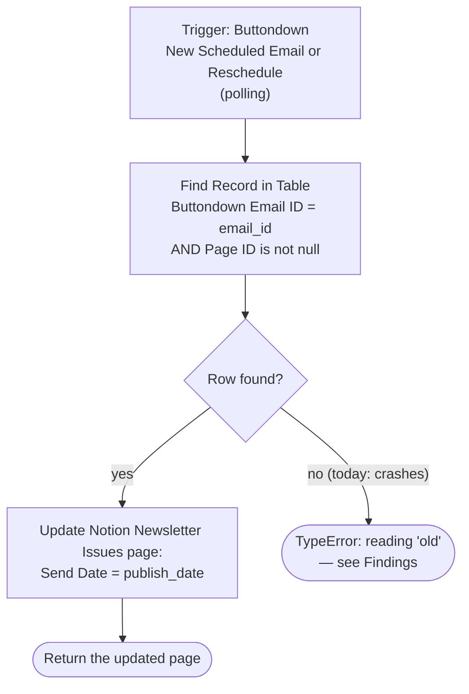

# update-notion-when-rescheduled-in-buttondown

Keeps the Notion **Newsletter Issues** `Send Date` in step with Buttondown. When an
email's send date is set or changed in Buttondown, this writes that date back onto the
Notion page the email came from.

**Status:** enabled on Zapier, but **it has never run** (no run history as of
2026-08-07). Migrated from a classic Zapier UI Zap to a Durable via the Durables UI
migration tool (2026-08-07). Stored here **exactly as deployed** — see
[Findings](#findings-from-the-first-inspection) for the three things that need fixing
before it can be trusted, none of which are applied yet.

This is the reverse leg of [`notion-newsletter-to-buttondown`](../notion-newsletter-to-buttondown/):
that Zap pushes Notion → Buttondown on a button press, this one pulls a Buttondown
reschedule back into Notion.

## What it does

Looks the Buttondown email id up in the shared **Email Newsletter ID Mapping** Zapier
Table (`01KNJN2MSBAJVXRME6M1Y65F5B`), which the outbound Zap writes on every send, and
patches `Send Date` on the Notion page the matching row points at. Nothing else on the
page is touched.

## Workflow



## Trigger

`new_email_reschedule` on the private **Buttondown Unofficial #2** app
(`App240106CLIAPI@1.0.4`, auth `63956850`; integration source lives in
`~/Repos/zapier-buttondown`). A **polling** trigger, not a webhook — so there is no
external catch URL, and nothing needs configuring on the Buttondown side.

It polls `GET /v1/emails?status=scheduled&ordering=-creation_date&page=1`, keeps rows
that have a `publish_date`, and dedupes on `` `${id}:${publish_date}` `` — that composite
key is what makes a *re*schedule a new event rather than a duplicate of the first one.
The payload carries `email_id` and `publish_date`, matching `InputSchema` exactly.

Two consequences worth knowing:

- **Durable triggers can't set a polling interval**, so this runs at the account
  default. If the classic Zap had a custom interval, it was silently dropped by the
  migration.
- **Unscheduling is invisible.** Moving an email back to draft removes it from the
  `status=scheduled` list, which produces no event, so the Notion `Send Date` is never
  cleared. Only sets and changes propagate.

## The mapping table

Zapier Table `01KNJN2MSBAJVXRME6M1Y65F5B` ("Email Newsletter ID Mapping"), written
best-effort by [`notion-newsletter-to-buttondown`](../notion-newsletter-to-buttondown/):

| Field | Name | Holds |
| --- | --- | --- |
| `f1` | Page ID | Notion Newsletter Issues page id |
| `f2` | Buttondown Email ID | `em_…` |
| `f3` | Created at | datetime |

The lookup filters on `f2 exact <email_id>` **and** `f1 isnull false`, so the legacy
rows with a null Page ID (there is at least one, from 2026-04-08) can't produce a write
against `undefined`. Table reads cost no tasks and need no connection.

`find_record` returns each hit wrapped as `{new, old, record_id, table_id}`, so the
page id is at `data[0].old.data.f1` — the migration tool got that shape right, verified
live.

## Findings from the first inspection

Nothing below is fixed in the deployed version; the source here matches Zapier byte for
byte, per the repo's deployed-is-truth rule.

1. **An unmapped email crashes the run — reproduced, not theoretical.** `find_record`
   returns `{data: []}` on no match, and `data[0].old` on an empty array throws
   `TypeError: Cannot read properties of undefined (reading 'old')`. Confirmed with
   `run-durable` run `019fdb87-d810-7abb-9e91-d95c4b2b1c4d`: step 1 completed with
   `{data: []}`, step 2 failed and began burning through its 5 retries. Because the
   trigger polls **every** scheduled email — not just ones sent from Notion — anything
   scheduled directly in Buttondown hits this path and raises a Zapier error alert for
   an event that was never ours to handle. The fix is the repo's usual skip:
   `if (!row) return { skipped: "no-notion-page-for-email" };`
2. **Missing the repo rule 2 source-of-truth header.** The deployed source has no
   `// Source of truth: …` comment.
3. **The container is private, which violates repo rule 7.** The migration tool created
   it with `is_private: true`. Visibility **cannot** be changed after creation —
   `update-workflow` takes only `--name`/`--description`, and no publish command exposes
   a visibility flag — so the only fix is recreating the container with `create-workflow`
   (no `--private`) and republishing. That's cheap here precisely because the trigger is
   a poll: no external URL to rewire, nothing on the Buttondown side to touch.

Smaller notes: `workflow.ts` doesn't typecheck under `--strict` (line 46 reads
`.old.data.f1` off an `unknown`, TS2571 — harmless at run time, since the runtime
transpiles without checking), and `InputSchema` is declared but never `.parse`d, so the
payload isn't validated.

## Verified behaviour

| Case | Input | Result |
| --- | --- | --- |
| Mapped email, real page | `em_7mzpzetzbg9vy81fbsq2n5a8h0` / `2026-04-15T01:00:00Z` | ✅ Table hit → `Send Date` written on the "Your CRM's $2,500 Enrichment Feature…" page (run `019fdb89-75d1-710c-b87f-90b4cf43017e`). Deliberately the value already on the page, so the write was a no-op. |
| Unmapped email | `em_doesnotexist` | ❌ `TypeError` on `.old`, step retried (finding 1) |

**Datetime representation.** `use_zapier_datetime_fields: true` passes the Buttondown
UTC string straight through rather than converting to the account timezone, so the
property flips from Notion's `2026-04-15T09:00:00.000+08:00` form to
`2026-04-15T01:00:00.000+00:00`. Same instant, and Notion renders it identically in the
UI, but every reschedule rewrites `Send Date` in UTC-offset form. Harmless — the
outbound Zap reads `date.start` and both forms are unambiguous.

**No feedback loop.** This writes `Send Date`; the outbound Zap only fires on a manual
**Send to Buttondown** button press, never on a property edit. So a Buttondown
reschedule cannot bounce back out to Buttondown.

## Test

```bash
SOURCE_FILES="$(jq -n --rawfile workflow workflow.ts '{"workflow.ts": $workflow}')"
zapier-sdk --experimental run-durable "$SOURCE_FILES" \
  --dependencies '{"zod":"4.3.6","@zapier/zapier-sdk":"0.70.2"}' \
  --zapier-durable-version '0.8.0' \
  --connections '{"notioncliapi_connection":{"connectionId":"02b73654-15c8-85c3-b16a-07304d2beb17"}}' \
  --input '{"email_id":"em_7mzpzetzbg9vy81fbsq2n5a8h0","publish_date":"2026-04-15T01:00:00Z"}' \
  --private
```

This **writes to a real Newsletter Issues page**. Pass the `Send Date` the page already
has so the write is a no-op, or the newsletter's schedule in Notion will disagree with
what actually went out. `run-durable` wants the connection as
`{"alias": {"connectionId": "<uuid>"}}`; the deployed binding is the legacy numeric form
`{"connection_id": 50656433}`, which is the same work.flowers Notion connection.

## Deploy

```bash
SOURCE_FILES="$(jq -n --rawfile workflow workflow.ts '{"workflow.ts": $workflow}')"
zapier-sdk --experimental publish-workflow-version 019fdb7e-70ed-7c6c-be85-71c6f09794d4 "$SOURCE_FILES" \
  --dependencies '{"zod":"4.3.6","@zapier/zapier-sdk":"0.70.2"}' \
  --zapier-durable-version '0.8.0' \
  --connections '{"notioncliapi_connection":{"connection_id":50656433}}' \
  --app-versions '{"TableCLIAPI":{"implementation_name":"TableCLIAPI","version":"1.26.0"},"NotionCLIAPI":{"implementation_name":"NotionCLIAPI","version":"2.39.1"}}' \
  --trigger '{"selected_api":"App240106CLIAPI@1.0.4","action":"new_email_reschedule","authentication_id":"63956850","params":{}}' \
  --enabled --json
```

Republishing into **this** container keeps it private (finding 3). If the visibility fix
is taken, `create-workflow` a fresh account-visible container first, publish there, then
disable and delete this one.

## Maintainer notes

- Notion connection: the deployed binding is the legacy numeric `50656433`, which is the
  **work.flowers** connection (UUID `02b73654-15c8-85c3-b16a-07304d2beb17`) — confirmed
  by the pinned `NotionCLIAPI@2.39.1` (the `Knoxx | Dennis #2` connection sits on
  `2.32.0`) and by Newsletter Issues resolving from it. Never bind the Knoxx connection.
- Notion data source `0c691b07-11ac-82fa-bc1b-07d0186a095d` = **Newsletter Issues**. Only
  `Send Date` is written, via `properties|||Send Date|||date__start`, which requires
  `use_zapier_datetime_fields: true` alongside it.
- No `template_mode` concern (repo rule 5): this updates an existing page, it never
  creates one.
- The durable pins `@zapier/zapier-durable@0.8.0` and `@zapier/zapier-sdk@0.70.2`, both
  behind the repo's newer Zaps (`0.11.1` / `0.92.0`). Left as migrated; bump only
  alongside a real change so a runtime regression is attributable.
