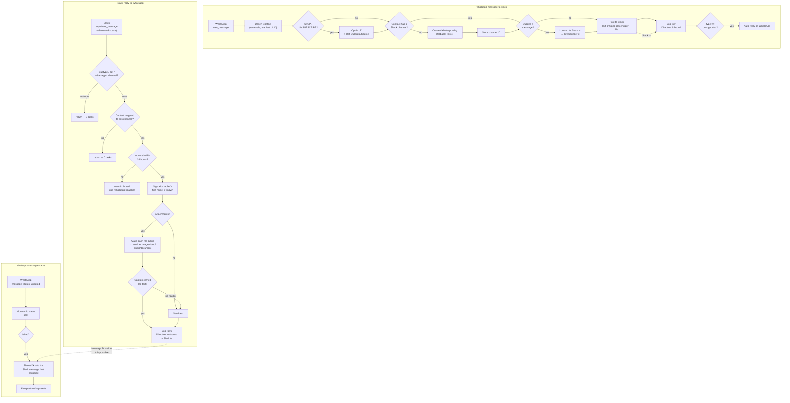

# whatsapp-slack-bridge

Two-way bridge between WhatsApp Business and Slack: each WhatsApp contact gets
their own `#whatsapp-<name>` Slack channel, messages land there, and replies in
that channel go back to the customer on WhatsApp.

Three durables replacing three classic Zaps, sharing one [`shared.ts`](shared.ts):

| Deployment | Entry file | Trigger | Replaces |
| --- | --- | --- | --- |
| `whatsapp-message-to-slack` | [`workflow.inbound.ts`](workflow.inbound.ts) | WhatsApp `new_message` | "WhatsApp -> Slack" |
| `slack-reply-to-whatsapp` | [`workflow.outbound.ts`](workflow.outbound.ts) | Slack `anywhere_message` | "Slack Replies -> WhatsApp" |
| `whatsapp-message-status` | [`workflow.status.ts`](workflow.status.ts) | WhatsApp `message_status_updated` | "Message Delivery" |

Each deployment publishes its entry file as `workflow.ts` alongside `shared.ts`,
the same shape as [`internal-user-ids-to-table-and-notion`](../internal-user-ids-to-table-and-notion/).

> **✅ Live since 2026-07-29.** The three classic Zaps are off and all three
> durables are enabled with their triggers `active`. The live media validation
> is still outstanding — see [Cutover validation](#cutover-validation).

The classic **"Send Template Message"** Zap (`:whatsapp:` reaction → `reeng`
template) is **out of scope and still live**. See [Known gaps](#known-gaps).

## Flow

[`whatsapp-slack-bridge.html`](whatsapp-slack-bridge.html) is a standalone visual of the
same three lanes, built for the [Notion page](https://app.notion.com/p/af61ea89e5af43c5a818db5172865568)
in Zapier OS. It adds what the flowchart above can't carry — where each workflow bails
out and what that prevents, plus the message-log merge rules. Fully self-contained
(workFlowers wordmark, Inter and JetBrains Mono all embedded as data URIs, nothing
fetched at runtime), so it can be dropped straight onto a Notion page as an HTML
preview block, or opened on its own.

## What changed from the classic Zaps

Ranked by what it cost in production, all evidenced from the live Tables.

**1. 36 of 42 contacts could never receive a message.** The classic Zap only
created a Slack channel when the contact record was *brand new* (its path
stopped on `_zap_data_was_found`), so anyone predating the one-channel-per-contact
model has no channel and the post went to `channel: ""`. Now the channel is
ensured on every inbound message whenever it's missing. Dormant contacts stay
dormant — nothing is backfilled — but one messaging again gets a channel
automatically.

**2. A new contact's first message was lost.** Channel creation and message
posting were *sibling paths* running concurrently; the posting path re-read the
contact record hoping to find a channel ID the other path was still writing.
Now it's sequential, and the re-read step is gone entirely.

**3. Concurrent find-or-create duplicated contacts.** 42 rows for 34 distinct
phones. `6591520097` acquired **five rows inside 0.54 seconds** when a burst of
messages each created its own. Now race-safe: create, re-read, converge on the
earliest ULID, delete only the duplicates this run created.

**4. Outbound rows keyed on a field that doesn't exist.** The log step looked up
`Message ID` = `gives[…].id` but *wrote* `messages[]id`. The send action returns
`messages[].id`, so the lookup ran with an empty value. Both now come from one
`sentMessageId()` helper.

**5. Every public Slack message outside a `whatsapp-*` channel raised a Zap
error.** The trigger is workspace-wide and the following Find Record had
success-on-miss off. A durable discards those with a `return` — no error, and no
task, because a run that performs no app action bills nothing.

**6. Status could regress.** WhatsApp doesn't guarantee webhook ordering and the
classic Zap overwrote unconditionally, so a late `delivered` clobbered a `read`.
Now monotonic, with `failed` terminal.

**7. `WhatsApp Username` received the sender's own phone number.** The classic
Zap wrote `from` into it, which is why four contacts have their phone number as
their username. The trigger *does* carry a real `contact_name` — it's what named
`#whatsapp-nasri-nasir`. Now the profile name goes to `WhatsApp Username` and its
first token to `First Name`, which no Zap had ever written.

**8. Opt-out destroyed consent provenance.** It overwrote `Marketing Opt-In Date`
with the opt-*out* time and `Opt-In Source` with "WhatsApp Opt-Out Request" —
deleting exactly the record needed to prove consent. Now written to dedicated
`Opt-Out Date` / `Opt-Out Source` columns, matched on word boundaries rather than
`icontains` (so "I don't want to unsubscribe" no longer opts someone out), and
announced in the contact's channel instead of flipping a flag silently.

**9. Media was lossy in both directions.** Inbound coalesced only `text.body` and
`image.caption`, so documents, voice notes, video and location all arrived as the
literal string "No Text" with no file. Outbound handled PDFs and images only —
anything else matched "File Attached", hit neither sub-path and was dropped; the
PDF test used `ireversecontains "pdf"`, true for `p`, `pd` and the empty string;
and only the first attachment was ever sent. Now every media type gets a typed
placeholder and its file inbound, and outbound maps mimetype → WhatsApp media
type with `document` as the fallback, across **all** attachments, setting the
`filename` the classic Zap never set.

**10. Nobody found out when a message failed.** A failure posted a bare message
ID to #zap-alerts. It now threads onto the Slack message that caused it — which
required storing the Slack `ts` on outbound rows, something the classic Zap never
did (13 of 89 rows had one). #zap-alerts is kept as a backstop and says plainly
when the sender couldn't be reached in-channel.

**11. Nothing knew about the 24-hour window.** A reply outside it "succeeded" at
Zapier and failed at Meta. Now checked before sending, with an in-thread warning
pointing at the `:whatsapp:` reaction.

**12. A reply from anyone not in the User IDs Table errored the whole Zap.** That
lookup had success-on-miss off. The reply now just goes unsigned.

**13. Opaque config.** The business phone number and the auto-reply text lived in
Zapier "Component variables", invisible to review. Both are now constants in
[`shared.ts`](shared.ts).

### Checked and *not* a problem

Worth recording so nobody re-investigates: the `Created` column is clean on all
89 rows despite three different input formats going in (epoch seconds,
`zap_meta_human_now`, ISO); `From`/`To` were semantically consistent between
inbound and status rows; channel-name slugification genuinely worked; and the 10
`failed` rows were all test sends to Dennis's own number, not real customers.

## Testing

Verified by `run-durable` against real connections with synthetic payloads, plus
Table read-back. **No live customer was messaged.** Full list in
[`zap.json`](zap.json) → `testing`. Highlights:

- Inbound text posted into `#whatsapp-dennis` and logged a complete row,
  including the `Message Ts` the classic Zap usually omitted.
- A `failed` status threaded onto the originating Slack message
  (`notifiedInChannel: true`) *and* posted to #zap-alerts.
- A following `delivered` left the status at `failed` (monotonicity), and left
  `Created` and `Body` untouched (fill-only).
- An outbound run in a non-WhatsApp channel returned `skipped` having performed
  **zero app actions**.
- An outbound run with a closed window skipped the send and warned in-channel.

**Not yet verified**, and the reason each is left:

- **A real WhatsApp send** — blocked by the 24-hour window being genuinely
  closed for the only safe recipient, which is itself the correct behaviour.
- **Inbound media field names** — the highest-risk gap. Only `image.file` is
  proven, from the classic Zap's own mapping. `document.file` / `audio.file` /
  `video.file` are read defensively through several key spellings, but no real
  payload has been seen.
- **Channel creation for a new contact**, including the collision fallback.
- **The `unsupported` auto-reply.**

## Cutover

**Done 2026-07-29.** The classic "WhatsApp -> Slack", "Slack Replies -> WhatsApp"
and "Message Delivery" Zaps were turned off, then all three durables enabled and
verified at `triggers[0].status: "active"` with `error: null`.

Two things worth keeping from how it went:

- `enable-workflow` re-claimed each trigger with no republish, as pre-verified on
  `whatsapp-message-status` before parking. Disabling leaves the trigger *bound*
  but `released`.
- **Always re-read with `get-workflow` after enabling.** `enabled: true`
  alongside a `released` trigger is the silent never-fires state, and nothing
  else surfaces it.

There was **nothing to repoint** — unlike several other Zaps here, all three
triggers are Zapier-managed app triggers. The `hooks.zapier.com/hooks/standard/…`
URLs under `triggers[0].details.webhook_url` are the REST-hook subscription
endpoints Zapier registers with Meta and Slack itself, not catch URLs for an
external system.

The classic "Send Template Message" Zap was deliberately left **on**.

### Cutover validation

**⚠️ Still outstanding.** Until these have run, the inbound media field names are
unverified in production.

Three WhatsApp messages from a real handset, which together cover everything
`run-durable` could not:

| Send | Confirms |
| --- | --- |
| A **text** message | The real trigger fires; the message posts; the log row is complete |
| A **voice note** | `audio.file` field name — the riskiest guess in the code. Expect "🎤 Voice note" plus playable audio in Slack |
| A **PDF** with a caption | `document.file` and `document.filename`. Expect "📄 <name>" plus the file |

Then reply in the channel — within 24 hours of those messages, so the window is
open — with text, and separately with an image and a non-image file, to confirm
the send path, the `filename`, and multi-attachment handling.

If a media message shows a typed placeholder but *no file*, the field-name guess
was wrong for that type: read the run's raw input with `get-workflow-run` and
correct `inboundFileUrl()` in [`shared.ts`](shared.ts).

## Known gaps

- **The Slack trigger is still workspace-wide.** `anywhere_message` accepts no
  channel filter, so every public message still transits Zapier. The cost and
  error problems are solved; the privacy one isn't. The upgrade path is a small
  Slack app subscribed to `message.channels`, which Slack delivers only for
  channels the bot is **in** — and the bot is only in `whatsapp-*` channels — so
  it scales to an unbounded number of channels. Deliberately not built: a second
  moving part for a problem the early return already solves.
- **`ae:395232` is load-bearing and account-private.** Outbound file replies
  depend on the "Make File Public (Custom Action)" Slack custom action, which
  isn't in Slack's public catalog. Deleting it breaks every file reply with no
  warning from here. A consequence inherited from the classic Zap: a file
  replied from Slack stays publicly reachable at an unguessable URL
  indefinitely. The sibling `ae:395244` (Revoke Public URL) is deliberately not
  called, since Meta may re-fetch media on re-delivery.
- **The template Zap is untouched and still live.** It reads `WhatsApp
  Username`, so it *improves* for free once this migration starts writing the
  real profile name there — it will greet people by name instead of by phone
  number, and pointing it at `First Name` later is a one-field change. But it
  still sends a **MARKETING**-category template (confirmed via
  `get_approved_templates`) without checking `WhatsApp Marketing Opt-In`, and 4
  of the 6 contacts with a Slack channel are opted out. This migration does not
  change that exposure.
- **Opt-out blocks proactive sends only**, never a reply inside the service
  window — a customer messaging us is consent to reply. Since these three
  workflows do no outbound marketing, the flag is recorded and surfaced in Slack
  rather than enforced in them.
- **8 duplicate contact rows are left in place** by design. The upsert picks the
  earliest ULID so the choice is deterministic, and heals the winner's empty
  fields from live trigger data on next contact.
- **Two phone numbers can't be repaired.** `85109301` (no country code) and
  `65977623461` (likely a typo). A send to either would fail; neither has a
  Slack channel, so both are unreachable anyway.
- **Double channel-name collision needs a human.** If both `whatsapp-<slug>` and
  `whatsapp-<slug>-<last4>` are taken, the run posts to #zap-alerts naming both
  attempts rather than dropping the message silently. It doesn't search Slack for
  the existing channel, which would mean depending on a second account-private
  custom action.
