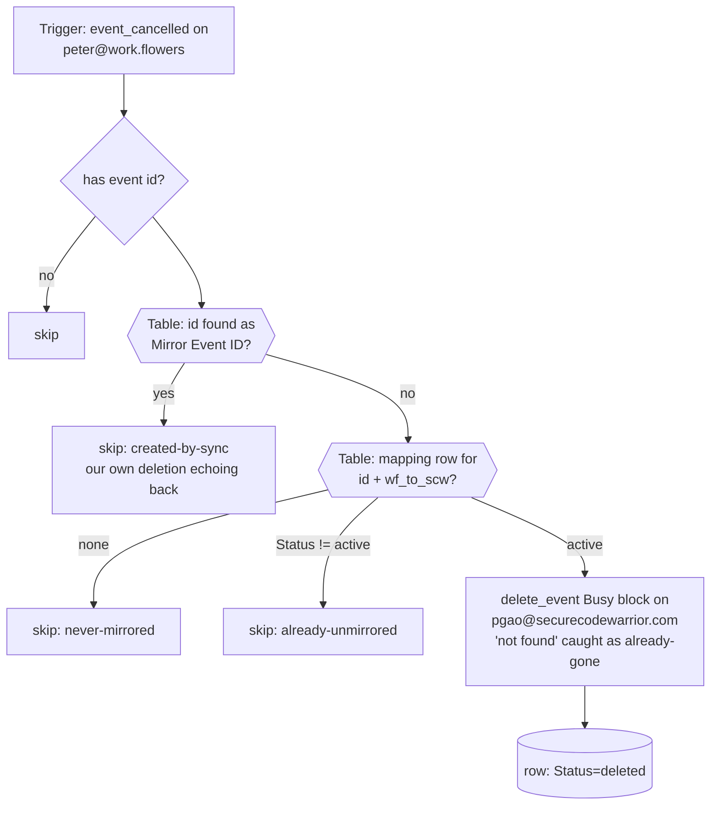

# workflowers-cancellations-to-scw-unblock-peter

**Peter's copy of [`workflowers-cancellations-to-scw-unblock`](../workflowers-cancellations-to-scw-unblock/)**, repointed at Peter's calendars, connections and table; logic identical. Deletion propagation for Peter's two-way calendar-blocking pair: triggers on **`event_cancelled`** for `peter@work.flowers`, looks the cancelled event up in **GCal Sync Map (Peter)** (`01M2HT9XPZEASFV09J4A3QTDGT`), deletes its private Busy block on `pgao@securecodewarrior.com`, and marks the row `deleted`. Creates and updates stay with [`workflowers-events-to-scw-busy-peter`](../workflowers-events-to-scw-busy-peter/).

## Why this exists

See [`scw-cancellations-to-workflowers-unblock-peter`](../scw-cancellations-to-workflowers-unblock-peter/) and the original [`workflowers-cancellations-to-scw-unblock`](../workflowers-cancellations-to-scw-unblock/): `event_updated` with `expand_recurring: true` silently drops cancellations, so each direction needs its own `event_cancelled` Zap.

## Maintainer notes

- **Loop guard**: deleting a mirror fires `event_cancelled` on the mirror's own calendar — for this trigger's calendar, that is the full-title mirrors from the SCW direction being deleted. The `Mirror Event ID` table lookup (free) swallows those echoes.
- Task cost: 0 for every skip path; 1 `delete_event` per real unblock.
- Truncated series leave orphans this trigger never hears about; [`gcal-block-sweep-peter`](../gcal-block-sweep-peter/) cleans those up.
- Peter-specific: trigger on Peter's work.flowers connection, `gcal_scw` is Peter's SCW connection, trigger pinned at `GoogleCalendarCLIAPI@1.16.0`.

## Verified cases (run-durable, 2026-09-15, pre-publish, against Peter's SCW connection and the new table)

| Case | Result |
| --- | --- |
| Cancelled tombstone for the sibling's test event (active row, live block on SCW) | `unmirrored: true`; the block reads back as `status: cancelled` on `pgao@securecodewarrior.com`, row `Status=deleted`, `Source Updated` refreshed |
| Same tombstone replayed | `skipped: already-unmirrored` |
| Unknown event id | `skipped: never-mirrored` |
| Id that is a known Mirror Event ID | `skipped: created-by-sync` |
