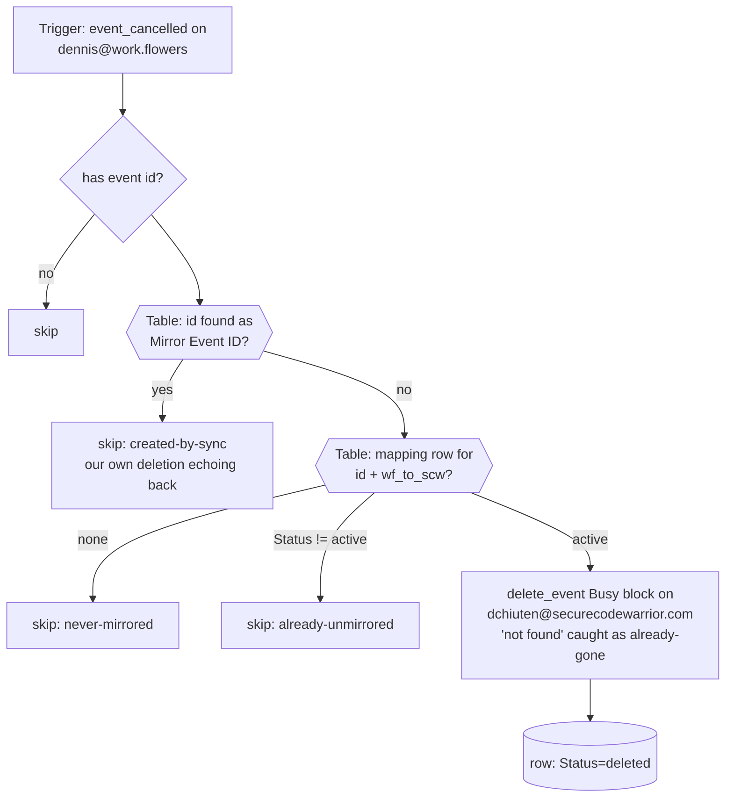

# workflowers-cancellations-to-scw-unblock

Deletion propagation for the two-way calendar-blocking pair. Triggers on **`event_cancelled`** for `dennis@work.flowers`, looks the cancelled event up in the shared **GCal Sync Map** Table (`01M13QPJ5GRJV33096MBNSN1Q5`), deletes its private Busy block on `dchiuten@securecodewarrior.com`, and marks the row `deleted`. Creates and updates stay with [`workflowers-events-to-scw-busy`](../workflowers-events-to-scw-busy/); this Zap does nothing else.

## Why this exists

See [`scw-cancellations-to-workflowers-unblock`](../scw-cancellations-to-workflowers-unblock/) for the full account: `event_updated` with `expand_recurring: true` silently drops cancellations (0 tombstones in 100 runs vs 13/100 on the `expand_recurring: false` meeting-note Zap). The motivating incident was on **this** direction — a work.flowers event deleted on 2026-08-31 ("9 AM discovery call") left its SCW Busy block standing until the main Zap's cancel path was hand-triggered. The `event_cancelled` probe that confirmed the fix contained that exact event.

## Maintainer notes

- **Loop guard**: deleting a mirror fires `event_cancelled` on the mirror's own calendar — for this trigger's calendar, that's the full-title mirrors from the SCW direction being deleted. The `Mirror Event ID` table lookup (free) swallows those echoes.
- Task cost: 0 for every skip path; 1 `delete_event` per real unblock.
- The `event_updated` Zaps keep their own cancel branch as a belt — harmless if a tombstone ever does arrive there.

## Verified cases (run-durable, 2026-08-31, pre-publish)

Same three-path matrix as the sibling (never-mirrored skip, created-by-sync skip, active-row delete with already-gone catch) — run against the shared source before the per-direction constants were split; the sibling's table records the results.
