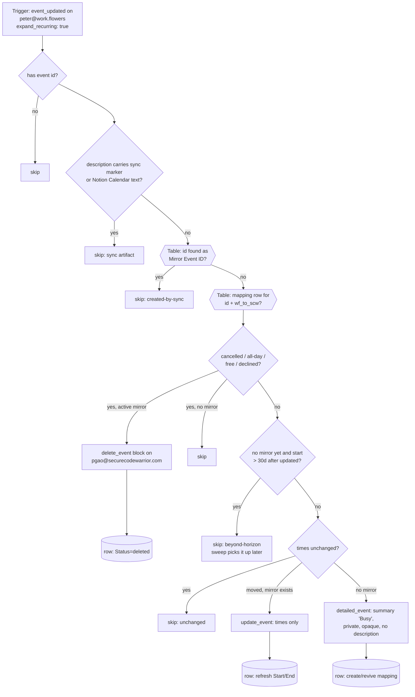

# workflowers-events-to-scw-busy-peter

**Peter's copy of [`workflowers-events-to-scw-busy`](../workflowers-events-to-scw-busy/)** — the same workflow, repointed at Peter's two Google Calendars, Peter's two connections and Peter's own **GCal Sync Map (Peter)** Zapier Table. The logic is deliberately identical to Dennis's file (only the constants block and the names differ), so a fix in either copy should be ported to the other by diff. Read the original's README for the full war stories; this one records what is specific to Peter's deployment.

One half of the two-way calendar-blocking pair between Peter's two calendars. Watches **peter@work.flowers** (`event_updated`, per-occurrence via `expand_recurring: true`) and mirrors every timed, busy, non-declined occurrence onto **pgao@securecodewarrior.com** as a **private, bare "Busy" block** — no title, description, location or attendees leak into the SCW workspace; only the time span crosses. As on Dennis's pair, this trigger only ever sees an occurrence once (Zapier durables dedupe on the raw event id — ticket W6ZE93-VMEWP) and never receives cancellations (`expand_recurring: true` drops them), so the move/delete branches are belts: every later move, decline or Free/all-day switch is propagated by [`gcal-block-sweep-peter`](../gcal-block-sweep-peter/), and deletions by [`workflowers-cancellations-to-scw-unblock-peter`](../workflowers-cancellations-to-scw-unblock-peter/).

Siblings: [`scw-events-to-workflowers-block-peter`](../scw-events-to-workflowers-block-peter/) (the reverse direction, full titles), [`workflowers-cancellations-to-scw-unblock-peter`](../workflowers-cancellations-to-scw-unblock-peter/) and [`gcal-block-sweep-peter`](../gcal-block-sweep-peter/). All five share the **GCal Sync Map (Peter)** Zapier Table (`01M2HT9XPZEASFV09J4A3QTDGT`) — never Dennis's `01M13QPJ5GRJV33096MBNSN1Q5`.

## Privacy posture

Same as Dennis's: the block sent to SCW is `summary: "Busy"`, `visibility: private`, `transparency: opaque`, no description, no attendees, no reminders. The **source title is stored only in the Sync Map table** (`Summary`, f7) for Peter's own debugging; no sync marker is written into the SCW event, so the reverse direction's loop belts are its `Busy`-summary check plus the table.

## Loop guards

Same three layers as Dennis's — structural (one direction per Zap), Peter's table (`Mirror Event ID` lookup), and content (`[gcal-block]` marker on the work.flowers side). A hand-made bare "Busy" event on Peter's work.flowers calendar *is* mirrored (it is a real commitment); a bare "Busy" on Peter's SCW calendar is never mirrored back by the sibling.

## What is Peter-specific

- **Calendars**: source `peter@work.flowers`, destination `pgao@securecodewarrior.com`.
- **Connections**: the trigger carries Peter's work.flowers Google Calendar connection; `gcal_scw` is Peter's SCW connection. Neither is one of Dennis's — see `zap.json`.
- **Trigger pin**: `GoogleCalendarCLIAPI@1.16.0` (Zapier's current version at authoring, 2026-09-15).
- **No Notion Calendar history.** Dennis's copy replaced Notion Calendar's built-in blocking; Peter never used it, so the "Event blocked with" content guard and the sweep's `cleanup_notion_blocks` mode are inherited and inert here.
- Ships `enable_on_publish: true` — Peter confirmed on 2026-09-15 that nothing else writes blocks on either calendar.

## Maintainer notes

- Keep `HORIZON_DAYS` (30) in lockstep across all five of Peter's workflows and with Dennis's.
- Task cost: 0 for every skip path, 1 per create (and, if the trigger ever does re-fire, per move/delete). Renames and description edits on the source change nothing on a bare Busy block.

## Verified cases (run-durable, 2026-09-15, pre-publish, against Peter's SCW connection and the new table)

| Case | Result |
| --- | --- |
| New timed wf event (confidential title + description, 16 Sep 21:00–21:30 SGT) | SCW block `85jbu67a8old1mn0t2vcjhbidc` created: summary `Busy`, `visibility: private`, no description, no attendees, no location, `reminders.useDefault: false`; row written with `Direction=wf_to_scw`, `Status=active`, `Start`/`End` stored verbatim with `+08:00`, source title in `Summary` |
| Same payload replayed | `skipped: unchanged`, 0 tasks |
| Event carrying the `[gcal-block]` marker (a scw→wf mirror) | `skipped: sync-artifact-not-mirrored` |
| Occurrence starting 90 days out | `skipped: beyond-horizon` |
| All-day event | `skipped: not-a-timed-event` |
| `transparency: transparent` | `skipped: event-is-free` |
| Self `responseStatus: declined` | `skipped: declined-by-self` |

The test block and its row were then removed by the [`workflowers-cancellations-to-scw-unblock-peter`](../workflowers-cancellations-to-scw-unblock-peter/) tests and a `delete-table-records`, so the table starts empty at cutover.
