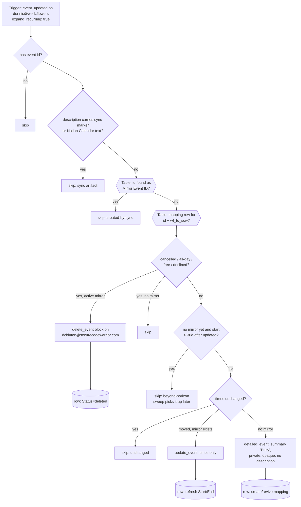

# workflowers-events-to-scw-busy

One half of the two-way calendar-blocking pair between Dennis's two Google Calendars. Watches **dennis@work.flowers** (`event_updated`, per-occurrence via `expand_recurring: true`) and mirrors every timed, busy, non-declined occurrence onto **dchiuten@securecodewarrior.com** as a **private, bare "Busy" block** — no title, description, location or attendees leak into the SCW workspace; only the time span crosses. Updates move the block; cancellations delete it.

Replaces **Notion Calendar's built-in event blocking**, which SCW IT cut off on 2026-08-28 (its old frozen blocks are cleaned up by the sweep's `cleanup_notion_blocks` mode).

Siblings: [`scw-events-to-workflowers-block`](../scw-events-to-workflowers-block/) (the reverse direction, full titles) and [`gcal-block-sweep`](../gcal-block-sweep/) (daily horizon backstop + cutover backfill). All three share the **GCal Sync Map** Zapier Table (`01M13QPJ5GRJV33096MBNSN1Q5`).

## Privacy posture

The block sent to SCW is `summary: "Busy"`, `visibility: private`, `transparency: opaque`, no description, no attendees, no reminders — verified live (see table below). The **source title is stored only in the Sync Map table** (`Summary`, f7) for Dennis's own debugging; deliberately no sync marker is written into the SCW event (Dennis's choice), so the reverse direction's loop belts are its `Busy`-summary check plus the table.

## Loop guards

Same three layers as the sibling — structural (one direction per Zap), the shared table (`Mirror Event ID` lookup, which also catches sparse cancelled tombstones of mirrors), and content (`[gcal-block]` marker / `Event blocked with` text on the work.flowers side). A hand-made bare "Busy" event on work.flowers *is* mirrored (it's a real commitment); a bare "Busy" on SCW is never mirrored back by the sibling.

## Maintainer notes

- **The horizon guard is load-bearing** — see the sibling README; keep `HORIZON_DAYS` (30) in lockstep across all three workflows.
- Task cost: 0 for every skip path, 1 per create/move/delete. Only a *moved* occurrence spends the update task — renames and description edits on the source change nothing on a bare Busy block.
- Skip-worthy transitions (declined later, changed to all-day, changed to Free) delete an existing block.
- This Zap polls the same calendar as [`gcal-event-updated-to-meeting-note`](../gcal-event-updated-to-meeting-note/); they coexist (separate workflows, separate dedupe).

## Verified cases (run-durable, 2026-08-28, pre-publish)

| Case | Result |
| --- | --- |
| New timed wf event (confidential title + description) | SCW block created: "Busy", private, opaque, no description, no reminders; row written |
| Event carrying the `[gcal-block]` marker (a scw→wf mirror) | `skipped: sync-artifact-not-mirrored` |
| `status: cancelled` tombstone | block deleted, row marked `deleted` |
