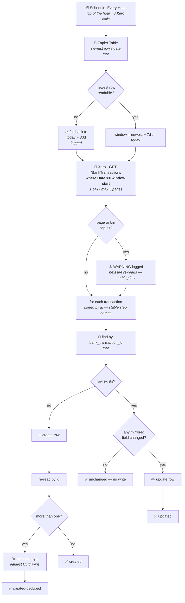

# Xero Bank Transactions → Zapier Table

Durable workflow (trigger **`read`** — "Every Hour" — `ScheduleCLIAPI@1.7.0`) that mirrors Xero
bank transactions into the **Xero Bank Transactions** Zapier Table, one row per transaction.
Migrated from the classic Zap *"Process New Reconciled Transactions"*.

> **This workflow is load-bearing.** [`drive-invoice-to-xero`](../drive-invoice-to-xero/) reads
> this Table to decide whether an invoice has already been paid. If this workflow stops, that one
> does not error — it silently starts raising duplicate draft bills. That is exactly what happened
> when the classic Zap's write step was accidentally paused.

> ### 🔁 It is schedule-driven, not Xero-poll-driven (since `019fd4b2`, 2026-08-06)
>
> It used to be triggered by Xero's `bank_transaction` **polling** trigger, which cost **~1,440 Xero
> API calls a day**. It is now triggered by an hourly **schedule** and reads Xero itself, in a
> bounded window, for **~24–48 calls a day**. See [Why a schedule](#why-a-schedule-and-not-a-poller).

## What it does

1. **Trigger** — *Every Hour*, at the top of the hour, weekends included. Costs Xero nothing.
2. **Window** — read the newest mirrored row's date (free Table read) and read Xero from
   **7 days before it** up to today. That overlap is what makes the sync self-healing.
3. **Fetch** — `GET /BankTransactions?where=Date>=DateTime(y,m,d)`, hard-bounded to **3 pages** and
   **200 transactions**, warning loudly rather than truncating silently.
4. **Upsert each**, keyed on `bank_transaction_id`:
   - **No row** → create it, then re-read and converge: if a concurrent run created one too, the
     earliest ULID wins and the strays are deleted.
   - **Row exists** → delete any strays, then refresh the row **only if a mirrored field actually
     changed**.



> ### ⚠️ 2026-08-07 — the first schedule version silently wiped the `date` column
>
> `019fd4b2` ran for ~17 hours and destroyed the `date` value on **214 of 685 rows**. Fixed in
> `019fdb43`; all 214 have been repaired and the mirror is verified converged. Worth reading, because
> the shape of this bug is more instructive than the typo at its centre.
>
> **The typo.** `date: toTableDate(p.Date ?? p.DateString)` against a `toIsoDate` that accepted only
> `YYYY-MM-DD`. Xero's raw JSON API returns `Date` in .NET epoch form
> (`/Date(1784937600000+0000)/`) and only `DateString` as ISO — and since `p.Date` is *always*
> present, `??` never fell through. Every snapshot got `date: null`. The old **polling trigger**
> delivered a plain date string, so a parser that only understood ISO worked fine for a year and then
> returned null for every row the instant the read moved to the raw API.
>
> **Why a typo became data loss.** `changedFields` compared the good stored date against `null`, saw
> a difference, and the update path wrote the null over it. Nothing stopped a mirror from *deleting*
> information it had merely failed to read.
>
> **Why it accelerated.** This workflow derives its own read window from the newest mirrored row. As
> dates were wiped the apparent newest row receded — `2026-02-24 → 02-17 → 02-05` — so the window
> ballooned to ~6 months, burned 3 Xero pages an hour instead of 1, and churned 13–17 rows every
> fire. It was eating its own tail.
>
> **It also broke coverage silently.** With `MAX_TRANSACTIONS` at 200 against 3 pages, a run fetched
> 215 and processed only the first 200 *sorted by transaction id* — an arbitrary subset — while still
> reporting success.
>
> **Why testing missed it.** The pre-publish `run-durable` died at the Xero fetch on the rate limit
> that prompted the whole migration, so the extraction and upsert code below it never executed once
> before reaching production. A skip-path test proves nothing about the code after it. There was also
> no way to exercise the main path without writing to the production Table — hence the `dryRun` input
> added in the same version. **Use it before every publish here.**
>
> The load-bearing fix is not the parser. It is
> [`wouldBlankAPopulatedField`](#never-blank-a-populated-field), which would have prevented this
> outright.

## Why a schedule and not a poller

Xero rate-limits **per tenant**: 60 calls/minute and **5,000 calls/day**. On 2026-08-06 five Xero
*polling* triggers on tenant `62699a8c` exhausted the daily limit, taking every Xero Zap in the
workspace down for ~10 hours and dropping two invoices in
[`drive-invoice-to-xero`](../drive-invoice-to-xero/). It was confirmed from Xero's own headers, not
inferred:

```
x-rate-limit-problem: day
x-daylimit-remaining: 0        ← daily quota gone
x-minlimit-remaining: 60       ← per-minute budget untouched, so NOT a burst
```

**A durable polling trigger cannot be throttled.** The `--trigger` payload accepts only
`selected_api` / `action` / `authentication_id` / `params` — verified across all 43 live triggers in
the account — so the classic Zap's `polling_interval_override: 5` had nowhere to go at migration and
this Zap silently began polling at the account default (~1 min).

A schedule trigger is the interval knob that doesn't otherwise exist. Moving the Xero read into the
workflow body changes the cost basis from *polls per day* to *fires per day*, and the fire rate is
ours to set:

| | Xero calls/day |
| --- | --- |
| `bank_transaction` polling trigger | ~1,440 |
| Hourly schedule + one windowed read | **~24–48** |

### The overlap is what makes it self-healing

The window starts **7 days before the newest mirrored row**, not at it. So a failed run, or an hour
the Zap spent disabled, is simply re-read on the next fire — up to `OVERLAP_DAYS` deep. The polling
trigger could never do that: it primed its dedupe on first poll, so a gap stayed a gap permanently.
That single property retires two of this Zap's three documented gaps.

## Never blank a populated field

`wouldBlankAPopulatedField` is the invariant that matters most in this file:

> **A blank extracted value never overwrites a populated stored one.** If we could not read a value,
> we have learned nothing about it, so the stored value stands.

It is enforced in **two** places, and both are necessary:

1. `changedFields` does not report such a field as a difference, and
2. the update payload **omits the key entirely** — excluding it from the diff alone is not enough,
   because the write sends the whole snapshot, so a `null` still lands unless it is dropped.

Missing half two is exactly how 214 dates were wiped. A mirror should only ever *add* or *correct*
information, never delete it: keeping something stale is recoverable, whereas a blanked column is
indistinguishable from a real absence. When the guard fires it logs a `WARNING` naming the preserved
fields — if that warning is widespread, the extraction for that field is broken.

`has_attachments` is deliberately exempt, because `false` there is a real value rather than an
absence. The same fill-don't-blank discipline governs Xero contact writes in
[`drive-invoice-to-xero`](../drive-invoice-to-xero/) ("fill a gap or fix drift, never blank").

## Testing without writing

```bash
zapier-sdk --experimental trigger-workflow 019fa885-7d5e-73a8-b601-4ec31290bf4a --input '{"dryRun":true}'
```

Computes the whole pass against real Xero data and reports what it *would* write, writing nothing —
including, per row, the stored date versus the newly parsed one. An empty input `{}` is a real
re-sync. **Run the dry version before every publish**, and check the run actually reached
`update-row`/`create-row` rather than stopping at the fetch.

### No new state table was needed

The mirror Table **is** the dedupe state — each transaction is looked up by its own key
(`bank_transaction_id`) to decide create-vs-update. That is why this was the cheapest poller to
convert. An *alerting* Zap like [`xero-draft-bill-to-slack-alert`](../xero-draft-bill-to-slack-alert/)
writes nothing, so it leans entirely on Zapier's built-in polling dedupe and needs state of its own
before it can move to a schedule.

## Why find-or-create

The classic Zap called *Create Record* unconditionally, so any re-delivery of the same transaction
produced a second row. The Table currently holds **4 duplicate pairs across 651 distinct
transactions** — rare, but real, and a duplicate row means a downstream match can pick either copy.

Find-or-create alone isn't enough under concurrency: two runs for the same transaction can both
find nothing and both create. So after creating, the workflow re-reads and converges on the
earliest ULID, deleting the rest. Deletes are idempotent, so whichever racer arrives second still
ends up correct. This is the same pattern
[`notion-companies-to-zapier-table`](../notion-companies-to-zapier-table/) uses.

## Why it also updates

An existing row is refreshed when — and only when — a mirrored field has actually moved. This
matters because **Xero fills several fields in after this trigger has already fired**:

| Field | Why it drifts | Stale rows in a 93-transaction sample |
| --- | --- | --- |
| `reference` | Xero sets `Reference` at reconciliation | 26 |
| `currency_rate` | set for non-base-currency transactions | 32 (also never mapped at all before) |
| `has_attachments` | flips to true when [`drive-invoice-to-xero`](../drive-invoice-to-xero/) attaches an invoice | 14 |
| `contact_name` | contact renamed in Xero | 1 |

Comparing the same 93 transactions between Xero and the Table found **no differences in any
structural field** — `date`, `type`, `currency_code`, `total`, `bank_account_id`, `contact_id` or
the key. That's the property that matters: this workflow extracts every field the same way the
classic Zap wrote it, so it will never churn a row it shouldn't.

### The trigger fires on creation, not reconciliation

Despite the classic Zap's title, `bank_transaction` fires when a transaction is **created**. The
`reference` evidence above is the proof: Xero has a value where the Table stored `''`, because the
row was written before reconciliation supplied it. The trigger payload does carry `IsReconciled`
(94 of 100 sampled were true), and the classic Zap never filtered on it — so the Table has always
held unreconciled transactions too. That behaviour is preserved deliberately: rows appearing sooner
is strictly better for the downstream match.

## Gaps, and which ones the schedule closed

| Gap | Status |
| --- | --- |
| **No backfill** — a missed run was permanently lost | ✅ **Closed going forward.** The window re-reads up to `OVERLAP_DAYS` (7) behind the newest row, so a failed run or a disabled hour self-heals on the next fire. |
| **Stale columns** — values Xero fills in after creation were never corrected | ✅ **Closed for recent rows.** Everything inside the window is re-read hourly, so the update path finally fires. Rows older than the window keep their stale values. |
| **Restatement of an old transaction** — more than 7 days after its date | ⚠️ **Open, and not a regression.** It falls outside every window. The polling trigger was no better: *New Bank Transaction* fires on creation, not restatement. If it ever matters, switch the fetch to Xero's `If-Modified-Since` header, which selects on modification time rather than transaction date. |

**The historical gap is still unfilled, and that's still accepted.** The ~7 `SPEND` transactions
missing from 2026-07-21..2026-07-26 predate this change and sit outside any current window. They were
reconciled against their receipts in Xero by hand, so nothing downstream needs those rows, and their
invoices have already been through the Invoices folder. To recover them deliberately, temporarily
raise `OVERLAP_DAYS` or run a one-off with a wider window —
[`scripts/backfill-zapier-partner-leads.mjs`](../scripts/backfill-zapier-partner-leads.mjs) is the
house pattern for anything bigger (plan-only unless `--commit`).

The mechanic worth carrying into the next incident has changed. It is no longer *"a pause is silent
and the gap is permanent"*. It is: **this Zap shares a 5,000-calls/day tenant ceiling with every
other Xero Zap.** If throttling returns, inventory the tenant's pollers before blaming this Zap, and
read Xero's `x-rate-limit-problem` / `x-daylimit-remaining` headers rather than guessing from the
error text — the error text alone made this look like a burst when it was a daily-quota exhaustion.

## Maintainer notes

- **One connection: `xero_wf`.** New as of `019fd4b2` — the body calls Xero now, where previously the
  credential lived on the trigger and the body only touched the Table. Note the shape mismatch:
  reads return `{"xero_wf":{"connection_id":…}}` (snake_case), the publish/update flags take
  `connectionId` (camelCase). `app_versions` is deliberately omitted, matching
  `drive-invoice-to-xero`, which also calls `XeroCLIAPI` via `runAction` with `app_versions: null`.
- **`moh` must be the string `"00"`, not the integer `0`** — even though
  `list-trigger-input-fields` declares it `value_type: INTEGER`. Its real choices are the zero-padded
  strings `"00"/"15"/"30"/"45"`; check with
  `list-trigger-input-field-choices ScheduleCLIAPI everyHour moh`. Publishing the integer was
  rejected with `ZAPIER_VALIDATION_ERROR: '0' is not an allowed value for 'moh'` — worth noting,
  because a bad trigger param is documented elsewhere in this repo as failing *silently*. Don't rely
  on either behaviour: verify `triggers[0].status == "active"` after every publish.
- **Never write `new Date` (or `Date.now()`) in the workflow body outside a `ctx.step`.** The durable
  runtime's `Date` Proxy throws `DeterminismViolation` before it even inspects its arguments, so a
  deterministic `new Date(Date.UTC(...))` fails as hard as a clock read. The only clock read here is
  inside `ctx.step("today")`; all date maths is integer arithmetic (`daysFromCivil` /
  `isoDateFromEpochMs`, copied from `drive-invoice-to-xero`).
- **Per-item step names are index-based off a batch sorted by transaction id.** Step names must be
  unique within a run, and the sort makes them stable across retries regardless of the order Xero
  returned things in. The batch itself is memoized by the `fetch-bank-transactions` step, so a retry
  never re-maps an index onto a different transaction.
- **`date` is written as `YYYY-MM-DDT00:00:00Z`.** A bare `YYYY-MM-DD` is read in the account's
  timezone (Asia/Singapore) and lands 8 hours off, shifting every date-window query against this
  Table at the boundaries.
- **`type` and `currency_code` are `labeled_string`.** Writing a plain string is fine — the API
  normalises it to `{value, label}`, matching existing rows. Reading them back requires `.value`.
- **`currency_rate` is new.** The classic Zap never mapped `f9`.
- **Transfers carry no contact.** `SPEND-TRANSFER` / `RECEIVE-TRANSFER` rows have no `Contact`, so
  `contact_id` and `contact_name` are written as `""`.
- **The classic Zap must be turned off, not unpaused** — unpausing it would have both writing the
  same rows. (Confirmed off as of 2026-08-06.)
- **The classic Zap set `polling_interval_override: 5`, and losing it is what caused the outage.**
  The durable `--trigger` payload has no field for a polling interval, so the migration silently sped
  this Zap up to the account default. That is the whole reason it is schedule-driven now — see
  [Why a schedule](#why-a-schedule-and-not-a-poller). **Do not convert it back to a Xero polling
  trigger** without budgeting the tenant's 5,000-calls/day ceiling first.
- **Window tuning lives in four constants** at the top of `workflow.ts`: `OVERLAP_DAYS` (7, also the
  self-heal depth), `INITIAL_LOOKBACK_DAYS` (30, used only when the newest row can't be read),
  `MAX_PAGES` (3) and `MAX_TRANSACTIONS` (200). At the observed rate (~651 rows over ~1 year, so
  ~12/week) a 7-day window returns ~12–15 transactions, and the caps cover roughly four months of
  catch-up. A capped run logs a `WARNING` and loses nothing — the next fire re-reads the same window.
