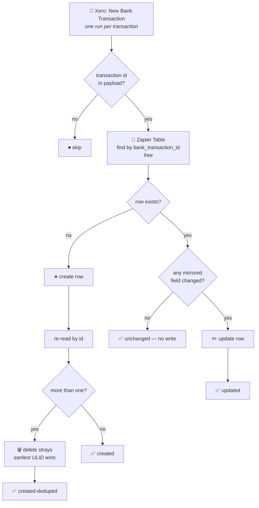

# Xero Bank Transactions → Zapier Table

Durable workflow (trigger **`read`** — "New Bank Transaction" — `XeroCLIAPI@2.20.5`) that mirrors
every Xero bank transaction into the **Xero Bank Transactions** Zapier Table, one row per
transaction. Migrated from the classic Zap *"Process New Reconciled Transactions"*.

> **This workflow is load-bearing.** [`drive-invoice-to-xero`](../drive-invoice-to-xero/) reads
> this Table to decide whether an invoice has already been paid. If this workflow stops, that one
> does not error — it silently starts raising duplicate draft bills. That is exactly what happened
> when the classic Zap's write step was accidentally paused.

## What it does

1. **Trigger** — Xero *New Bank Transaction*, one run per transaction.
2. **Find** — look for an existing row with this `bank_transaction_id` (free Table read).
3. **Then either:**
   - **No row** → create it, then re-read and converge: if a concurrent run created one too, the
     earliest ULID wins and the strays are deleted.
   - **Row exists** → delete any strays, then refresh the row **only if a mirrored field actually
     changed**.

## Why find-or-create

The classic Zap called *Create Record* unconditionally, so any re-delivery of the same transaction
produced a second row. The Table currently holds **4 duplicate pairs across 651 distinct
transactions** — rare, but real, and a duplicate row means a downstream match can pick either copy.

Find-or-create alone isn't enough under concurrency: two runs for the same transaction can both
find nothing and both create. So after creating, the workflow re-reads and converges on the
earliest ULID, deleting the rest. Deletes are idempotent, so whichever racer arrives second still
ends up correct. This is the same pattern
[`notion-companies-to-zapier-table`](../notion-companies-to-zapier-table/) uses.

## Why it also updates

An existing row is refreshed when — and only when — a mirrored field has actually moved. This
matters because **Xero fills several fields in after this trigger has already fired**:

| Field | Why it drifts | Stale rows in a 93-transaction sample |
| --- | --- | --- |
| `reference` | Xero sets `Reference` at reconciliation | 26 |
| `currency_rate` | set for non-base-currency transactions | 32 (also never mapped at all before) |
| `has_attachments` | flips to true when [`drive-invoice-to-xero`](../drive-invoice-to-xero/) attaches an invoice | 14 |
| `contact_name` | contact renamed in Xero | 1 |

Comparing the same 93 transactions between Xero and the Table found **no differences in any
structural field** — `date`, `type`, `currency_code`, `total`, `bank_account_id`, `contact_id` or
the key. That's the property that matters: this workflow extracts every field the same way the
classic Zap wrote it, so it will never churn a row it shouldn't.

### The trigger fires on creation, not reconciliation

Despite the classic Zap's title, `bank_transaction` fires when a transaction is **created**. The
`reference` evidence above is the proof: Xero has a value where the Table stored `''`, because the
row was written before reconciliation supplied it. The trigger payload does carry `IsReconciled`
(94 of 100 sampled were true), and the classic Zap never filtered on it — so the Table has always
held unreconciled transactions too. That behaviour is preserved deliberately: rows appearing sooner
is strictly better for the downstream match.

## Enabling this does not repair the gap — and doesn't need to

A Zapier polling trigger primes its dedupe on first poll, so **only transactions created from now
on are delivered**. Transactions missed while the classic Zap was paused are not backfilled, and
neither are the stale columns above (the update path only runs when the trigger re-delivers a
transaction, which for a polling trigger is rare).

**No backfill is planned.** The ~7 `SPEND` transactions missing from 2026-07-21..2026-07-26 were
reconciled against their receipts in Xero by hand, so nothing downstream still needs those rows —
and their invoices have already been through the Invoices folder, which the Drive trigger will not
re-deliver either. The gap is closed by other means, not by this Table.

Keep the mechanic in mind for the next incident, though: a pause here goes unnoticed, and turning
the workflow back on recovers the flow but never the gap. If a future gap *does* need recovering,
[`scripts/backfill-zapier-partner-leads.mjs`](../scripts/backfill-zapier-partner-leads.mjs) is the
house pattern — plan-only unless `--commit`.

## Maintainer notes

- **No connections at all.** The Xero credential lives on the trigger; the body only touches a
  Zapier Table, which needs no connection and costs no tasks. `--connections` was omitted at
  publish, and `connections` reads `null` on the deployed version — that is correct here, not a
  missing binding.
- **`date` is written as `YYYY-MM-DDT00:00:00Z`.** A bare `YYYY-MM-DD` is read in the account's
  timezone (Asia/Singapore) and lands 8 hours off, shifting every date-window query against this
  Table at the boundaries.
- **`type` and `currency_code` are `labeled_string`.** Writing a plain string is fine — the API
  normalises it to `{value, label}`, matching existing rows. Reading them back requires `.value`.
- **`currency_rate` is new.** The classic Zap never mapped `f9`.
- **Transfers carry no contact.** `SPEND-TRANSFER` / `RECEIVE-TRANSFER` rows have no `Contact`, so
  `contact_id` and `contact_name` are written as `""`.
- **The classic Zap must be turned off, not unpaused** — unpausing it would have both writing the
  same rows.
- The classic Zap set `polling_interval_override: 5`; the durable `--trigger` payload has no field
  for it, so the default interval applies.
