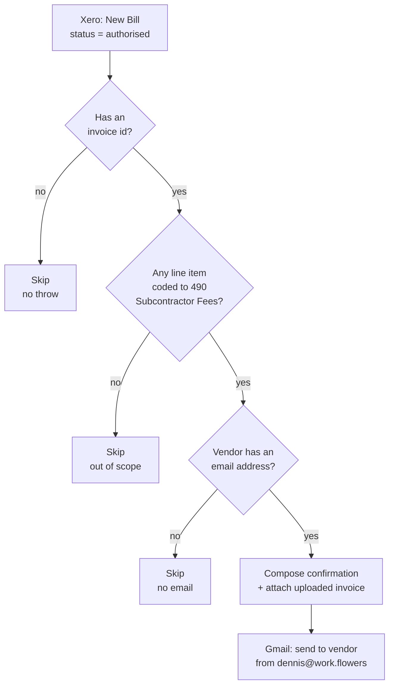

# Xero bill approved → subcontractor confirmation email

> ## 🛑 Retired 2026-08-06 — superseded by [`xero-invoice-alerts`](../xero-invoice-alerts/)
>
> This Zap is **disabled, not deleted**, and its trigger is `released`. Its behaviour now runs as the
> **`email-subcontractor`** channel of [`xero-invoice-alerts`](../xero-invoice-alerts/) — the approval email to a subcontractor is
> unchanged, message text and filters ported verbatim.
>
> **Why.** Its Xero *polling* trigger cost ~1,440 Xero API calls/day. Five such pollers on tenant
> `62699a8c` exhausted Xero's **5,000-calls/day-per-tenant** limit, taking every Xero Zap in the
> workspace down for ~10 hours (`x-rate-limit-problem: day`, `x-daylimit-remaining: 0`, with
> `x-minlimit-remaining: 60` proving a daily-quota exhaustion rather than a burst). A durable polling
> trigger **cannot be throttled** — the `--trigger` payload has no interval field — so the only lever
> was removing pollers. One hourly schedule now does the work of all three for ~24 calls/day.
>
> **⚠️ Do not re-enable.** It would both double-alert and put ~1,440 Xero calls/day back on the
> tenant. Change [`xero-invoice-alerts`](../xero-invoice-alerts/) instead.

When a bill is approved (**AUTHORISED**) in Xero and at least one of its line items is coded
to the **Subcontractor Fees** account, emails the vendor a confirmation — invoice number,
amount due, due date — with their own uploaded invoice/receipt attached.

Migration of the classic Zap **"Confirmation Email for Sub-contractor Invoices"**.

## Trigger

Xero **New Bill** (`bill`, polling), filtered to `status: authorised`, on the `work.flowers`
organization — identical trigger params to the classic Zap.

## What it does

1. Reads the approved bill straight off the trigger payload — no re-read of Xero. The `bill`
   trigger already delivers the full Invoice object (`Contact`, `LineItems`, `attachments`,
   `Total`, `CurrencyCode`, `DueDate`, `InvoiceNumber`).
2. Skips cleanly (no throw) if the payload carries no invoice id — an empty or test delivery.
3. Skips if **no line item** is coded to the Subcontractor Fees account (`490`) — this Zap is
   scoped to subcontractor payments, not every approved bill (rent, software, etc.).
4. Skips if the vendor contact has no email address in Xero.
5. Builds the confirmation email — subject `Invoice <number> Approved`, body confirming
   approval with invoice details — and attaches whatever the vendor uploaded to the bill in
   Xero (their own invoice/receipt, not a Xero-rendered PDF).
6. Sends via Gmail (`dennis@work.flowers`) to the vendor's email address only — no cc/bcc.

## Cost

1 task per approved subcontractor bill (the Gmail send). Every other approved bill is
filtered out in code before any app action runs — 0 tasks. No Xero re-read.

## Maintainer notes

- **The classic Zap's filter, formatter and Gmail steps were ALL `paused: true`** in the
  export — only the trigger was live. So the classic Zap has never actually sent a
  confirmation; this durable is the first time this email goes out for real. **Turn the
  classic Zap off** in the Zapier UI (don't unpause its steps), or both would email the same
  subcontractor once a bill is approved.
- **Account-code filter tightened.** The classic Zap's "Subcontractor Fees" filter used
  `icontains` on `LineItems[]AccountCode` against `"490"` — a substring match that would also
  fire on a hypothetical code like `"4900"` or `"1490"`. This durable uses an exact match,
  since Xero account codes are short discrete codes, not free text.
- **Date formatting moved from a paid Zapier Formatter step to free pure-code date
  arithmetic** — the classic Zap spent an extra task (`ZapierFormatterCLIAPI` `date.formatting`)
  just to render `DueDate` as `YYYY-MM-DD`; this durable does the same conversion in workflow
  code at zero cost (the same integer civil-from-days technique used throughout this repo,
  since the durable runtime blocks `new Date()` even when deterministic).
- **Attachments are the subcontractor's own uploaded file(s) on the bill**, passed through as
  opaque Zapier "file" hydrate references — same mechanism `xero-overdue-invoice-to-gmail-reminder`
  uses for `InvoicePDF`, just sourced from `bill.attachments[].file` instead.
- **Three bills are already AUTHORISED in the live org with a `490` line item** (Ernest Choo
  `INV009`, Lantern Labs `INV-26-0007`, Nasri Nasir `NIT-11`) as of publish. None of these will
  retroactively get a confirmation — a polling trigger primes its dedupe on first poll, matching
  every other polling Zap in this repo. Watch the next bill actually approved after this
  publish.
- A manual run accepts `{"dryRun": true, "bill": {...}}` and returns the composed message
  without sending — verified against the real `INV-26-0007` bill data (see `zap.json` →
  `verified_cases`). The Xero trigger itself never sets `dryRun`.
- The email body's "Amount Due" line maps to Xero's `Total` field, not `AmountDue` — preserved
  verbatim from the classic Zap's field mapping. The two are equal immediately after a bill is
  authorised (nothing paid yet), so this is a naming quirk, not a live bug.
