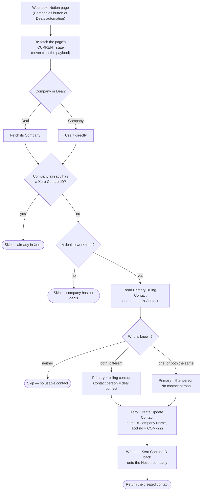

# xero-contact-from-notion-deal

Creates a company's contact in Xero from the Notion CRM, so a deal that is about to be invoiced has somewhere to be invoiced to.

**Status:** enabled on Zapier. Replaces the classic Zap **Create Xero Contact from Notion**.

## What it does

A webhook delivers a Notion page — either a **Company** (the `Create Xero Contact` button on the Companies record) or a **Deal** (a stage automation on the Deals database). The workflow re-reads that page's current state, resolves the Company/Deal pair, and creates the company's Xero contact with the right person on it.

Who ends up on the contact:

| Company's `Primary Billing Contact` | Deal's `Contact` | Xero contact |
| --- | --- | --- |
| set | set, different person | billing contact is the primary person; deal contact rides along as Xero's secondary "contact person", included in emails |
| set | set, **same person** | that person, once, as the primary — no secondary |
| set | empty | billing contact as the primary — no secondary |
| empty | set | deal contact as the primary — no secondary |
| empty | empty | nothing created (`no-usable-contact`) |

The Xero contact is named after the company and carries the company's Notion `ID` (e.g. `COM-766`) as its Account Number.

## Workflow



## Trigger

Webhooks by Zapier Catch Hook (`hook_v2`). **Two Notion senders post to the same URL:**

```
https://hooks.zapier.com/hooks/catch/20495893/igoRSxsAwMIxDwO6/
```

- the `Create Xero Contact` **button** property on Companies (sends the Company page)
- a **stage automation** on Deals (sends the Deal page)

The classic Zap only understood the Company shape, so a Deal-shaped payload would have read `Deals`, `Company Name` and `ID` off a Deal page and found none of them. This one detects the page's data source and resolves the pair either way.

`previewOnly: true` in the payload resolves the whole chain and returns the exact Xero inputs it *would* send, without writing anything. Use it for testing — see the maintainer notes.

**An empty payload is treated as a ping, not an event.** A catch URL is public: opening it in a browser, curling it, or hitting "test" while wiring up the Notion side delivers `{"querystring":{}}`. Those return `skipped: "empty-payload"` rather than failing. A payload that *does* carry content but no page id still throws — that is a real event we failed to understand, and it should be loud.

## Verified cases

All against live CRM records, 2026-08-02. The first three are dry runs (`previewOnly`, Notion reads only); the last two are real.

| Case | Trigger page | Mode | Result |
| --- | --- | --- | --- |
| GGV — Technical Advisory Retainer | Deal | preview | `billing-primary-with-deal-contact-person` — Jeffrey Paine (billing) primary, Angela Toy as contact person |
| GastroGig — Notion Implementation | Deal | preview | `single-person` — Deal → Company resolved; Jasmine Cheah primary, acct `COM-766` |
| Knoxx Business Group | Company (button) | preview | `single-person` — billing contact **is** the deal contact, so it collapses to one person |
| GastroGig — Notion Implementation | Deal | **live**, via the deployed catch hook | Xero contact `a0d4f085-8e7b-4834-9f1a-c5c8cf1b5747` created; `writeBack: "written"` and the id verified back on the Notion company |
| GastroGig, fired a second time | Deal | **live** | `skipped: "already-in-xero"` — returns before the Xero call. This is the repeat the classic Zap could not stop, and it is the whole point of the write-back |
| `{"querystring":{}}` — the real payload that failed during cutover | — | replay | `skipped: "empty-payload"`, no longer a failed run |
| `{"data":{"properties":{...}}}` with no id | — | replay | still fails loudly, as a malformed real event should |

## What changed from the classic Zap

Three deliberate differences; everything else is a straight port.

- **The branch had a hole.** Its Path A required billing ≠ deal contact and Path C required *no* billing contact, and there was no Path B. So "billing contact **is** the deal contact" and "billing contact but no deal contact" matched no path and the Zap silently did nothing. Both now produce a single-person contact. This is not hypothetical: Knoxx hits the first case (see the table above).
- **The dedupe guard now has teeth.** The classic Zap stopped when `[Table] Company IDs` held a `Xero Contact ID` — but nothing wrote that property, so it almost never fired, and Xero's Create/Update Contact matches on **name**, meaning a repeat trigger quietly *overwrote* the live contact's people. The durable writes the new id back onto the Notion company after creating, which [`notion-companies-to-zapier-table`](../notion-companies-to-zapier-table/) then mirrors into the Table for free.
- **The guard reads Notion, not the Table.** The company page is already in hand, the Table is fed from that same property, and the Table read would only ever be staler. One less lookup.

Two smaller ones: the empty `address__type_of: "Postal Address"` is dropped (no address data was ever sent with it), and the `contact_person__first_name: "na"` placeholder is gone — when there is no second person the contact-person fields are simply omitted.

## Maintainer notes

- Connection aliases `notion_wf` (Notion, **work.flowers** workspace — never the Knoxx one) and `xero_wf` (Xero work.flowers), resolved at run/publish time via `--connections`.
- **Test with `previewOnly`, not a live run.** Xero's Create/Update Contact upserts on name, so a careless test against a real company overwrites that contact's people in the production ledger. Preview does Notion reads only.
- `previewOnly` deliberately walks *past* the already-in-Xero guard and reports it as `wouldSkip`. Every company that currently has a `Primary Billing Contact` also already has a Xero id, so returning at the guard would make the two-person shape impossible to exercise without writing.
- **When the button fires on a Company with several deals, the first entry of the `Deals` relation wins** — the same arbitrary choice the classic Zap made. It only matters for picking the secondary contact person; the company, name and account number are unaffected. Firing from the Deal instead removes the ambiguity.
- The Xero contact id is dug out of the action result defensively (`ContactID` / `contact_id` / `id` / nested `Contacts[0]`), because the action's output key spelling is not contractual. If none matches, the contact is still created and the write-back is skipped with a `WARNING` log rather than failing the run.
- Notion property names are hoisted to constants at the top of [workflow.ts](workflow.ts); the CRM schema is the thing most likely to drift under this workflow.
