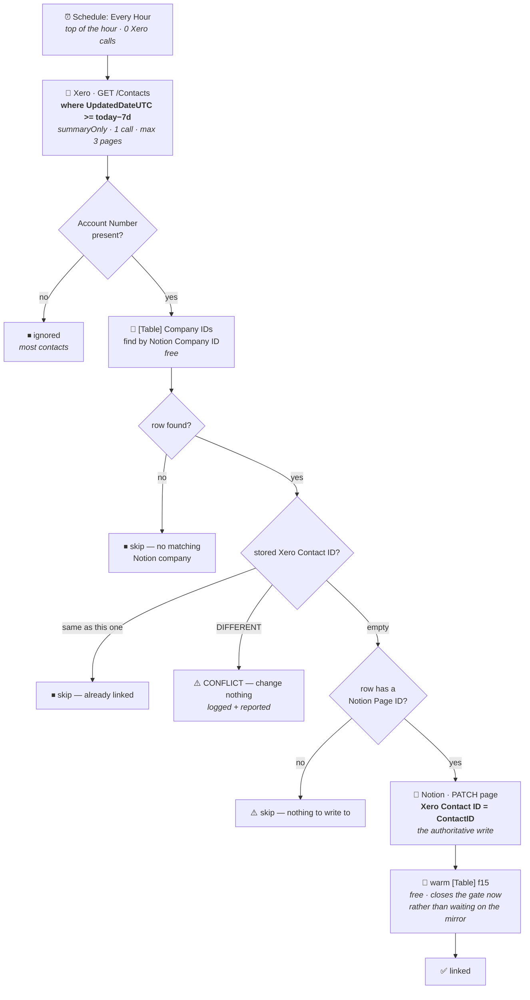

# Xero Contact → Notion Company

Durable workflow (trigger **`read`** — "Every Hour" — `ScheduleCLIAPI@1.7.0`) that completes the
company/contact link in the **Xero → Notion** direction: a Xero contact carrying a Notion Company ID
in its **Account Number** gets its `ContactID` written onto the matching Notion Company page.

> [`xero-contact-from-notion-deal`](../xero-contact-from-notion-deal/) covers the opposite direction
> (Notion → Xero). These two are complements, not alternatives.

## The case this exists for

A contact gets created in Xero **by other means** — typically a transaction arrives from a new vendor
and the contact is made by hand. If a Company record already exists in Notion, its Notion Company ID
(the `ID` property, e.g. `COM-766`) is pasted into that Xero contact's **Account Number**, and this
workflow spots it and links the two.

Nothing changes on the Notion side in that flow, so no Notion webhook fires and the other durable
never runs. That is why this cannot simply be folded into it.

## What it does

1. **Trigger** — *Every Hour*, top of the hour, weekends included. Costs Xero nothing.
2. **Read Xero once** — `GET /Contacts?where=UpdatedDateUTC>=<today−7d>&summaryOnly=true`, bounded to
   3 pages. Observed volume is ~12 contacts per 13 days, so one page is the norm by a wide margin.
3. **Keep only contacts with an Account Number** — that field is the deliberate human signal that a
   contact wants linking.
4. **Look up the company** in [`[Table] Company IDs`](#the-table-lookup-is-not-just-a-gate) by
   `Notion Company ID` (free read).
5. **Write the `ContactID` onto the Notion Company page**, then warm the Table's copy.



## Why it writes to Notion, not the Table

This is the bug it was migrated to fix. The two classic Zaps wrote the `ContactID` into
`[Table] Company IDs` (`f15`) and left the Notion property empty. That was wrong twice over:

- **The link was temporary.** [`notion-companies-to-zapier-table`](../notion-companies-to-zapier-table/)
  is a *true mirror* — its own source comment reads *"empty in Notion clears the table value"* — and
  `Xero Contact ID` is in its mirrored set. With the Notion property empty, the next edit of that
  company wiped `f15` straight back out.
- **The other durable's dedupe guard stayed blind.** That guard reads `Xero Contact ID` off the
  *Notion page*. With it empty, a later Companies-button or Deals-stage trigger would re-run the
  upsert — and **Xero matches contacts on NAME**, so it would silently overwrite the hand-made vendor
  contact's people. Precisely the failure the guard exists to prevent.

Notion is therefore the authoritative write, and the mirror carries the value to the Table on its own.

### The Table lookup is not just a gate

It is also the **only** source of the Notion page UUID. The Xero contact carries Notion's `ID`
property (`COM-766`), not a UUID, so a Notion write is impossible without resolving it — and the
Table already holds `Notion Page ID` alongside `Notion Company ID`. Reads are free, so this costs
nothing.

| Table column | Role here |
| --- | --- |
| `Notion Company ID` (`f11`) | matched against Xero's `AccountNumber` |
| `Notion Page ID` (`f14`) | the page UUID to write to — unobtainable otherwise |
| `Xero Contact ID` (`f15`) | the already-linked / conflict check, and the cache warmed after writing |

### Why the Table is still written, carefully

After the Notion write, `f15` is set in the same run. That is **not** a second source of truth — the
mirror would set it anyway, from the value just written to Notion. It exists only so the
already-linked gate closes on *this* run instead of waiting on a webhook we don't control; without
it, a fire landing inside the mirror's latency window would re-issue an identical (harmless but
pointless) Notion PATCH. Writing **only** here is what the classic Zaps did, and is the bug above.

## A changed link is never applied

If the Notion company already carries a *different* Xero contact id, the workflow **changes nothing**
and reports it as a conflict with a `WARNING` naming both ids. Either two Xero contacts claim the same
company, or an Account Number is wrong — both need a human, and silently repointing the link would
hide it. The classic Zap's `f15 isnull` filter declined this case too, but silently.

## Why a schedule and not a polling trigger

Migrating `updated_contact` as a *polling* durable would have made this **worse**: a durable trigger
has no polling-interval field (the `--trigger` payload accepts only `selected_api` / `action` /
`authentication_id` / `params`, verified across all 43 live triggers in the account), so it would have
run at the account default — ~1,440 Xero calls/day against the 96/day the classic Zap cost at its
15-minute override.

Five Xero pollers on this tenant exhausted Xero's **5,000-calls/day-per-tenant** limit on 2026-08-06,
downing every Xero Zap for ~10 hours. A schedule trigger costs Xero nothing and puts the rate under
our control.

| | Xero calls/day |
| --- | --- |
| Two classic Zaps at 1-minute polling | ~2,880 |
| Two classic Zaps at 15-minute polling | ~192 |
| Naive polling durable | ~1,440 |
| **This workflow** | **~24** |

## Verified behaviour

Dry run against live Xero and the real Table, 2026-08-07, before publishing:

| | Result |
| --- | --- |
| Window | `UpdatedDateUTC >= 2026-07-31`, 11 contacts read, **1 page**, `coverageIncomplete: false` |
| Candidates | **5** — every Xero contact carrying an Account Number (`COM-15`, `COM-318`, `COM-689`, `COM-766`, `COM-803`) |
| Outcome | all 5 **`already linked`** — each resolved to its Company IDs row and its stored `f15` matched the Xero `ContactID` exactly |
| Conflicts | 0 |

That exercises the Xero read, the Account Number filter, the name-keyed Table lookup and the
link comparison. **The write path is not exercised by it**, because nothing currently needs linking —
but `writeXeroIdToNotion` is byte-identical to the proven implementation in
[`xero-contact-from-notion-deal`](../xero-contact-from-notion-deal/) (same API version, connection,
property name and payload shape), and `notion-companies-to-zapier-table` independently confirms
`Xero Contact ID` is a `rich_text` property. **Watch the first real link.**

## Testing without writing

```bash
zapier-sdk --experimental trigger-workflow 019fdb77-594e-7426-a1f2-9c0b153d986c --input '{"dryRun":true}'
```

Computes the whole pass against live data and reports what it *would* write, writing nothing. An
empty input `{}` is a real run. **Run the dry version before every publish** — and check the run
actually reached the decision logic rather than stopping at the fetch. A sibling Zap shipped a
column-wiping bug precisely because its pre-publish test died before reaching its extraction code.

## Maintainer notes

- **`moh` must be the string `"00"`, not the integer `0`**, even though `list-trigger-input-fields`
  declares it `value_type: INTEGER`. Real choices are `"00"/"15"/"30"/"45"` — check with
  `list-trigger-input-field-choices ScheduleCLIAPI everyHour moh`. Verify
  `triggers[0].status == "active"` after every publish regardless.
- **`summaryOnly=true` still returns `AccountNumber`.** Xero omits the key entirely when it is empty,
  so its absence on a given contact is not evidence the parameter dropped it.
- **Never write `new Date` / `Date.now()` in the workflow body outside a `ctx.step`** — the runtime's
  `Date` Proxy throws `DeterminismViolation` before inspecting arguments. The only clock read is
  inside `ctx.step("today")`; all date maths is integer arithmetic.
- **Notion connection is `notion_wf` = `02b73654-15c8-85c3-b16a-07304d2beb17`** (work.flowers).
  Never the Knoxx connection — it cannot see work.flowers databases.
- **Per-item step names are index-based off a batch sorted by `ContactID`**, and the batch is memoized
  by the `fetch-contacts` step, so a retry can never re-map an index onto a different contact.
- **The two classic Zaps this replaced must be turned off** — otherwise they keep writing `f15`
  directly (reintroducing the temporary-link bug) and keep costing ~192 Xero calls/day. They are
  invisible to the SDK CLI and the MCP connector, so that is a Zapier UI job.
