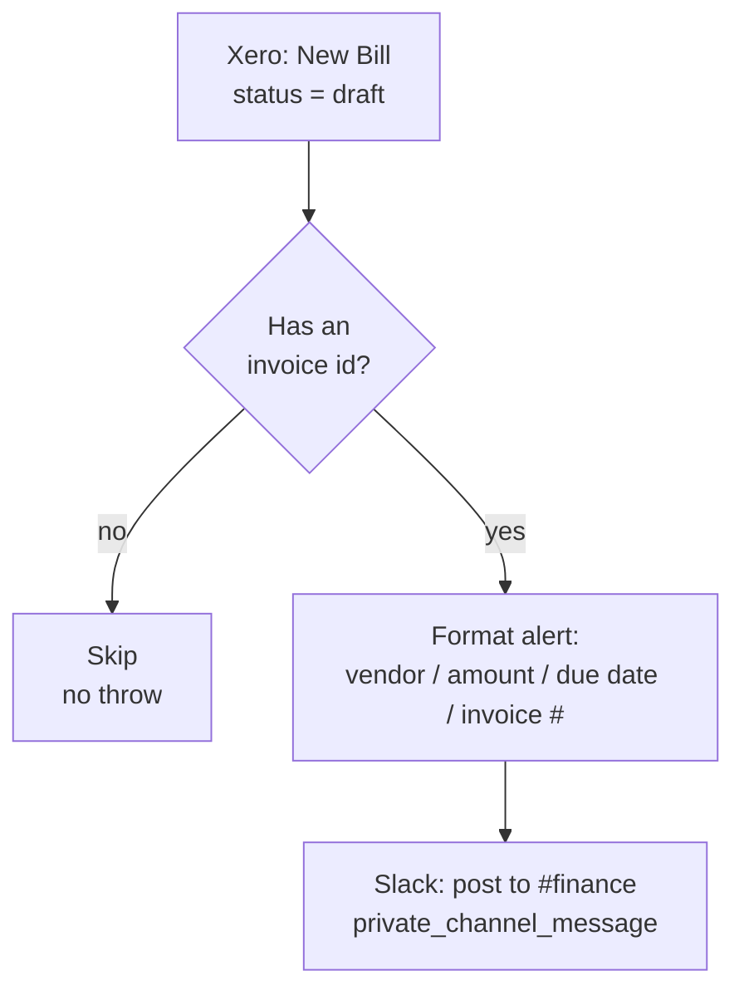

# Xero new draft bill → Slack alert

> ## 🛑 Retired 2026-08-06 — superseded by [`xero-invoice-alerts`](../xero-invoice-alerts/)
>
> This Zap is **disabled, not deleted**, and its trigger is `released`. Its behaviour now runs as the
> **`slack-bill-draft`** channel of [`xero-invoice-alerts`](../xero-invoice-alerts/) — the Slack alert on a new draft bill is
> unchanged, message text and filters ported verbatim.
>
> **Why.** Its Xero *polling* trigger cost ~1,440 Xero API calls/day. Five such pollers on tenant
> `62699a8c` exhausted Xero's **5,000-calls/day-per-tenant** limit, taking every Xero Zap in the
> workspace down for ~10 hours (`x-rate-limit-problem: day`, `x-daylimit-remaining: 0`, with
> `x-minlimit-remaining: 60` proving a daily-quota exhaustion rather than a burst). A durable polling
> trigger **cannot be throttled** — the `--trigger` payload has no interval field — so the only lever
> was removing pollers. One hourly schedule now does the work of all three for ~24 calls/day.
>
> **⚠️ Do not re-enable.** It would both double-alert and put ~1,440 Xero calls/day back on the
> tenant. Change [`xero-invoice-alerts`](../xero-invoice-alerts/) instead.

Posts an alert to the **#finance** Slack channel whenever a new **draft** bill (Accounts
Payable invoice) is created in Xero — vendor, amount, due date, invoice number, and a link
straight to the bill in Xero.

Migration of the classic Zap **"New Draft Bill Alert"**.

## Trigger

Xero **New Bill** (`bill`, polling), filtered to `status: draft`, on the `work.flowers`
organization — identical trigger params to the classic Zap.

## What it does

1. Reads the draft bill straight off the trigger payload — no re-read of Xero. The `bill`
   trigger already delivers the full Invoice object (`Contact`, `Total`, `CurrencyCode`,
   `DueDate`/`DueDateString`, `InvoiceNumber`, `InvoiceID`), so there's nothing to gain from
   an extra Xero call.
2. Skips cleanly (no throw) if the payload carries no invoice id at all — an empty or test
   delivery of the trigger.
3. Formats a Slack message: same wording and 📋 emoji as the classic Zap, but with the amount
   rendered to two decimals and the due date normalized to `YYYY-MM-DD` regardless of which of
   Xero's two date shapes the trigger hands back. A bill with no invoice number (an absent key,
   not `null`, on a bill that has none) renders `(not numbered)` instead of a blank line.
4. Posts to **#finance** via Slack's `private_channel_message` action — same channel, same
   connection, same action flags as the classic Zap.

## Cost

1 task per draft bill (the Slack post). No Xero re-read.

## Maintainer notes

- **The classic Zap's Slack step was `paused: true` in the export** — only the trigger was
  live. So the classic Zap has never actually posted an alert; this durable is the first time
  this notification goes out for real. **Turn the classic Zap off** in the Zapier UI (don't
  unpause its Slack step), or both would post the same alert once a draft bill appears.
- No draft bills existed in the live Xero org at build time, so the workflow was verified with
  a synthetic payload via `dryRun: true` (builds the message, does not call Slack) rather than
  against a real trigger delivery. Watch the first live draft bill to confirm the end-to-end
  path.
- A manual run accepts `{"dryRun": true, "bill": {...}}` and returns the composed message
  without posting — useful for testing without touching #finance. The Xero trigger itself
  never sets `dryRun`.
- `InvoiceNumber` is an absent key (not `null`) on a bill with none — confirmed against real
  Xero data while designing [`xero-bill-approved-to-wise-transfer`](../xero-bill-approved-to-wise-transfer/).
