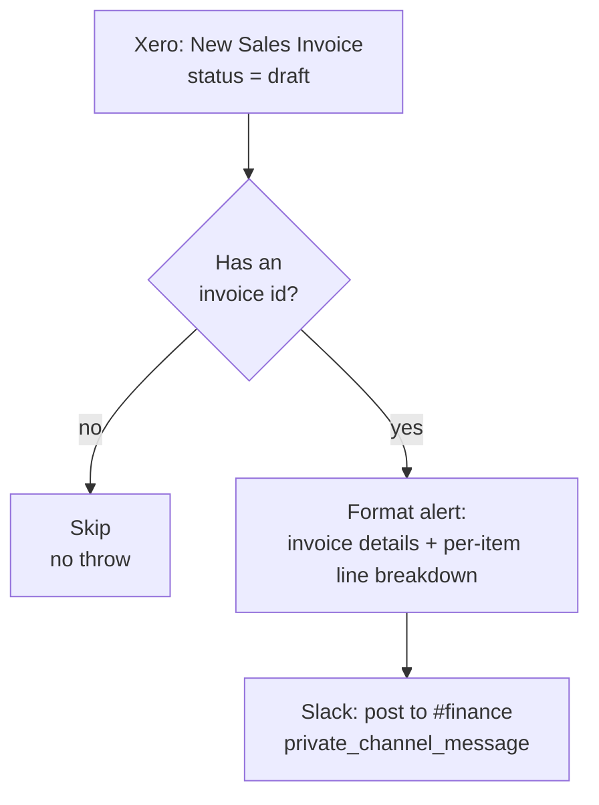

# Xero new draft sales invoice → Slack alert

> ## 🛑 Retired 2026-08-06 — superseded by [`xero-invoice-alerts`](../xero-invoice-alerts/)
>
> This Zap is **disabled, not deleted**, and its trigger is `released`. Its behaviour now runs as the
> **`slack-sales-draft`** channel of [`xero-invoice-alerts`](../xero-invoice-alerts/) — the Slack alert on a new draft sales invoice is
> unchanged, message text and filters ported verbatim.
>
> **Why.** Its Xero *polling* trigger cost ~1,440 Xero API calls/day. Five such pollers on tenant
> `62699a8c` exhausted Xero's **5,000-calls/day-per-tenant** limit, taking every Xero Zap in the
> workspace down for ~10 hours (`x-rate-limit-problem: day`, `x-daylimit-remaining: 0`, with
> `x-minlimit-remaining: 60` proving a daily-quota exhaustion rather than a burst). A durable polling
> trigger **cannot be throttled** — the `--trigger` payload has no interval field — so the only lever
> was removing pollers. One hourly schedule now does the work of all three for ~24 calls/day.
>
> **⚠️ Do not re-enable.** It would both double-alert and put ~1,440 Xero calls/day back on the
> tenant. Change [`xero-invoice-alerts`](../xero-invoice-alerts/) instead.

Posts an alert to the **#finance** Slack channel whenever a new **draft** sales invoice
(Accounts Receivable) is created in Xero — invoice number, customer, dates, status, amount
due, total tax, and a per-line-item breakdown.

Migration of the classic Zap **"Draft Sales Invoice Alert"**. Sibling to
[`xero-draft-bill-to-slack-alert`](../xero-draft-bill-to-slack-alert/), which does the same
thing on the Accounts Payable side.

## Trigger

Xero **New Sales Invoice** (`sales_invoice_v2`, polling), filtered to `status: draft`, on the
`work.flowers` organization — identical trigger params to the classic Zap.

## What it does

1. Reads the draft invoice straight off the trigger payload — no re-read of Xero. The trigger
   already delivers the full Invoice object including `LineItems`.
2. Skips cleanly (no throw) if the payload carries no invoice id at all — an empty or test
   delivery of the trigger.
3. Formats a Slack message: same wording, emoji and section layout as the classic Zap, with
   two fixes. **Line items** are the substantive one — the classic template used Zapier's
   array-flattening (`{{LineItems[]Description}}` etc.), which renders one list per *field*
   (all descriptions, then all quantities, then all amounts) instead of one line per *item*, so
   any invoice with more than one line item read as three disjoint lists. This durable keeps
   each item's description/quantity/amount together. Amounts and dates are also normalized
   (two-decimal thousands-separated amounts, `YYYY-MM-DD` dates regardless of which of Xero's
   two date shapes the trigger hands back).
4. Posts to **#finance** via Slack's `private_channel_message` action — same channel, same
   connection, same action flags as the classic Zap.

## Cost

1 task per draft invoice (the Slack post). No Xero re-read.

## Maintainer notes

- **The classic Zap's Slack step was `paused: true` in the export** — only the trigger was
  live. So the classic Zap has never actually posted an alert; this durable is the first time
  this notification goes out for real. **Turn the classic Zap off** in the Zapier UI (don't
  unpause its Slack step), or both would post the same alert once a draft invoice appears.
- No draft sales invoices existed in the live Xero org at build time, so the workflow was
  verified with a synthetic multi-line-item payload via `dryRun: true` (builds the message,
  does not call Slack) rather than against a real trigger delivery. Watch the first live draft
  invoice to confirm the end-to-end path, especially the line-item formatting.
- A manual run accepts `{"dryRun": true, "invoice": {...}}` and returns the composed message
  without posting — useful for testing without touching #finance. The Xero trigger itself
  never sets `dryRun`.
- Unlike the sibling `bill` trigger, this trigger's `get-workflow` read-back shows a
  `details.webhook_url` (`hooks.zapier.com/hooks/standard/…`) — that's Zapier's own internal
  subscription mechanism for this particular trigger type, not an external catch URL; nothing
  outside Zapier should be pointed at it.
