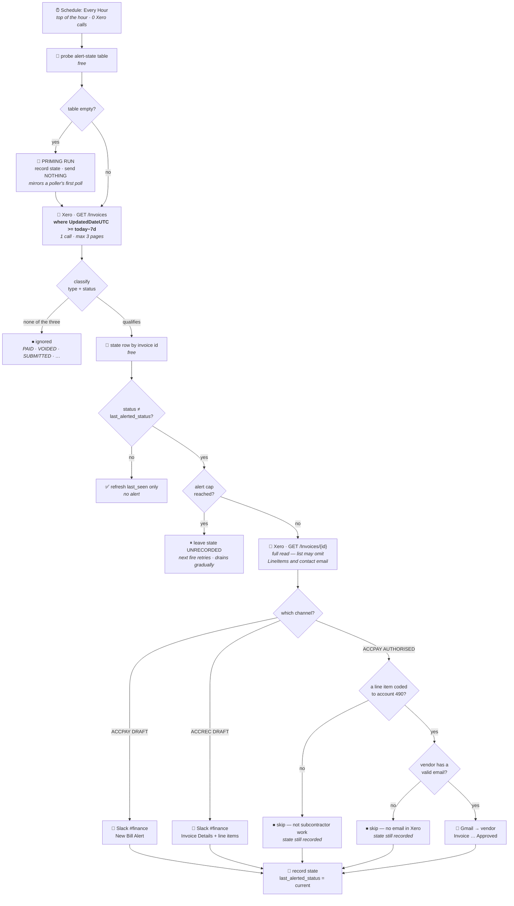

# Xero Invoice Alerts

Durable workflow (trigger **`read`** — "Every Hour" — `ScheduleCLIAPI@1.7.0`) that reads Xero
invoices updated in the last 7 days and sends the three alerts that used to be three separate Zaps,
deduped through its own state Table.

> ### 🔁 One schedule replaced three Xero pollers
>
> | Retired Zap | Old trigger | Now |
> | --- | --- | --- |
> | [`xero-draft-bill-to-slack-alert`](../xero-draft-bill-to-slack-alert/) | `bill`, `status=draft` | the `slack-bill-draft` channel here |
> | [`xero-bill-approved-to-subcontractor-email`](../xero-bill-approved-to-subcontractor-email/) | `bill`, `status=authorised` | the `email-subcontractor` channel here |
> | [`xero-draft-sales-invoice-to-slack-alert`](../xero-draft-sales-invoice-to-slack-alert/) | `sales_invoice_v2`, `status=draft` | the `slack-sales-draft` channel here |
>
> **~4,320 Xero API calls/day → ~24.** All three are disabled, not deleted. See
> [Why a schedule](#why-a-schedule).

## What it does

1. **Trigger** — *Every Hour*, top of the hour, weekends included. Costs Xero nothing.
2. **Read Xero once** — `GET /Invoices?where=UpdatedDateUTC>=<today−7d>`, bounded to 3 pages.
3. **Classify** each invoice. Anything that isn't one of the three cases below is ignored, which is
   the large majority: `PAID`, `VOIDED`, `DELETED`, `SUBMITTED`, and authorised *sales* invoices.
4. **Dedupe** against the [state Table](#dedupe-the-part-that-replaced-zapiers-polling-dedupe): an
   alert fires only if the invoice's current qualifying status differs from the one we last alerted on.
5. **Re-read the invoice in full** before alerting, then send it and record the new state.

| Type + status | Channel | Destination |
| --- | --- | --- |
| `ACCPAY` + `DRAFT` | `slack-bill-draft` | Slack **#finance** |
| `ACCPAY` + `AUTHORISED` | `email-subcontractor` | approval email to the vendor — **only** with a Subcontractor Fees (`490`) line item and a valid email |
| `ACCREC` + `DRAFT` | `slack-sales-draft` | Slack **#finance**, with per-item line items |



## Why a schedule

Xero rate-limits **per tenant**: 60 calls/minute and **5,000 calls/day**. On 2026-08-06 five Xero
*polling* triggers on tenant `62699a8c` exhausted the daily limit, taking every Xero Zap in the
workspace down for ~10 hours and dropping two invoices in
[`drive-invoice-to-xero`](../drive-invoice-to-xero/). Read off Xero's own headers, not inferred:

```
x-rate-limit-problem: day
x-daylimit-remaining: 0        ← daily quota gone
x-minlimit-remaining: 60       ← per-minute budget untouched, so NOT a burst
```

**A durable polling trigger cannot be throttled.** The `--trigger` payload accepts only
`selected_api` / `action` / `authentication_id` / `params` — verified across all 43 live triggers in
the account — so there is no interval to turn down. A schedule trigger is the knob that doesn't
otherwise exist: it costs Xero nothing, and moving the read into the workflow body changes the cost
basis from *polls per day* to *fires per day*.

| | Xero calls/day |
| --- | --- |
| Three polling triggers | ~4,320 |
| One hourly schedule + one windowed read | **~24** (+1 per alert actually sent) |

Of Xero's 47 triggers, only `updated_invoice_v2` supports push delivery (it's the one with a
`trigger_preference` field), and it was already in use by
[`xero-invoice-paid-to-gmail-confirmation`](../xero-invoice-paid-to-gmail-confirmation/). Webhooks
were not an option for any of these three.

### The window is on `UpdatedDateUTC`, not `Date`

This is the load-bearing detail. A bill issued three weeks ago and **approved today** still carries
its original `Date`, so a window on `Date` would never see the approval — the single most important
event this Zap detects. `UpdatedDateUTC` bumps on both creation and status change, which is exactly
the event set required.

The 7-day overlap also makes the sync **self-healing**: a failed run, or an hour the Zap spent
disabled, is simply re-read on the next fire. A polling trigger could never do that — it primed its
dedupe on first poll, so a gap was permanent.

## ⚠️ Why the two bill pollers couldn't just be merged

They *look* redundant — identical `selected_api`, action, credential and organization, differing
only in `status`. They are not. **Each polling subscription keeps its own dedupe store**, so with
`status: authorised` a bill enters that store only when it *becomes* authorised. That is what made
approval detectable at all.

One unfiltered poller would have seen the bill as draft, fired, and then deduped that `InvoiceID`
forever — **silently losing every draft → authorised transition** and killing subcontractor emails
with no error anywhere. Moving to a schedule with our own state makes transition detection
deliberate rather than an artifact of Zapier's plumbing.

## Dedupe: the part that replaced Zapier's polling dedupe

Zapier Table **`01KZACA2ZA3XJWWGSMNEC381ZE`** ("Xero Invoice Alert State"), one row per invoice,
keyed on `xero_invoice_id`, 14 fields. Created via the **SDK** (`create-table` +
`create-table-fields`) rather than the Tables *actions*, because the actions silently drop bad values
and cap at 8 field types while the SDK validates. Reads and writes cost no tasks.

**The rule:** `last_alerted_status` is the dedupe key. An alert fires only when an invoice's current
qualifying status differs from the status we last alerted on. So a bill alerts once as `DRAFT` and
again when it becomes `AUTHORISED`, but never twice for the same status however many times the 7-day
window re-reads it.

### Three safeguards worth knowing

- **Priming.** If the state-table read *succeeds* and returns zero rows, the run records state for
  every qualifying invoice and sends **nothing** — mirroring how a polling trigger primes its dedupe
  on first poll. Without it, the first fire would alert on every qualifying invoice at once.
  A **failed** read is deliberately *not* treated as empty: it throws and the step retries, because
  mistaking a failure for an empty table would silently suppress every alert.
- **Blast radius.** `MAX_ALERTS_PER_RUN` (25) is a safety valve, not an optimisation. If the table
  were ever emptied, one fire could otherwise post hundreds of messages. Anything over the cap keeps
  its state **unrecorded**, so the next fire picks it up and the backlog drains gradually.
- **A skipped invoice still records state.** A bill failing the `490` filter, or a vendor with no
  email, records its alerted status anyway — otherwise the filter would be re-evaluated and re-logged
  every hour forever. `last_skip_reason` keeps the reason visible and `alert_count` is not bumped.

## Behaviour ported from the retired Zaps

Message text, emoji, the `go.xero.com` deep link, the Subcontractor Fees (`490`) filter, the
no-email skip, and the per-item line-item rendering that fixed the classic Zap's flattened-array
jumble are all carried over verbatim. One deliberate change:

> ### ⚠️ The subcontractor email no longer carries an attachment
>
> The retired Zap attached the vendor's **own uploaded invoice**, read from the `bill` trigger
> payload's `attachments[].file` Zapier hydrate references. A raw Xero API read cannot produce
> those — Xero exposes only `upload_attachment` (**write**), with no read counterpart, and hydrate
> refs exist only inside a trigger payload.
>
> Agreed 2026-08-06 on two grounds: the attachment was the vendor's own document, which they already
> have; and the retired Zap had **never actually sent** — its classic predecessor's step was
> published `paused: true` and the durable itself had **0 runs** — so no recipient experience
> regressed.

## Testing without sending

```bash
zapier-sdk --experimental trigger-workflow 019fd4cc-6d23-7aa4-964a-ddc6cf489a1b --input '{"dryRun":true}'
```

A dry run computes the whole pass against live Xero data, reports what it *would* send, and writes
no state. It is the safe way to inspect this Zap.

## Maintainer notes

- **`moh` must be the string `"00"`, not the integer `0`** — even though `list-trigger-input-fields`
  declares it `value_type: INTEGER`. The real choices are `"00"/"15"/"30"/"45"`; confirm with
  `list-trigger-input-field-choices ScheduleCLIAPI everyHour moh`. Publishing the integer is rejected
  with `ZAPIER_VALIDATION_ERROR: '0' is not an allowed value for 'moh'` — loudly, unlike the *silent*
  trigger-claim failures documented elsewhere in this repo. Rely on neither: verify
  `triggers[0].status == "active"` after every publish.
- **`details.webhook_url` on this trigger is Zapier's own plumbing** for the schedule subscription,
  not a catch URL. Nothing external should ever POST to it.
- **Every alerted invoice is re-read in full.** Xero's invoice *list* response is not guaranteed to
  carry `LineItems` or the contact's `EmailAddress`, and both are load-bearing — line items drive the
  `490` filter and the sales-invoice body, the email address is the recipient. Re-reading costs ~1
  call per alert (rare) and cannot silently degrade, which depending on the list's contents would.
- **Never write `new Date` (or `Date.now()`) in the workflow body outside a `ctx.step`.** The durable
  runtime's `Date` Proxy throws `DeterminismViolation` before inspecting its arguments, so a
  deterministic `new Date(Date.UTC(...))` fails as hard as a clock read. The only clock read here is
  inside `ctx.step("now")`; all date maths is integer arithmetic.
- **Table datetimes are written with an explicit `Z`.** A bare `YYYY-MM-DD` is read in the account's
  timezone (Asia/Singapore) and lands 8 hours off.
- **Per-item step names are index-based off a batch sorted by invoice id**, and the batch is memoized
  by the `fetch-invoices` step — so a retry can never re-map an index onto a different invoice. The
  two `create-state-<tag>` call sites sit on mutually exclusive branches.
- **`from` is deliberately unset on the Gmail action.** The connection already sends as
  `dennis@work.flowers`, and the field is a dynamic enum that rejects an unvalidated literal.
- **Reviving any of the three retired Zaps would double-alert** *and* put ~1,440 Xero calls/day back
  on the tenant. Don't re-enable them; change this Zap instead.
