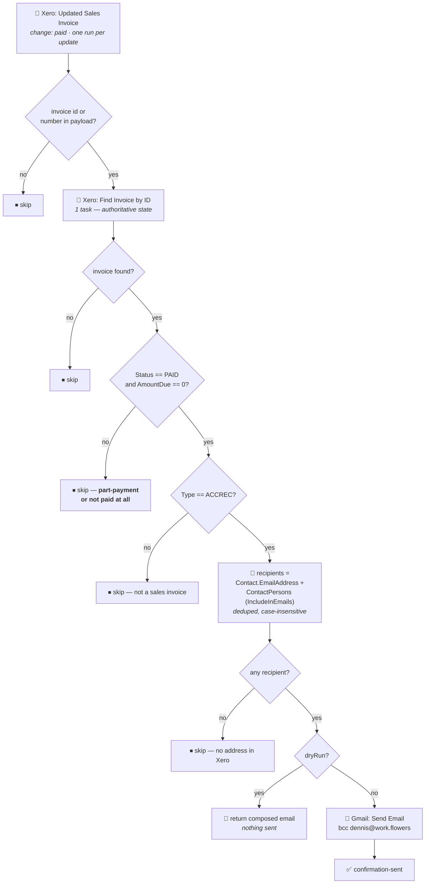

# Xero Invoice Paid → Gmail Payment Confirmation

Durable workflow (trigger **`read`** — "Updated Sales Invoice" — `XeroCLIAPI@2.20.5`, filtered to
`change: paid`) that emails the customer a payment confirmation when one of our sales invoices is
settled. Migrated from the classic Zap *"Send Gmail payment confirmation when invoice paid in
Xero"*.

> **This workflow emails customers directly.** It is the only Zap in this repo that sends mail to
> someone outside work.flowers with no human in the loop. Every confirmation is bcc'd to
> `dennis@work.flowers`, which is the tripwire: if confirmations stop arriving in that inbox, or
> arrive for invoices that are not settled, something is wrong here.

## What it does

1. **Trigger** — Xero *Updated Sales Invoice*, `change: paid`, one run per update.
2. **Re-read the invoice** from Xero by id. The trigger says *something changed*; the email asserts
   *we received your payment*. Only Xero can confirm that, so it is asked.
3. **Guard — settled in full?** `Status == PAID` **and** `AmountDue == 0`. Anything else stops here.
4. **Build the recipient list** from the contact and its contact persons.
5. **Send** the confirmation, bcc `dennis@work.flowers`.

## Why the paid-in-full guard is the point of this migration

The classic Zap went straight from trigger to send. Its body says:

> Thank you for your payment! We're writing to confirm that we've received your payment for invoice
> … Amount Paid: {{CurrencyCode}} {{AmountPaid}}

Nothing checked that the invoice was actually settled. Two ways that goes wrong:

- **A part-payment.** Xero moves `AmountPaid` when *any* payment lands. A customer paying half of a
  SGD 10,000 invoice would have received a confirmation quoting the half they sent — and then no
  confirmation at all when they paid the balance, because by then `AmountPaid` had already been
  confirmed once.
- **The change filter is not reliable on its own.** Zapier's own help text on the trigger's
  *Trigger Preference* field says it is notified of an invoice update almost immediately, but Xero
  takes time to reflect the update in the invoice's History — and that you should choose
  **Detailed** if knowing *what* changed matters to your workflow. This Zap filters on
  `change: paid`, so it matters. The classic Zap left the field unset, which defaults to *as soon as
  possible*. This workflow sets `trigger_preference: "detailed"`, and the code guard means an
  over-delivery is harmless either way.

`Status` and `AmountDue` are both checked because they answer different questions: `Status` is
Xero's own verdict, `AmountDue` is the arithmetic.

## Recipients

The classic Zap's `To` was two fixed mappings —
`invoice.Contact.ContactPersons.ContactPerson.EmailAddress` and `invoice.Contact.EmailAddress`. That
sends an empty recipient when there are no contact persons, and the same address twice when a
contact person shares the contact's address. Its Gmail node carried `has_automatic_issues: true`,
which is consistent with that mapping never having resolved.

Here the list is built and then cleaned: contact address plus every contact person, filtered on
Xero's own `IncludeInEmails` flag, validated as address-shaped, deduped case-insensitively. If
nothing survives, the run skips with a reason rather than mailing nobody.

Note that `IncludeInEmails: false` is respected deliberately — it is the customer's own "don't copy
this person on invoice email" setting, and overriding it would mail someone who asked not to be.

## Verified cases

Re-run these before changing the guard or the body. A manual run takes
`{"InvoiceID": "<guid or INV-nnnn>", "dryRun": true}` and returns the composed email **without
sending**.

| Case | Invoice | Result |
| --- | --- | --- |
| Not settled in full | INV-0077 — AUTHORISED, USD 7,398.17 due | ⏹ skipped, `invoice is not paid in full`. No email. The exact case the classic Zap had no defence against. |
| Settled in full (dry run) | INV-0075 — PAID, SGD 6,300.00, fully paid 2026-07-16 | 📄 composed: *Payment Received - Invoice INV-0075*, to `ap.scw@securecodewarrior.com`, bcc `dennis@work.flowers`, body carrying `SGD 6,300.00`, `Payment Date: 2026-07-16`, `Reference: PO944`. |

**The live send has not been fired against a customer** — doing so would have emailed Secure Code
Warrior a payment confirmation they did not need. What is verified is the composed message above,
plus the identical Gmail input shape exercised for real by
[`xero-overdue-invoice-to-gmail-reminder`](../xero-overdue-invoice-to-gmail-reminder/), whose
`draft_v2` call takes the same `to`/`cc`/`subject`/`body`/`body_type`/signature fields and succeeded.
The bcc makes the first real confirmation self-verifying.

## Cutover

The classic Zap had **both** its trigger and its Gmail node `paused: true` — it was entirely off and
had never sent a confirmation. **Turn it off (or delete it) rather than unpausing it**, or both it
and this workflow will email the customer.

Because it never ran, going live here is a genuine behaviour change: invoices marked paid from now on
will produce customer-facing email that previously did not exist. Nothing is back-mailed — a Zapier
polling trigger primes its dedupe on first poll, so invoices settled before now are not confirmed,
which is the right outcome.

## Body changes

The wording, the `Hi team,` opening and the `workFlowers Team` sign-off are verbatim from the classic
Zap. Only rendering changed:

| Field | Classic | Now |
| --- | --- | --- |
| Payment Date | `2026-07-16T00:00:00` (raw `FullyPaidOnDateString`) | `2026-07-16` |
| Amount Paid | raw float, could render `7398.170000000001` | `7,398.17` |
| Reference | dangling `- Reference:` when empty | line dropped |

## Maintainer notes

- **`new Date()` is unusable in workflow code.** The durable runtime runs the body in GUARDED mode
  and throws `DeterminismViolation: Non-deterministic API "new Date()" called` on the *constructor* —
  including `new Date(ms)`, which is perfectly deterministic. The first published version of this
  workflow failed at run time on exactly that. Dates are converted with integer civil-from-days
  arithmetic in `isoDateFromEpochMs`, checked against native `Date` across a 50,000-day sweep plus
  2000-02-29 and 2100-02-28.
- **A PAID invoice's `FullyPaidOnDate` has no `…String` twin.** It arrives as
  `/Date(1784160000000+0000)/`. The `.NET`-date branch in `toIsoDate` is load-bearing, not defensive
  — that is how the `new Date()` fault was found.
- **Xero's per-invoice contact snapshot is inconsistent.** The same contact (Secure Code Warrior
  Limited, identical `UpdatedDateUTC`) returned `ContactPersons: [{Jaap Singh}]` on INV-0077 and
  `ContactPersons: []` on INV-0075. A confirmation can therefore reach fewer people than a reminder
  for the same customer. `Contact.EmailAddress` is always present, so nobody is missed entirely;
  reading the contact separately would cost another task and was not judged worth it.
- **Only the invoice id is taken from the trigger payload.** Everything the email says is read back
  from Xero, so the workflow does not depend on the trigger's field naming — which is what let it be
  built and tested without a sample trigger delivery.
- **A repeat confirmation is possible but unlikely.** Nothing records which invoices have been
  confirmed. Part-payments are absorbed by the guard, but a payment applied to an already-PAID
  invoice (an overpayment, or a credit note re-allocated onto it) would confirm twice. A Zapier Table
  keyed on invoice id would close it at no task cost if it ever happens.
- **Cost:** 1 task per delivery for the Xero read, plus 1 for the send. The classic Zap spent 1 (the
  send). The extra read is the price of not telling a customer their invoice is settled when it is
  not.

## Files

| File | Purpose |
| --- | --- |
| [`workflow.ts`](workflow.ts) | The durable source, as published |
| [`zap.json`](zap.json) | Deployment metadata: workflow + version ids, trigger config, connections, verified cases |
| [`package.json`](package.json) | Pinned dependency versions |
