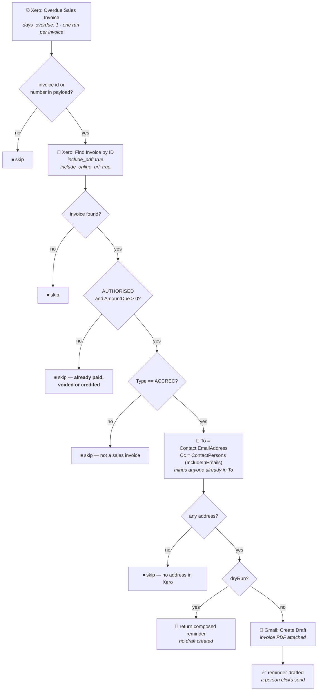

# Xero Overdue Invoice → Gmail Reminder Draft

Durable workflow (trigger **`read`** — "Overdue Sales Invoice" — `XeroCLIAPI@2.20.5`,
`days_overdue: 1`) that prepares a payment reminder when one of our sales invoices goes a day past
due. Migrated from the classic Zap *"Overdue Invoice Reminders (1 Day)"*.

> **This workflow never sends.** Its last step is Gmail *Create Draft*, exactly as the classic Zap's
> was. A debt-chasing email goes out only after a person has read it and clicked send. There is no
> code path here that can send mail.

## What it does

1. **Trigger** — Xero *Overdue Sales Invoice*, `days_overdue: 1`, one run per invoice.
2. **Re-read the invoice** from Xero by id, asking for the online-invoice URL **and the PDF**.
3. **Guard — still owed?** `Status == AUTHORISED` ("Awaiting Payment") **and** `AmountDue > 0`.
4. **Build To / Cc** from the contact and its contact persons.
5. **Create the draft**, with the invoice PDF attached.

## The three things that were broken

**1. The reminder never actually carried the invoice.** The classic Zap's draft attached
`gives[trigger].InvoicePDF` — a field on the *trigger's* output, not the lookup's — while the lookup
step was configured with `include_pdf: false`. So no PDF was ever fetched, and the field being
referenced does not exist. Now the lookup asks for the PDF and the returned file reference is
attached; verified on a real draft (`19fa8c76377a87ba`).

**2. The body told customers their invoice came from themselves.** The classic body read:

> This is a friendly reminder that the following invoice from **{{Contact.Name}}** is now overdue

`Contact.Name` is the *customer*. A reminder to Secure Code Warrior would have opened "the following
invoice from Secure Code Warrior Limited is now overdue". It now reads "from workFlowers".

**3. Nothing checked the invoice was still owed.** The trigger polls a due-date window, so an invoice
paid, voided or credited between the poll and the run would still have been chased. Chasing a
customer for money they have already sent is the one failure mode worth spending code on here, so
the still-owed guard is checked before anything is composed.

## Recipients

`To` is the contact's own address; `Cc` is every contact person, filtered on Xero's `IncludeInEmails`
flag and with anyone already in `To` removed — the classic Zap Cc'd contact persons unconditionally,
so a customer whose contact person shares the main address was both To'd and Cc'd. A contact with no
address of its own but contact persons who have one gets them promoted to `To` rather than producing a
Cc-only draft. A contact with no address at all is skipped with a reason instead of drafting to
nobody.

`IncludeInEmails: false` is respected deliberately — it is the customer's own "don't copy this person
on invoice email" setting.

## Verified cases

Re-run these before changing the guard or the body. A manual run takes
`{"InvoiceID": "<guid or INV-nnnn>", "dryRun": true}` and returns the composed reminder **without
creating a draft**.

| Case | Invoice | Result |
| --- | --- | --- |
| Still awaiting payment (dry run) | INV-0077 — AUTHORISED, USD 7,398.17, due 2026-08-02 | 📄 composed: to `ap.scw@securecodewarrior.com`, cc `jaap@scw.io`, `attachedPdf: true`, due date `2026-08-02` |
| No longer awaiting payment | INV-0075 — PAID, 0.00 due | ⏹ skipped, `invoice is no longer awaiting payment`. No draft. The case where the classic Zap would have chased a paid customer. |
| Real draft, end to end | INV-0077 | ✅ draft `19fa8c76377a87ba` created in Gmail with the PDF attached and the composed body. Deleted afterwards — it was a test against an invoice that is not actually overdue — and verified gone from Drafts. |

At migration time Xero reported **0 overdue invoices** (4 awaiting payment, all due in August), so
the happy path was verified by firing the workflow manually against a real but not-yet-overdue
invoice rather than waiting for a genuine delivery. The trigger itself is claimed and `active`; the
first real delivery will be whichever August invoice goes a day past due first.

## Cutover

The classic Zap's trigger was **live** (`paused: false`) but **both** its action steps were
`paused: true` — so it polled Xero every 15 minutes and then did nothing. **Turn it off rather than
unpausing it**, or both it and this workflow will draft the same reminder.

## Body changes

The wording, the `Hi <FirstName>,` opening and the `Dennis` sign-off are verbatim from the classic
Zap apart from the issuer-name fix above. Otherwise:

| Field | Classic | Now |
| --- | --- | --- |
| Due Date | `2026-08-02T00:00:00` (raw `DueDateString`) | `2026-08-02` |
| Amount Due | raw float, could render `7398.170000000001` | `7,398.17` |
| Reference | not in the body at all | `Reference: PO944` line when the invoice has one — **an addition**, see below |

The `Reference` line is the one thing here that is not in the classic Zap. It is included because an
AP team matches a reminder against their own PO number, which is what gets the invoice paid — but it
is customer-facing copy that was not asked for, so it is easy to remove: delete the
`if (inv.reference)` push in `buildBody`.

## Maintainer notes

- **`days_overdue` must be a number, not a string.** The classic Zap carried `"1"`;
  `list-trigger-input-fields` gives the field `type: number`. A scalar/array or string/number
  mismatch in trigger params makes the trigger claim fail **silently** at publish — the publish
  returns success and the workflow simply stays disabled with nothing explaining why. Confirmed
  claimed here (`status: active`).
- **`new Date()` is unusable in workflow code.** The durable runtime runs the body in GUARDED mode
  and throws `DeterminismViolation: Non-deterministic API "new Date()" called` on the *constructor* —
  including `new Date(ms)`. The sibling Zap
  [`xero-invoice-paid-to-gmail-confirmation`](../xero-invoice-paid-to-gmail-confirmation/) failed at
  run time on exactly that; this workflow had the same latent fault, reached whenever a date arrives
  as `/Date(ms)/` with no `…String` variant. Dates are converted with integer civil-from-days
  arithmetic in `isoDateFromEpochMs`, checked against native `Date` across a 50,000-day sweep plus
  2000-02-29 and 2100-02-28.
- **A Zapier file field is an opaque reference.** `include_pdf: true` returns
  `InvoicePDF: "hydrate|||…|||hydrate"`, which is passed straight through to Gmail's `file` input
  with no fetching or decoding — the same way `drive-invoice-to-xero` passes its `fileRef`.
- **Only the invoice id is taken from the trigger payload.** Everything the reminder says is read back
  from Xero, so the workflow does not depend on the trigger's field naming — which is what let it be
  built and tested without a sample trigger delivery.
- **There is no escalation ladder.** This is the 1-day reminder and the trigger delivers an invoice
  once as it crosses that threshold. The classic Zap's name implies 7-day or 30-day siblings were
  intended; none existed. Adding one means the same source deployed again with `days_overdue` changed
  — record it as a second deployment in `zap.json`, the way
  [`luma-event-to-notion`](../luma-event-to-notion/) does.
- **Duplicate drafts are tolerated.** Nothing records which invoices have been drafted, so a
  re-delivery would produce a second draft. Harmless — drafts do not send themselves and a duplicate
  is plainly visible in Drafts — so no Zapier Table was added.
- **Cost:** 1 task for the Xero read plus 1 for the draft, the same as the classic Zap.

## Files

| File | Purpose |
| --- | --- |
| [`workflow.ts`](workflow.ts) | The durable source, as published |
| [`zap.json`](zap.json) | Deployment metadata: workflow + version ids, trigger config, connections, verified cases |
| [`package.json`](package.json) | Pinned dependency versions |
