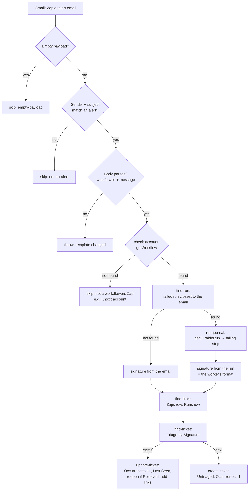

# zapier-error-email-to-triage

Turns Zapier's failure alert emails for work.flowers Code Zaps into tickets in the **Zapier Error Triage** Notion database (`db78a092-515d-40e6-9416-aab114460f86`).

It replaces the `errorsDelta` sync in the notion-workers `zapier-durables-docs` worker, which walked every durable's run history hourly to find failures. That walk existed because durables used to send no failure notification. Zapier now emails the Zap owner on every failed run, about three minutes after it happens, so the walk was paying Notion credits for something an email already tells us.

## Trigger

Gmail **New Email Matching Search** on dennis@work.flowers:

```
from:notifications@mail.zapier.com subject:("had an error" OR "couldn't run")
```

Zapier sends two alert subjects for Code Zaps, and both are ticketed:

| Subject | Meaning |
|---|---|
| `Your Zap "<name>" had an error` | the run failed in our code |
| `Your Zap "<name>" couldn't run` | a Zapier-side failure (the 2026-09-15 outage, `upstream_rejected`) |

The search only narrows what Gmail polls. `extractAlert()` re-checks the exact sender and subject shape.

## Flow



## How the email becomes a ticket

The email carries only the Zap name, the workflow id (from the "Open in workflow manager" link) and Zapier's readable error message. Everything else comes from Zapier itself, through the durable's own ambient SDK credentials (`@zapier/zapier-sdk/experimental`, no connection needed, verified 2026-10-03):

1. **Account check, `getWorkflow`.** Knoxx-account Zaps alert the same inbox (`batch-so-creation-cron` did on 2026-09-15). Their ids answer `Workflow not found` and are skipped. Any other error throws and retries, so a transient failure never skips a real Zap. This asks Zapier rather than the daily-synced Zaps table, so a brand-new Zap counts from its first failure.
2. **The failed run, from run history.** The runs API is paged newest-first, and the durable picks the `failed`, non-draft run whose `updated_at` is closest to the email, within 30 minutes before and 2 minutes after. Observed: the email lands ~2 s after the run finishes. It goes through the raw API client, not `listWorkflowRuns`, because the SDK's strict schema rejects a whole page containing an editor draft run (the worker hit the same thing).
3. **The failing step, from the run's journal (`getDurableRun`).** It takes the last operation that didn't complete, same as the worker's `failureDetail`. That operation's own error is the real cause, e.g. *"Provided ID … is a database, not a page"* behind a run error that only says *Step "check-page-access" exhausted all retry attempts*. It is logged to the run's history but **not** written to the ticket, because the body and the `Root Cause` select belong to whoever triages. The journal also carries a stack trace, which the worker's notes said Zapier never exposes. That is no longer true.

Steps 2 and 3 are enrichment. If either fails or finds nothing, the ticket is still made, from the email alone.

## What a ticket is

One ticket per **signature**: `<workflow id> · <error type> · <normalised message>`. The normalisation is ported from the worker's `normaliseMessage` and strips ids, timestamps, semver and appended JSON dumps, so a recurring fault lands on one ticket.

- **When the run is found** (the normal case), the error type is the run's `details.name` or `code` (`StepExhaustedError`, `execution_failed`, `upstream_rejected`). The signature and title are **byte-identical to the worker's**, so a fault the worker ticketed before 2026-10-03 recurs onto its existing ticket. Covered by tests against ZAP-54 and ZAP-57.
- **When it isn't**, the error type is `Zap error` or `Couldn't run` (from the subject) and the message is the email's wording.

Writes:

- **New signature:** a ticket is created with `Status = Untriaged`, `Occurrences = 1`, `First Seen`/`Last Seen` (the run's start, else the email's time), `Error Type`, `Error Message`, and `Failing Step` when the journal named one. `Zap` and `Zap Runs` are linked when their rows exist.
- **Repeat:** `Occurrences` goes up by one and `Last Seen` moves. A `Resolved` ticket goes back to `Untriaged`. `Won't fix` is a deliberate verdict and stays closed. The run is added to `Zap Runs` (newest first, capped at 25; `Occurrences` is the count), and `Zap` is filled in if it was missing.
- **Hands off:** the page body, `Priority`, `Assignee`, `Root Cause`, `Resolution Notes`, `Resolved on`, `Due` and `GitHub Pull Requests`.

**Links lag by up to a day.** The Zaps and Runs rows come from the worker's daily `zapsSync` and `runsDelta`, and the failed run is minutes old when its email arrives, so a first ticket usually has no `Zap Runs` link. A brand-new Zap's first ticket has no `Zap` link either. Both are filled in when the same signature recurs. A one-off failure stays unlinked, but its title, signature (which carries the workflow id) and `First Seen` identify the run.

## Unrecognised payloads

This repo throws on unrecognised payloads (see `CLAUDE.md`):

- **An empty ping skips.**
- **A non-alert email skips.** The Gmail search is fuzzy, so a non-alert match is expected noise, not a schema change.
- **An email from Zapier's alert sender with an alert subject whose body no longer parses THROWS.** That means Zapier changed the template, and skipping it would silently stop all ticketing.

## Concurrency

Two alerts for the same new signature arriving within seconds of each other can both find no ticket and both create one. The 2026-09-15 outage produced 14 failures of one Zap in 50 minutes, so this is possible, but each is a separate Gmail poll and they are spread out in practice. Duplicates are harmless and can be merged by hand. Repo posture: accept rare duplicates rather than build a lock (see "Concurrency" in the shared rules).

## Prerequisites

- The triage, Zaps and Runs data sources must be shared with the **Zapier** integration that backs `notion_wf` (`02b73654-…`). They were created by the worker, so they weren't shared by default; sharing the parent page *Next-Gen Zaps DB* covers all three. Unshared, the API answers `404 object_not_found`.
- The triage database must stay **detached** from the worker (`ntn workers databases detach errors`, done 2026-10-03). While it was worker-managed, its columns were read-only to everything but the worker's sync.

## Testing

```shell
npm test        # offline, 12 checks: both real alert emails in fixtures/, run matching,
                # journal parsing, and signature/title parity with worker tickets ZAP-54 and ZAP-57
```

Verified live with `run-durable` on 2026-10-03, against the production Notion databases:

| Case | Result |
|---|---|
| Email-only, new signature | `created`: ZAP-58, `Untriaged`, `Occurrences 1`, `Zap` linked |
| Email-only, same email again | `updated`, `Occurrences 2` |
| Email-only, ticket set to `Resolved` | `updated`, `reopened: true`, back to `Untriaged` |
| Workflow id not in the account | `skipped: not-a-work.flowers-zap` (the first build checked the Zaps table; now `getWorkflow`, which answers `Workflow not found` for a foreign id) |
| With run lookup: the 2026-09-30 `had an error` email | `runFound: true`, matched run `01a0f097…` (finished 04:34:52, email 04:34:54), signature identical to the worker's **ZAP-57**, which was updated and reopened |
| `getDurableRun` on the 2026-09-28 `check-page-access` failure | failing step `check-page-access`, cause and stack trace present |

ZAP-58 was a test ticket and was moved to the Notion trash. ZAP-57 was restored by hand afterwards (`Occurrences 1`, `Resolved`, and its original `Resolved on`, which the status automation re-stamps when `Status` moves back to `Resolved`).

`fixtures/` holds the real `had an error` (2026-09-30, `slack-thread-to-notion-discussion`) and `couldn't run` (2026-09-30, `gcal-event-updated-to-meeting-note`) emails, reshaped to the Gmail trigger's field names.
